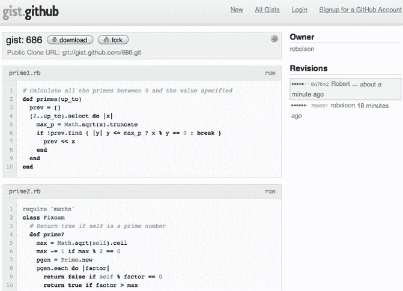

# GitHub 将版本控制与 Pastie  结合起来

> 原文：<https://web.archive.org/web/https://techcrunch.com/2008/07/22/github-unites-version-control-with-the-pastie/>

# GitHub 将版本控制与 Pastie 结合起来

[GitHub](https://web.archive.org/web/20230321222343/https://github.com/) ，托管 [Git](https://web.archive.org/web/20230321222343/http://git.or.cz/) 库的流行服务，已经迈出了一步，改进了经典的 pastie 服务(程序员发布代码片段的地方)。为了做到这一点，GitHub 采用了在他们的存储库托管服务中证明成功的相同公式，并将其应用于 pasties。结果是:一项新服务今天在 gist.github.com[推出。](https://web.archive.org/web/20230321222343/http://gist.github.com/)

这对 pastie 用户意味着什么？每个 pastie 或 gist 都有自己的 Git 存储库。通过将馅饼放在 git 存储库中，GitHub 能够重新定义馅饼的工作方式。

Gisting 的优势:

*   多次修订
*   支持单个 pastie 中的多个文件
*   可以离线编辑，然后“推”到 GitHub，就像任何其他 Git 存储库一样
*   私人馅饼是通过 SSL 加密的
*   馅饼可以被另一个用户叉开并改进。任何改进都可以以补丁的形式发送给原作者。让每个 pastie 成为自己的小型开源项目。

GitHub 还内置了在网络浏览器中编辑视频的功能。每次编辑都被保存为 Git repo 中的一个修订，允许在线提交。GitHub 团队计划将这一功能引入他们的主应用程序。他们希望消除用户在参与 GitHub 项目之前熟悉 Git 版本控制系统的需求。这对于那些想提交不需要任何测试的补丁的人也很有帮助，比如文档补丁。由于大多数开发人员使用的是源代码管理系统而不是 Git，这可能是 GitHub 在开源项目中实现更大协作目标的重要一步。

Gist 还不是一个完整的产品。最值得注意的是，它缺少删除馅饼的功能。搜索现有的馅饼也将是有益的。由于 GitHub 存储库托管也缺少全文搜索，因此 GitHub 可以先开发一个 pasties 搜索，然后扩展到所有存储库。

缺失的功能并没有阻止 GitHub 社区跳到 gist.github.com。在过去的 24 小时里，Gist 收到的馅饼数量(在撰写本文时为 724 个)超过了领先的馅饼服务公司 Pastie.org(524 个)。

尽管 GitHub 只有 8 个月的历史，他们已经托管了超过 10，000 个开源项目。更重要的是，他们已经从数以千计的付费用户那里获得了利润。

GitHub 在拉开与开源项目的领先主机 [SourceForge](https://web.archive.org/web/20230321222343/http://sourceforge.net/) 的距离方面做得很好，它增加了不仅有利于用户而且有利于开源项目本身的社区方面。最流行的是能够跟踪对您最喜欢的项目的贡献，这使得跟踪您使用或参与的项目的进展变得更加容易。虽然 SourceForge 十年来一直停滞不前，但 GitHub 正在超越它们，提供了一些进步的功能，如 follow、activity feeds 和更简洁的设计。

