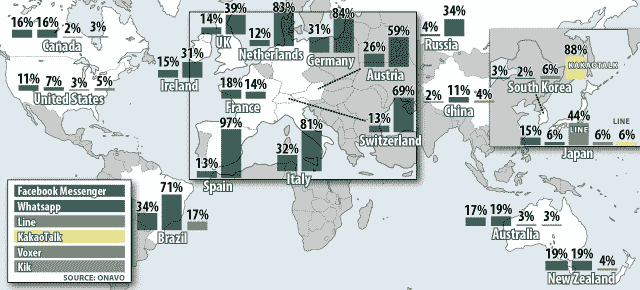
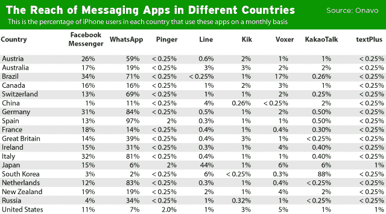

# 全球消息应用市场的现实是:它真的非常分散

> 原文：<https://web.archive.org/web/https://techcrunch.com/2012/12/04/global-messaging-market/>

# 全球消息应用市场的现实是:它真的非常分散

人们很容易认为，Facebook Messenger 或苹果的 iMessage 在智能手机信息领域占据全球主导地位。但现实是，这一景观看起来非常不同，而且非常分散——至少目前如此。

包括 WhatsApp 在内，有很多应用程序在它们的母国韩国、日本或中国拥有数千万用户或占据主导市场份额。

我从红杉支持的 Onavo 公司获取了一些市场份额数据，on AVO 公司拥有数据压缩和应用软件，已经有几百万用户安装在他们的手机上。他们能够看到数十万个应用的活跃使用情况，该公司没有遵守许多移动分析公司与其开发人员客户签订的保密协议。

上图显示了每个国家的 iPhone 用户中不同消息应用的活跃用户比例。这不仅仅是原始安装或下载。这是每月的实际活跃使用量，Onavo 可以看到这一点，因为如果用户的手机上有 Onavo 产品，它会压缩和分析每个应用程序的数据流入和流出。他们的样本规模在“个位数”的数百万 iPhone 用户中。

正如你所看到的，WhatsApp 在大多数欧洲国家拥有主导市场份额，在活跃使用量方面远远领先于 Facebook Messenger。在亚洲，情况要复杂得多。[韩国的 KakaoTalk 在韩国 88%的 iPhones 上被频繁使用](https://web.archive.org/web/20230307211555/http://pandodaily.com/2012/07/06/what-does-this-korean-messaging-app-think-its-doing-with-more-us-users-than-path/)。在日本， [NHN 的 Line 应用程序在 44%的 iPhones 上被积极使用](https://web.archive.org/web/20230307211555/https://techcrunch.com/2012/11/19/nhn-line/)。我们无法立即从腾讯在中国的微信应用上获取数据，因为他们使用自定义的 HTTP 协议。(不过，如果读者感兴趣的话，我们可以在本周末推出。我们也可以提取 Android 数据，但也需要更长的时间。)

另一件要注意的事情是，美国也是一个例外。如果你是一个美国或硅谷的读者，你可能从来没有意识到 WhatsApp 的巨大影响力的原因是因为美国人坦率地说并不热衷于聊天应用。除了南韩、俄国和中国(原因很明显，脸书不能进入中国)，这个样本中几乎所有其他国家的 Facebook Messenger 用户比例都高于美国。美国用户更可能依赖短信。

那么这意味着什么呢？至少在短期内，智能手机短信会继续保持分散状态。KakaoTalk 和 NHN 航运公司在其母国南韩和日本拥有非常强大的网络。腾讯的马化腾在 9 月份表示，他们的聊天应用微信在 6 个月内翻了一番，达到 2 亿用户，而肯定不会很快进入中国。

从长远来看，这种情况有可能改变吗？桌面网络上的社交网络开始时非常分散。StudiVZ 在德国占有显著的市场份额，谷歌的 Orkut 在印度和巴西表现良好，VKontakte 在俄罗斯占据主导地位，Mixi 在日本保持强势等等。由于脸书的压力，他们开始一个接一个地倒下。

今天[在 Android 上发布](https://web.archive.org/web/20230307211555/https://techcrunch.com/2012/12/04/messenger-no-facebook-account/)一款不需要账户的*Facebook Messenger 应用程序，这将大大有助于吸引发展中国家的纯移动用户。他们中的许多人开始购买廉价的 Android 设备，并首次注册数据套餐。*

除了短信，他们还有很多选择可以考虑。

