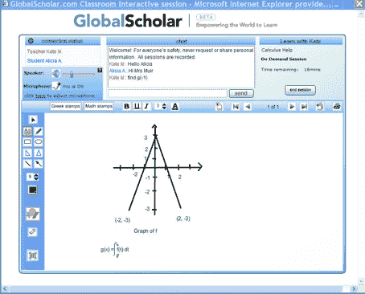
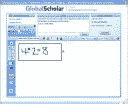

# GlobalScholar 融资 2700 万美元用于在线教育 

> 原文：<https://web.archive.org/web/https://techcrunch.com/2008/01/30/globalscholar-raises-27-million-b-round-to-tackle-online-education/>

# GlobalScholar 融资 2700 万美元解决在线教育问题

总部位于西雅图的全球学者(global scholar)今天宣布，现有投资者 Ignition Partners 和知识宇宙教育(Knowledge Universe Education)将提供 2700 万美元的 B 轮投资。除此之外，该公司去年年初还筹集了一轮 1550 万美元的资金，这笔资金此前没有披露。董事会成员包括 Ignition 的布拉德·西尔弗伯格(Brad Silverberg)和前 Drugstore.com 首席执行官彼得·纽珀特(Peter Neupert)。

在这轮投资的同时，GlobalScholar 还宣布它已经收购了 [Excelsior Software](https://web.archive.org/web/20221209121946/http://www.excelsiorsoftware.com/) ，金额未披露(尽管它还不到融资总额的一半)。Excelsior 制作学生评估软件，供全国 1000 个学区的教师使用。GlobalScholar 将把 Excelsior 的业务添加到其现有的基于网络的辅导平台上，该平台于去年秋天悄然推出。

 GlobalScholar 是一个面向导师的 WebEx。家长和学生可以在 GlobalScholar 上找到各种科目的预先筛选的导师，并支付一次性家庭作业帮助或参加持续的辅导课程。会议在 GlobalScholar 的网站上举行，该网站提供在线白板、音频聊天、存档和计费。(这里有一个[截屏](https://web.archive.org/web/20221209121946/http://flvideo.globalscholar.com/Training/B2C/Videos/StudentDemo/StudentDemo.html)解释它是如何工作的)。

导师可以收取自己的费用——从每小时 5 美元到 95 美元不等 GlobalScholar 收取 20%的提成。第一个小时只有 1 美元，以鼓励人们尝试这项服务，GlobalScholar 向在线参加 SAT 预备课程的 SAT 最高分学生提供 5000 美元。竞争对手包括 [SmartThinking](https://web.archive.org/web/20221209121946/http://www.smarthinking.com/) 、【Tutor.com】T2 和[TutorVista](https://web.archive.org/web/20221209121946/http://www.smarthinking.com/)—[NYT 点评今日 Tutor.com](https://web.archive.org/web/20221209121946/http://www.nytimes.com/2008/01/31/fashion/31CYBER.html?ex=1359522000&en=7e55fe77d4377379&ei=5124&partner=permalink&exprod=permalink)。小心，卡普兰。

除了 GlobalScholar，该公司还在过去几周推出了另外两个网站。SchoolFinder 汇集了小学和高中的基本信息，并让家长对不同的学校进行比较。CollegeFinder 对大学也做同样的事情，从《美国新闻》、《世界报道》和《普林斯顿评论》中获取排名。它还列出了每所大学的名人校友。(你知道西格妮·韦弗和特德·科佩尔都是斯坦福大学的吗？).家长和学生评论马上就要来了。

以下是一些屏幕截图:

