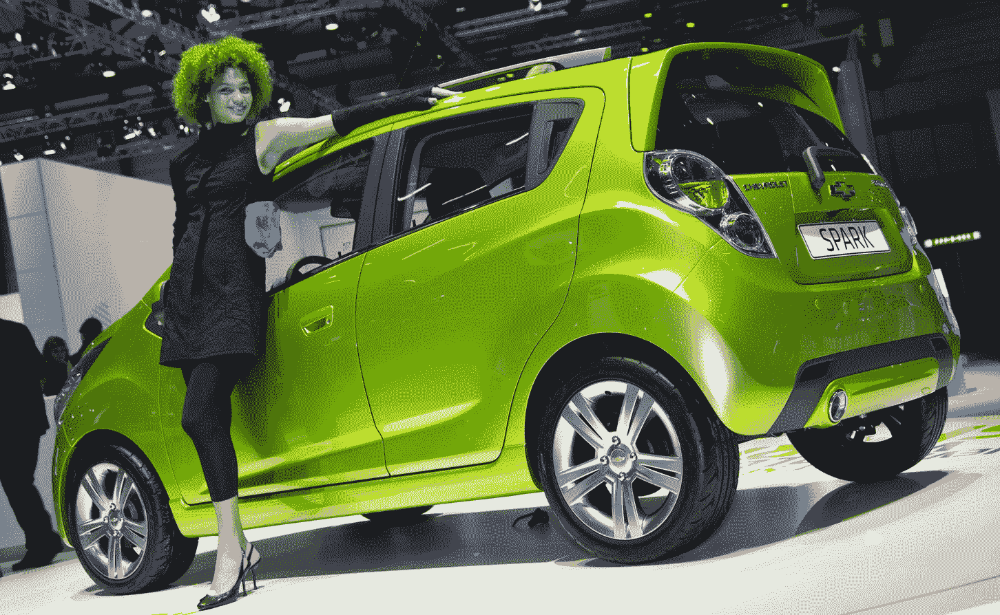
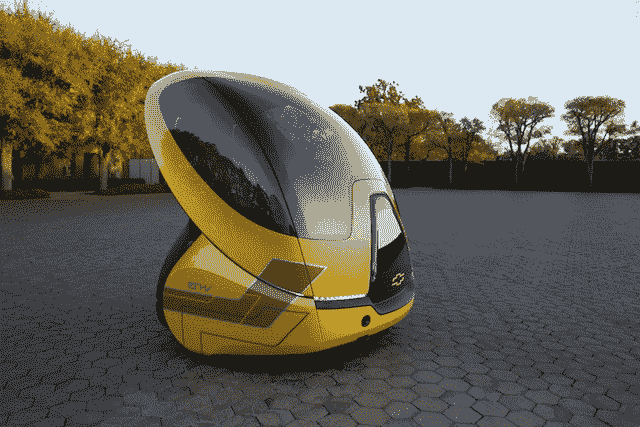

# 通用汽车宣布推出全电动雪佛兰 Spark EV 以及全新概念车 Chevy EN-V 

> 原文：<https://web.archive.org/web/https://techcrunch.com/2011/10/14/gm-announces-all-electric-chevy-spark-ev-plus-new-concept-car-chevy-en-v/>

# 通用汽车宣布推出全电动雪佛兰 Spark EV 以及全新概念车 Chevy EN-V

本周，通用汽车宣布将推出雪佛兰品牌下的全电动汽车 Spark EV。这款车基本上是 Spark 微型车的电动版，将从 2013 年开始在美国包括加州限量销售。

该公司还宣布，它已经开始致力于其新概念车，雪佛兰 EN-V。

汽车制造商表示，将利用雪佛兰在上海(赛欧电动汽车)、韩国(科鲁兹电动汽车)和印度(Beat 电动汽车)的电动汽车示范车队的反馈来制造 [Spark 电动汽车](https://web.archive.org/web/20230205024244/http://spark.chevrolet.com/)。汽车的纳米磷酸盐锂离子电池组将由 [A123 系统](https://web.archive.org/web/20230205024244/http://www.a123systems.com/)提供。除此之外，细节很少。

关于具体市场、范围、数量和价格的信息尚不清楚。

此外，通用汽车宣布，它已经开始研究其下一代 EN-V 概念车，这款车也将带有雪佛兰的徽章。这款车将采用一种疯狂的、未来主义的设计，是专为日益拥挤的城市地区开发的双座零排放汽车。

雪佛兰 EN-V(电动联网汽车的缩写)将增加新的功能，如气候控制、个人存储空间以及全天候和路况操作。它还将包括原始 EN-V 的元素，如其小尺寸和机动性，电池电力推进，连接和自动驾驶能力。