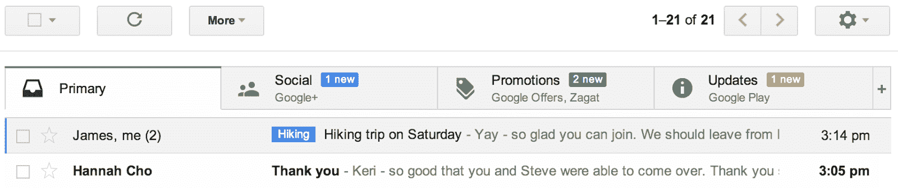
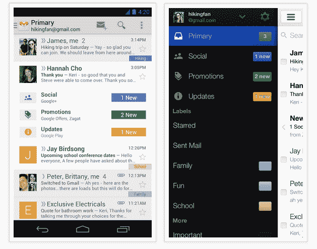

# Gmail 获得了一个时髦的新收件箱和自动分类功能，有助于应对信息过载

> 原文：<https://web.archive.org/web/https://techcrunch.com/2013/05/29/gmail-for-desktop-and-mobile-gets-a-new-inbox-now-automatically-categorizes-your-email/>

谷歌今天[向](https://web.archive.org/web/20230111081527/http://gmailblog.blogspot.com/2013/05/a-new-inbox-that-puts-you-back-in.html)介绍了一种管理你的 [Gmail 收件箱](https://web.archive.org/web/20230111081527/https://mail.google.com/)的新方法。收件箱的这个新视图在 Gmail 收件箱栏的顶部放置了许多标签。默认情况下，谷歌会显示标签——并自动将你的信息分类——显示你在 Google+、Twitter、脸书或 YouTube 等网站的社交更新，谷歌优惠和 Groupon 等网站的促销，以及一种包含所有账单、收据和类似信息的“更新”标签。

您还可以添加一个论坛通知选项卡，至少在我的测试中，它还包括电子邮件列表。当然，谷歌允许你随意添加或删除这些标签。要回到传统的收件箱，你只需要关闭所有的标签或者切换到另一种[收件箱风格](https://web.archive.org/web/20230111081527/https://support.google.com/mail/answer/18522?hl=en)。

这一更新将于今天开始向所有 Gmail 用户推出，将在桌面和谷歌 iOS 和 Android 移动应用程序上提供，下周初应该会有更新。正如谷歌告诉我的，这将是一个渐进的推出，所以在新设计出现在你的收件箱之前可能需要一点时间。

如果你等不及了，也要留意一下档位菜单。一旦“配置收件箱”出现在那里，您将能够手动打开这个新功能。

值得注意的是，选项卡式界面不能与优先收件箱功能或任何其他非默认的 Gmail 视图一起使用。正如谷歌 Gmail 产品经理亚历克斯·高利(Alex Gawley)昨天告诉我的那样，该团队认为新的收件箱是大多数 Gmail 用户的最佳默认设置。从长远来看，优先收件箱和这种新的视图可能会以某种形式协同工作，但现在还不是一个选项，Gawley 也没有任何预计何时会发生。

然而，Gmail 也会在侧边栏中显示这些新的类别，所以你仍然可以在那里看到你的自动分类邮件。

**更新手机应用**

正如 Gawley 在我与他交谈时强调的那样，对于团队来说，确保这种新的收件箱视图也可以在移动设备上使用非常重要，因此 iOS 和 Android 应用程序现在都将在这些设备上的常规收件箱流中的这些选项卡中显示谷歌所谓的“预告”更新。这些基本上是这些类别中有可用更新的通知，但它们不包括通常的摘要，多个更新将被捆绑在一起成为一行。

在这次更新中，谷歌还引入了最近泄露的 Android 应用程序的导航抽屉，这比该公司在以前的设计中使用的“旋转器”更容易在类别之间切换。当然，默认情况下，应用程序总是在“主”标签上打开。

【T2

正如 Gawley 告诉我的，这次重新设计背后的主要动机是想知道如何帮助用户浏览我们大多数人今天必须处理的源源不断的新电子邮件。他说，团队意识到，尽管 Gmail 增加了过滤器、优先收件箱和更多定制功能，“你的收件箱开始感觉像你的主人。”当用户浏览邮件时，他们会不断地切换上下文，这在你处理几十封邮件时会产生影响。

他告诉我，谷歌从类似的谷歌实验室功能中学到了不少东西，该功能也可以自动对电子邮件进行分类和标记。该系统还将在用户移动电子邮件时学习重新分类(你可以手动将邮件拖放到不同的类别中)。

[YouTube http://www.youtube.com/watch?v=CFf7dlewJus&w=560&h=315]