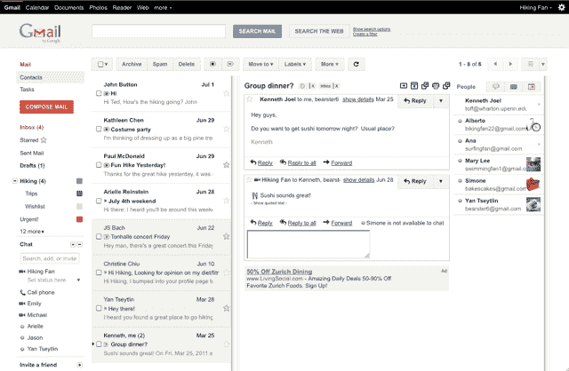

# Gmail 得到一个预览窗格(万岁！)，需要工作(Aww)TechCrunch

> 原文：<https://web.archive.org/web/https://techcrunch.com/2011/08/05/gmail-gets-a-preview-pane-hooray-needs-work-aww/>

# Gmail 得到一个预览窗格(万岁！)，需要工作(Aww)

是的，你没看错标题，下面的截图没有任何篡改。你渴望已久的 Gmail 功能终于来了:Gmail [现在支持](https://web.archive.org/web/20230205011559/http://gmailblog.blogspot.com/2011/08/new-in-labs-preview-pane.html)三格浏览，让你可以同时看到你的消息列表*和*邮件内容。

当然，这个功能并不新颖——这是你多年前就能在 Outlook 等电子邮件客户端上实现的功能。iPad 的邮件客户端自推出以来就提供了预览窗格查看模式，Gmail 去年也推出了一款具有类似界面的[平板电脑网络应用](https://web.archive.org/web/20230205011559/https://techcrunch.com/2010/04/02/gmail-ipad-app/)。Gmail 的原生 Android 版本也提供了一个预览面板。

但是，即使 Gmail 桌面 web 应用是聚会的最后一个，它仍然是许多人访问收件箱的主要方式，所以这是一件大事。

该功能可以在 Gmail 实验室的“预览窗格”选项下激活。打开后，你需要点击 Gmail 界面右上角的新按钮来选择垂直或水平布局。

我整个早上都在摆弄这个功能，至今心情复杂。一方面，我一直希望有一个预览窗格，我不禁感到兴奋。但是在左侧导航侧边栏、消息列表、消息本身以及右侧侧边栏(包括新的[人物小工具](https://web.archive.org/web/20230205011559/https://techcrunch.com/2011/05/26/gmails-people-widget-takes-on-rapportive-no-browser-plugin-required/)和广告)之间，我的收件箱中有很多*内容。我发现自己希望最右边的窗格根本不存在。这是一个问题，因为我怀疑谷歌会在短期内清除这些广告。*

还有一些小问题需要解决，这并不奇怪，因为该特性仍然是一个实验室项目。到目前为止，我最大的不满是:如果你“检查”一条消息，然后使用键盘命令前进到另一条消息，预览页面不会显示你现在突出显示的消息(它只会说“选择了一个对话”)。这个功能还弄乱了我的左侧栏——聊天被分配了太多的空间，我不得不滚动来访问我的标签，尽管这很容易通过将聊天列表的大小改为“小”来纠正。

所以它还有很长的路要走。但我会接受的。

