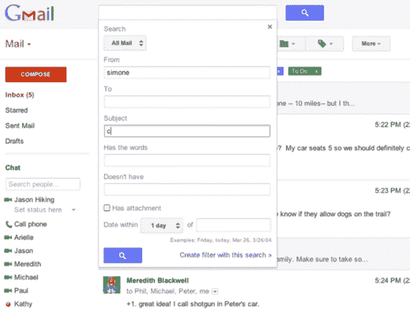
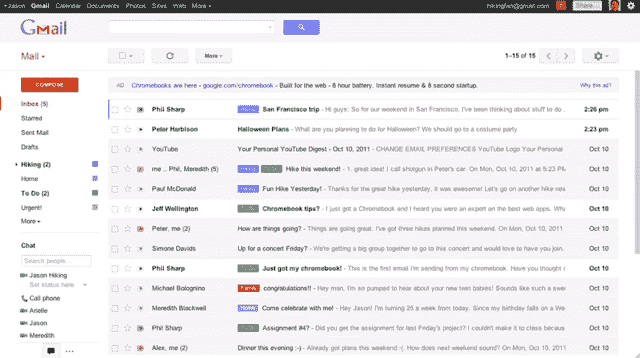

# Gmail 无意中透露了即将进行的重新设计 TechCrunch

> 原文：<https://web.archive.org/web/https://techcrunch.com/2011/10/20/gmail-gives-an-accidental-peek-at-its-upcoming-redesign/>

# Gmail 无意中透露了即将重新设计的内容

一段无意中发布到谷歌 YouTube 账户上的视频让我们得以一窥 Gmail 在不久的将来将会发生的一些变化。它很快就被撤下了，但在此之前有几张截图被谷歌操作系统截获。

新的用户界面显然是基于 Gmail 的“预览”主题，这是早在 6 月份[就开始提供的](https://web.archive.org/web/20230205024956/http://gmailblog.blogspot.com/2011/06/preview-of-gmails-new-look.html)，它有更多的空白和选项来调整你希望你的对话列出的密度。视频中最大的变化是对话/回复视图，这看起来更像脸书消息——对话中的每个人都有他们的照片，并且更容易阅读主题中以前的消息。

另一个关键变化是:只要你点击搜索框，Gmail 就会开始显示其高级搜索功能。在此之前，这些信息并不容易获取——你必须点击“显示搜索选项”链接，或者使用搜索操作符(“已发送:”和“附件”等)。).现在，这些选项会立即弹出，您还可以动态地从您的搜索查询中创建一个新的过滤器。

还有一些更小的调整。一些按钮现在用视觉图标表示，让人想起在 Android 蜂巢/冰淇淋三明治中看到的那些图标。您现在可以手动调整标签和聊天窗口的大小。还有一个新的巧妙效果:当你调整浏览器窗口大小时，Gmail 会动态调整它的布局，让一切都合适。

这些都是很好的改进，但是，作为一个整天生活在 Gmail 中的人，我仍然希望看到很多变化。特别是，Hotmail(是的， Hotmail)最近[推出了](https://web.archive.org/web/20230205024956/http://windowsteamblog.com/windows_live/b/windowslive/archive/2011/10/03/hotmail-declares-war-on-graymail.aspx)的一些功能，我希望 Gmail 能够重现。例如，Hotmail 现在可以在几天后自动删除某些邮件(毕竟没有理由让那些过期的邮件塞满你的收件箱)。

**更新** :
谷歌将其视频撤下，但这里有一面镜子，再次通过[谷歌操作系统](https://web.archive.org/web/20230205024956/http://googlesystem.blogspot.com/2011/10/new-look-for-gmail.html):
【YouTube = ' http://www . YouTube . com/watch？v=aF2I8c3fNQs']

