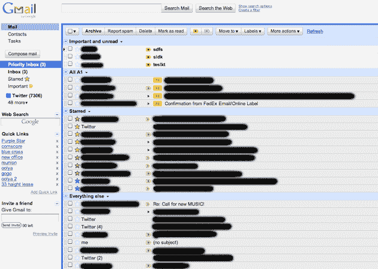
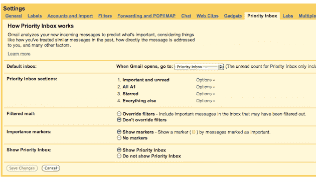

# 收件箱英雄:Gmail 优先收件箱已经浇灭了我熊熊的电子邮件之火——目前 

> 原文：<https://web.archive.org/web/https://techcrunch.com/2010/08/31/gmail-inbox-hero/>

希望你看到这篇文章的时候，你已经可以打开 Gmail 优先收件箱了。 [Jason 昨晚已经发布了他的评论/概述](https://web.archive.org/web/20221006114913/https://beta.techcrunch.com/2010/08/30/gmail-priority-inbox/)，所以我想我应该谈谈自从 Google 让我用我的账户测试它以来，我过去几天是如何使用它的。我对它的看法与 Jason 的一致——一旦你对它进行微调，它会改变游戏规则。如果不启用 Gmail，我根本没办法回去使用它。那么我是如何调整它的呢？

首先，在你开始之前，我强烈建议你看一下谷歌为这个功能制作的概述视频。这是两分钟长，使基本知识易于理解。对于大多数人来说，基本的就足够了。但是对于那些收到很多邮件的人来说，你会想要更深入一点。

我最喜欢优先收件箱的一个方面是允许你创建收件箱四个不同部分的设置。是的，你以前可以通过多收件箱功能做到这一点，但是这些新的设置使事情更容易理解和实现。这里的三个默认部分是:“重要和未读”、“已标星”和“其他一切”——但有一个选项可以添加第四个，你应该这样做。您应该创建一个新标签，以便快速标记电子邮件。例如，我选择了“A1 ”,因为“A”首先出现在标签下拉菜单中。设置此部分(实际上是第二部分)显示带有该标签的电子邮件。

一旦你这样做了，你的收件箱就会变成四个不同的盒子，一个叠一个。顶部是“重要的和未读的”元素——这是你真正的优先收件箱，理想情况下大部分时间都是空的(表明你已经阅读了所有这些邮件)。下面是这个新的 A1 部分——这些是你保存的最重要的电子邮件。下面是你标有星号的部分——这些是你很快标上星号的电子邮件，你*可能会*想要回复。在它下面是所有其他的东西——你收到的普通电子邮件。或者我喜欢称之为地狱。

这个新的“其他一切”部分的伟大之处在于，它过滤掉了你已经在上面的部分之一中的东西，所以事情不会重复。普通的 Gmail 收件箱不会这样做。

有了这个四级层次结构，你基本上就有了一个堆积如山的电子邮件，以一种易于理解的方式从最重要的到最不重要的。对我来说，这无疑比 Gmail 过滤重要邮件更重要。

也就是说，当你每天第一次打开收件箱的时候，过滤仍然是一个很大的杀手。对我来说，最令人印象深刻的是它学习的速度。在第一天，这是相当击中或错过。但是现在，在使用它的第五天，它非常准确。我怀疑它会越来越好。其中一部分是我为绝对不会被标记为“重要”的事情创建新的过滤器——但大部分只是点击“重要”或“不重要”按钮。

再说一次，所有这一切实际上与你以前通过组合多个收件箱和你自己的高度定制的过滤器所能做的没有什么不同。但是有了优先收件箱，你就不必花那么多时间去做那些过滤器——大多数用户永远不会去做的事情。相反，你只是花时间通过点击按钮，或者简单地阅读/不阅读某些邮件来教 Gmail 什么是重要的，什么是不重要的。

这很奇怪，但我现在真的很期待每天打开 Gmail，看看优先收件箱过滤邮件的效果如何。当我中午回到收件箱时，我也发现自己不那么不知所措了。也就是说，这仍然没有解决电子邮件的基本问题:即邮件太多，回复时间太长，以及回复每封邮件被认为是适当的礼仪。

我估计我每天会收到大约 100 到 200 封电子邮件——外加几百封发送到我可以访问的普通工作账户的邮件。如果我试着阅读并回复每一封邮件，那要花上几个小时。如果我还想完成工作，那简直是不可能的。主要问题是所有的点击要求。点击打开，点击回复，点击发送。所有这些，加上每次动作后加载花费的时间，加起来很快。这与这样一个事实相结合，即期望通常是这样的，你会更正式地回复电子邮件——再一次，见鬼。

这是我喜欢 Twitter 的一个原因。这是一条小溪。没什么好打开的，东西都是飘过去的。当你想回复什么的时候，只需点击一下——不需要打开任何新的东西。这是一个点击发送，但没有关闭后的盒子(至少 twitter.com 没有)，也没有必要重新定位自己。此外，140 个字符的限制给了你世界上最好的借口来保持简短。人们过去常常抱怨和抱怨这种限制阻碍了对话——我认为这是 Twitter 最伟大的方面。当然，没有一种固有的观念认为每条消息都需要回应。太棒了。

似乎每个人都确信，我们即将开始解决基本的电子邮件问题。但我不确定这是否可能。即使某件事真的很棒，也需要大量的运气和时间才能让世界上的每个人都像使用当前的电子邮件系统那样参与进来。Twitter 或脸书是最接近的，但当你仔细想想，他们真的没有那么接近。

相反，改写规则的可能必须是老牌玩家之一。其中，谷歌的 Gmail 显然做得最好。但即使是优先收件箱也不是规则的改写，它只是一个组织工具，让一切*看起来*更好。但是相信我，我会接受的。