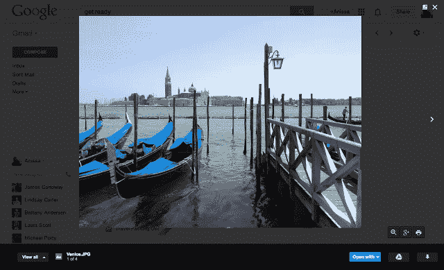
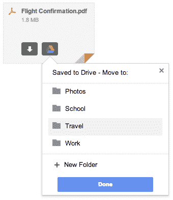
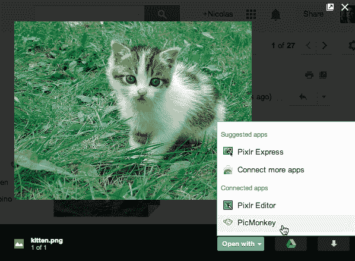
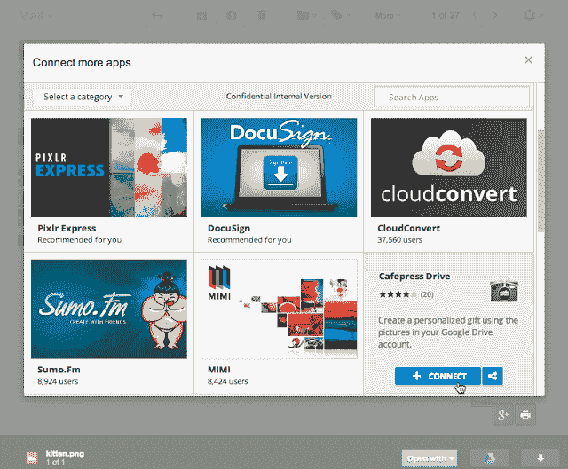

# Gmail 用户不再需要下载附件，因为 Google Drive 已经进入收件箱了

> 原文：<https://web.archive.org/web/https://techcrunch.com/2013/11/12/gmail-users-no-longer-need-to-download-attachments-as-google-drive-gets-baked-into-the-inbox/>

谷歌今天发布了 Gmail 的另一个更新，谷歌驱动将更深入地整合到该公司的电子邮件平台。现在，用户将能够跳过下载电子邮件附件的整个过程，而是直接查看并保存他们的文件到 Google Drive——而不用离开他们的收件箱。

这一变化发生在谷歌推出[新的“快速行动”按钮](https://web.archive.org/web/20230406195846/https://techcrunch.com/2013/11/11/gmails-quick-action-buttons-now-support-one-click-access-to-google-offers-seamless-opentable-dropbox-more/)的前一天，这种按钮只需点击一下，就可以更容易地与电子邮件进行互动。类似地，Google Drive 集成也旨在加速用户与电子邮件内容(在这种情况下是附件)的交互。

随着该功能的推出，Gmail 用户将开始在电子邮件底部看到新的文件缩略图预览，包括照片和视频，以及办公文档、pdf 和电子表格。单击其中一个文件预览将会以全屏图像格式显示该项目。从这里，你基本上可以直接从你的 Gmail 收件箱与文件本身进行交互，而不需要先下载然后使用桌面软件启动文件。

然而，如果你确实需要保存项目供以后查看，你只需点击当你悬停在预览上时出现的 Google Drive 按钮。在出现的窗口中，您可以单击将文件保存到您的驱动器，甚至可以选择存储该项目的文件夹。如果你仍然需要走老派的“下载”路线，不要害怕——一个箭头按钮将允许你继续以传统方式做事。

这一举措不仅支持谷歌各种在线服务之间的互动，例如，这可能会推动更多用户采用 Dropbox 或 box 等竞争服务，而且也有助于谷歌更大的“云”议程。谷歌基于网络浏览器的操作系统 Chrome OS 彻底放弃了“桌面软件”的概念。

这也是让在线软件感觉更像手机的另一种努力，反之亦然。当你在手机上查看电子邮件附件时，涉及的步骤已经很少了。

还值得指出的是，这一增加是在面向销售人员的电子邮件初创公司 Yesware 之后不久，[收购了位于旧金山的一家名为 Attachments.me 的公司](https://web.archive.org/web/20230406195846/https://techcrunch.com/2013/11/11/email-productivity-startup-yesware-buys-attachments-me/)，该公司也在努力更好地将电子邮件附件与云连接起来。即使后一家公司在成长的道路上没有遇到障碍，Gmail 的这一新功能也可能给这种服务带来严峻的挑战。

谷歌表示，该更新最初面向桌面 Gmail 用户，并将在下周陆续推出。该公司指出，Google Drive 现在有 1.2 亿活跃用户，这个数字谷歌直到现在才公布。这使得这项服务接近——甚至可能超过——在同一领域运营的其他公司。Dropbox 拥有[1.75 亿注册(非活跃)用户账户](https://web.archive.org/web/20230406195846/https://techcrunch.com/2013/07/09/dropbox-dbx-conference/)，[苹果的 iCloud 拥有 3.25 亿](https://web.archive.org/web/20230406195846/http://gigaom.com/2013/07/24/apples-software-and-services-report-q3-update-on-itunes-icloud-and-apps/)， [SkyDrive 拥有超过 2.5 亿](https://web.archive.org/web/20230406195846/https://techcrunch.com/2013/11/11/on-xbox-one-skydrive-will-put-on-a-show-with-your-stored-videos-and-photos/)，box 以超过[2000 万账户](https://web.archive.org/web/20230406195846/https://www.box.com/about-us/)紧随其后。

**面向第三方开发者**

除了支持标准附件， [Google Drive SDK](https://web.archive.org/web/20230406195846/https://developers.google.com/drive/) [现在还将允许](https://web.archive.org/web/20230406195846/http://googledevelopers.blogspot.com/2013/11/open-attachments-with-your-web-app.html)第三方开发者更好地将他们的应用程序与 Google Drive 集成，并让用户与 Gmail 中的应用程序和文件进行交互。

Gmail 用户将能够从 Gmail 中的新文件预览功能中选择使用哪个应用程序来打开他们的文件附件，该功能将显示建议的和连接的应用程序。如果用户没有看到他们想要的应用程序，一个“连接更多应用程序”选项将让他们选择一个新的兼容应用程序-同样，直接从收件箱中。

关于这个特性的更多细节在谷歌开发者博客上[。](https://web.archive.org/web/20230406195846/http://googledevelopers.blogspot.com/2013/11/open-attachments-with-your-web-app.html)