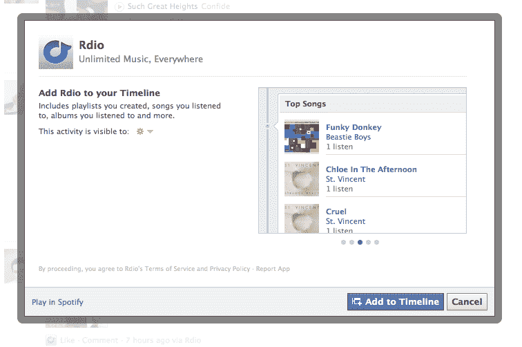

# 超越 Ticker，使用脸书音乐仪表盘查看您的朋友在听什么 

> 原文：<https://web.archive.org/web/http://techcrunch.com/2011/09/23/go-beyond-ticker-use-facebook-music-dashboard-to-see-what-your-friends-listen-to/>

# 超越 Ticker，使用脸书音乐仪表板，看看你的朋友听什么

在昨天宣布其扩展的 [Open Graph 功能](https://web.archive.org/web/20230204231548/https://techcrunch.com/2011/09/22/button-down/)后，脸书一直在通过其新闻自动收报机分享你的音乐收听活动，允许音乐发现和实现，正如 TechCrunch 创始人[所说](https://web.archive.org/web/20230204231548/https://www.facebook.com/profile.php?id=500065899)“你们中的许多人对音乐的品味真的很差。”

如果你想进一步了解你朋友糟糕的音乐品味，脸书刚刚推出了音乐仪表盘，作为你个人资料左侧栏的永久书签。脸书的 Josh Constine [指出](https://web.archive.org/web/20230204231548/http://www.insidefacebook.com/2011/06/20/music-dashboar/)你可以通过点击一个朋友的[播放列表](https://web.archive.org/web/20230204231548/https://www.facebook.com/?sk=music&playlist_id=10150401137930993)或通过这里的直接链接[来访问它并将其停靠在你的侧边栏上。](https://web.archive.org/web/20230204231548/https://www.facebook.com/?sk=music)

现在，音乐仪表板显示你的朋友正在听什么歌——按乐队汇总朋友的收听模式——以及热门歌曲和所谓的特色音乐服务，对我来说，至少目前正在为 Earbits 和 Spotify 做广告。

虽然看起来你必须至少有一个音乐播放合作伙伴应用程序才能通过 Dashboard 听音乐，但它最酷、最无缝的功能之一是，如果你点击一首你目前没有的音乐播放器中的歌曲，脸书会给你一个减轻的选项，让你在你首选的播放器中听这首歌。

当然，因为这是脸书，你可以喜欢或评论用户的音乐收听活动，也可以根据他们的歌曲选择来评判你的朋友，因为我们都知道，戴夫·马休斯是蹩脚的。但是，在你做出过于严厉的判断之前，请记住所有这些音乐整合的严重问题…

正如[菲利普·卡普兰](https://web.archive.org/web/20230204231548/http://www.crunchbase.com/person/philip-kaplan)所说，“Spotify 整合的问题在于，我最终会(出于好奇)点击很多朋友的糟糕选择，然后它们看起来就像是我的照片。"

所以，是的，在你点击你的大学室友的更新之前要小心，他们正在听神的“我触摸我自己”开放[是](https://web.archive.org/web/20230204231548/https://www.facebook.com/profile.php?id=500065899)一把双刃剑。