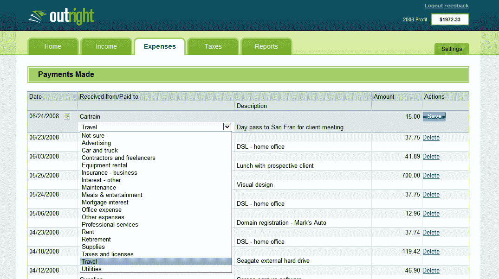

# GoDaddy 直接收购，建立山景城办公室

> 原文：<https://web.archive.org/web/https://techcrunch.com/2012/07/18/godaddy-acquires-cloud-based-financial-management-application-company-outright/>

# GoDaddy 彻底收购，建立山景办公室

今天，GoDaddy 收购了基于云计算的财务管理应用公司，交易金额未披露。买断联合创始人 Ben Curren、首席执行官 Steven Aldrich 及其 24 人团队将加入全球最大的虚拟主机提供商 GoDaddy。

GoDaddy 首席执行官沃伦·阿德尔曼告诉我，买断将留在他们的山景城办公室，总部位于亚利桑那州的 GoDaddy 将把这里作为扩大硅谷业务的“枢纽”。

GoDaddy 不是最明显的直接收购者，但他们都以小企业主为目标，此次收购可能标志着 GoDaddy 向更广泛的服务领域扩张。

“我们看到了支持小企业和帮助它们成长的共同热情，”阿德尔曼告诉我。“当然，他们是从不同的角度出发的，但是当我们和他们在一起时，我们真的达成了共识。我们认为这是我们在 GoDaddy 为小企业所做工作的延伸。”

随着买断加入更大的公司，买断的客户将很快“受益于 Go Daddy 丰富的云服务套件”。“你的彻底服务将保持不变，”奥尔德里奇今天在彻底的[博客](https://web.archive.org/web/20230318055702/http://outright.com/blog/outright-acquired-by-godaddy-get-ready-for-bigger-and-better-small-business-financial-management/)上用粗体写道。“继续像今天这样使用它。”

“对我们来说，最重要的是有机会接触更多的小企业，”阿德里奇告诉我。据阿德尔曼称，买断只有 20 万用户，而 GoDaddy 有 1030 万客户，其中 75%是小企业。

Outright 成立于 2008 年，为小企业主提供“简单、数据驱动和社区支持的业务管理应用程序”，如自动化会计任务的财务应用程序。

奥尔德里奇正在为买断公司筹集一轮资金，该公司获得了 750 万美元的资金，但自 2009 年以来还没有为 T4 筹集过资金，同时也在考虑收购要约。他说，他们选择 GoDaddy 是因为他们“对未来的巨大愿景”

**更新**:在后来的 SEC 文件中，交易条款被披露:*“在 2012 年，我们完成了一项商业收购，对价*
*，包括 17，775 美元现金和 373 个新公司单位，价值 1，894 美元。”*这些数字以千美元为单位，因此 1777.5 万美元和 189.4 万美元的库存就是这些数字。这是 2012 年唯一的一笔交易。