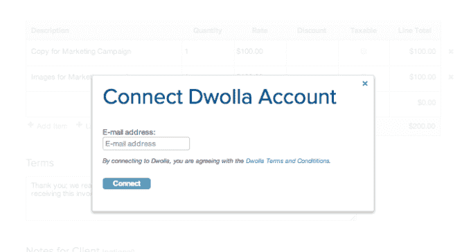
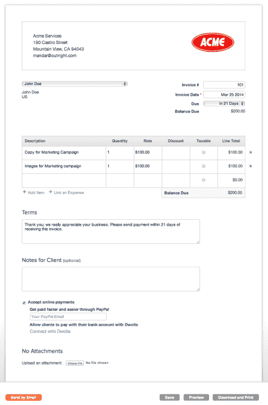

# GoDaddy 与 Dwolla 合作，为小型企业提供新的电子发票选项 TechCrunch

> 原文：<https://web.archive.org/web/https://techcrunch.com/2014/03/27/godaddy-partners-with-dwolla-on-new-e-invoicing-option-for-small-businesses/>

网络主机和小企业服务提供商 [GoDaddy](https://web.archive.org/web/20221006095204/http://www.godaddy.com/) 正在与支付网络 [Dwolla](https://web.archive.org/web/20221006095204/http://www.dwolla.com/) 合作，两家公司[今天](https://web.archive.org/web/20221006095204/http://blog.dwolla.com/godaddy-online-bookkeeping-and-dwolla-team-to-deliver-quick-easy-online-payments-for-smbs)宣布，为 GoDaddy 的企业客户提供纸质支票和竞争对手在线支付服务(如 PayPal)的替代方案，为他们的客户和供应商开具发票。从今天开始，GoDaddy 的 1200 万小企业客户将可以使用该选项。

这项服务建立在去年推出的电子支票技术上，该技术允许一次性和多次支付。这样，客人可以访问 Dwolla 网络，并直接从现有的银行账户或信用合作社发起交易，以便向 Dwolla 用户付款。然而，到目前为止，企业必须将这种客户功能编码到他们自己的现有发票解决方案中，以便接受这些支付，或者他们只能接受来自注册的 Dwolla 帐户的支付。

GoDaddy 现在基本上已经为他们完成了编码，使用 Dwolla 的 API 和服务为他们的商业客户设计了一个新的电子发票流程。此外，GoDaddy 使得企业和“发票接受者”都不需要首先拥有一个 Dwolla 帐户来发送或接收付款。这是一个显著的成就，因为对于许多企业和供应商来说，仅仅为了支付而建立一个第三方账户并不是那么方便。这就是为什么他们倾向于坚持现有的解决方案，如通过支票或 PayPal 支付，而不是改变新技术，即使这涉及到成本节约。

通过 GoDaddy 的服务，该公司将其设计为企业可以立即向他们的客户或供应商发送电子发票，而不必事先注册 Dwolla。同时，发票人可以选择用他们自己的 Dwolla 账户(如果他们已经有一个的话)付款，或者他们可以简单地使用电子支票选项，如上所述，从他们的银行账户付款。

在支付发票后，企业会被邀请注册 Dwolla 帐户——dw olla 声称这一过程需要大约 2 到 3 分钟才能完成，并通过提交电子邮件让企业连接到他们的帐户开始。

如果他们这样做，超过 10 美元的交易每笔 25 美分(由收款人支付)，而低于 10 美元的交易是免费的。这比贝宝便宜，贝宝收取 2.9%的手续费，外加每笔交易 30 美分的手续费。像 PayPal 一样，Dwolla 也提供其他商业工具，如[的 MassPay 解决方案](https://web.archive.org/web/20221006095204/https://beta.techcrunch.com/2012/10/22/with-masspay-dwolla-takes-on-paypal-mass-pay-by-offering-lower-fees-support-for-more-recipients/)，以及自动支付的自动取款。

这项之前处于测试阶段的新服务将从今天开始向所有 GoDaddy 企业客户推出，作为一种选择。

