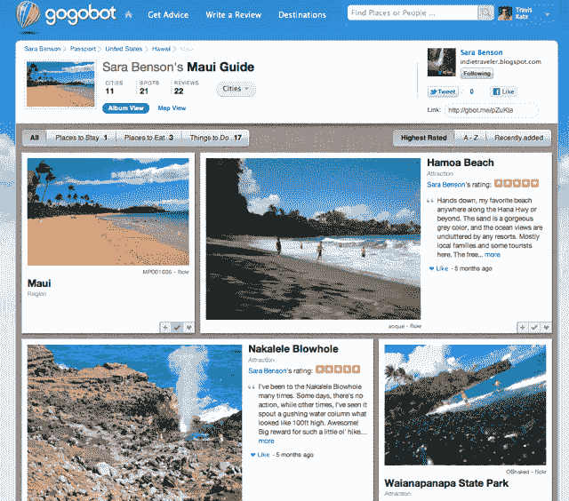

# 随着增长的加速，Gogobot 为社交旅行筹集了 1500 万美元 TechCrunch

> 原文：<https://web.archive.org/web/http://techcrunch.com/2011/11/03/gogobot-raises-15-million/>

# 随着增长的加速，Gogobot 为社交旅行筹集了 1500 万美元

不到一年前推出的社交旅游网站 Gogobot 正在蓬勃发展。该公司已经赢得了各种荣誉，包括被《时代周刊》评为 2011 年最佳网站之一，以及 2010 年最佳设计奖得主。他们看到了非常强劲的增长。今天，他们宣布已经筹集了 1500 万美元的巨额 B 轮融资。这轮融资由红点创投牵头，Battery Ventures 和 CrunchFund 参与其中。红点的普通合伙人 Satish Dharmaraj 将加入 Gogobot 的董事会。继 2010 年 6 月 400 万美元的首轮融资后，这使得 Gogobot 的[总融资](https://web.archive.org/web/20230203154506/http://www.crunchbase.com/company/gogobot)达到 1900 万美元。

鉴于 Gogobot 如此年轻，有可能你以前没有偶然发现过它。但你的一些朋友也有很大的可能:Gogobot 创始人兼首席执行官特拉维斯·卡茨表示，该网站现在是网络上最大的社交旅游服务，其用户群在过去六个月中增长了 10 倍。两周前，[公司发布了一款手机应用程序](https://web.archive.org/web/20230203154506/https://techcrunch.com/2011/10/18/gogobot-takes-social-travel-discovery-platform-mobile-with-ios-app/)，它现在是应用商店中 31 个国家排名前十的旅游应用程序。它是脸书最大的旅游相关应用。该公司还没有分享任何具体的用户统计数据，但听起来事情进展得非常顺利。

Gogobot 的卖点似乎显而易见:它将社交与利润丰厚的旅游市场结合起来，让你可以与朋友联系，获得他们关于去哪里旅游、吃什么、住哪里的建议。你可以使用这项服务来提前计划事情，或者你可以随时调查你的朋友。问题是，这是一个我多年来见过很多次的想法 Gogobot 的大多数竞争对手都没有获得几乎相同的牵引力。那他们为什么要离开？

根据 Katz 的说法，Gogobot 成功的关键主要在于经验。Gogobot 包括许多你在其他网站上看到的社交机制:病毒循环、徽章、与朋友互动的奖励等等。Katz 说，建立一个社交网站听起来很容易，但实际上，做好所有这些事情比大多数人想象的要困难得多。但是 Gogobot 的团队知道他们在做什么。Katz 是 MySpace 的早期员工，Gogobot 的其他几位关键员工也是如此。Katz 的联合创始人 Ori Zaltzman 创建了 Yahoo Answers。换句话说，他们有很多帮助服务病毒化的经验。

该网站增长的另一个关键因素是它对设计的关注，它看起来比猫途鹰等现有的旅游网站更现代、更友好。顺便说一句，猫途鹰是这个领域最大的玩家(它正走向首次公开募股)，但卡茨说 Gogobot 有一些优势。首先，他指出，大多数 TripAdvistor 评论都是陌生人留下的，所以你对评论者的个性或品味没有太多了解。他说，网站上有“大量来自各种餐馆和酒店员工的欺诈行为”。有了 Gogobot，你首先会从你的朋友那里得到介绍，他们没有任何动机留下误导性的评论。

