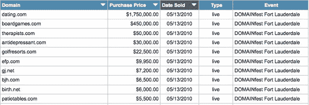

# 去了，去了:Dating.com 售价 175 万美元，域名销售升温 TechCrunch

> 原文：<https://web.archive.org/web/https://techcrunch.com/2010/05/13/going-going-gone-dating-com-sells-for-1-75m-domain-sales-heat-up/>

# 去了，去了:Dating.com 售价 175 万美元，域名销售升温

进入总是有利可图的绝望单身市场，有人在英国《金融时报》的域名拍卖会上以 175 万美元购买了域名 Dating.com。佛罗里达州劳德代尔。今天的拍卖获得了 240 万美元的销售额，BoardGames.com(以 45 万美元的价格远远落后于第二名)、Therapists.com(5 万美元)和 Antidepressant.com(3 万美元)——可悲的是，可爱的老古董 CdCollection.com 只卖了 300 美元。以下是域名拍卖的十大销售额:

Dating.com 被域名公司[Oversee.net](https://web.archive.org/web/20230124090017/http://www.crunchbase.com/company/oversee)通过其 SnapNames 部门出售。该房产的销售备受期待，但其最终价格并无异常。Oversee.net 最近享受了一连串六位数以上的域名交易。它的昵称部门上周以 125 万美元的价格出售了 Photo.com，3 月初以 80 万美元的价格出售了 Guns.com——当然，本周还有另一场 SnapNames 拍卖:Slots.com 以令人瞠目的 550 万美元的价格适度出售。或者就像罗宾·沃特斯描述的那样:“每个角色超过 100 万美元。”买家的身份没有透露。

随着域名市场的升温，2010 年还发生了其他高调的交易，包括 Flying.com([在 4 月份以 110 万美元的价格被 UsedAirplanes 收购](https://web.archive.org/web/20230124090017/https://techcrunch.com/2010/04/07/gone-with-the-wind-flying-com-sells-for-1-1-million))、Poker.org(2 月份 100 万美元)和 Files.com(3 月份 72.5 万美元)。