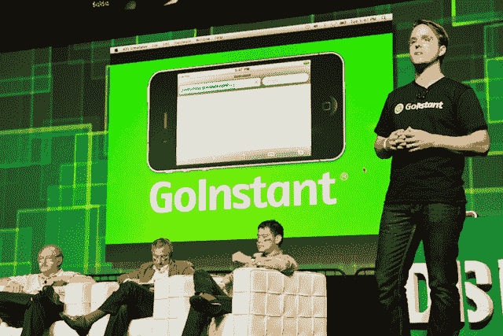
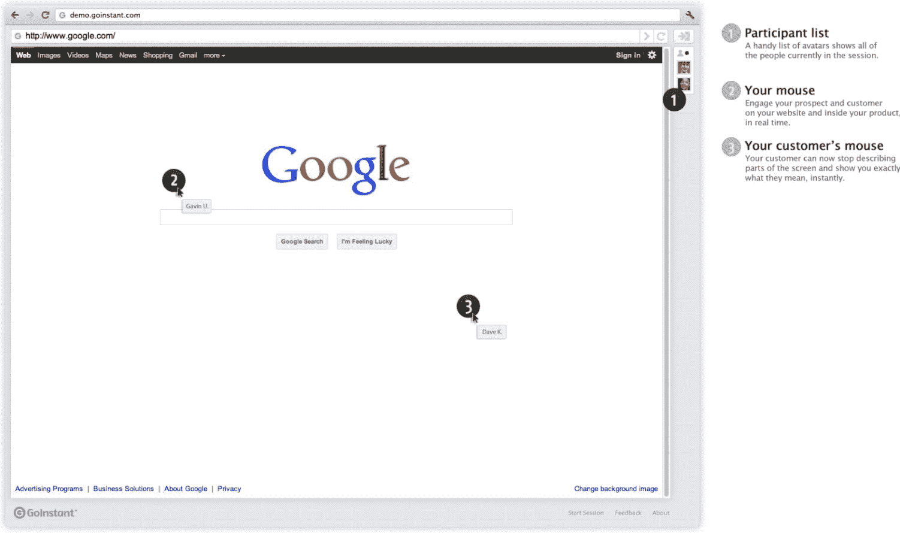

# GoInstant 是不下载的浏览器共享

> 原文：<https://web.archive.org/web/https://techcrunch.com/2011/09/13/goinstant-is-browser-sharing-with-no-downloads/>

创新的浏览器协作技术 [Go Instant](https://web.archive.org/web/20230307033218/http://website.goinstant.com/) 今天在 TechCrunch Disrupt 上发布了私人测试版，首次允许人们在无需下载额外插件或软件的情况下相互浏览网页。

无论您是在 Mac、PC、iOS、Android、Blackberry 等移动设备上，还是在任何其他网络浏览设备上，Go Instant 都可以让希望在给定 URL 上相互协作的用户共享链接并启动共同浏览会话。

联合创始人 Uhma 和 Jevon MacDonald 是技术领域的资深人士，曾在 Dachis Group 担任高级合伙人，Uhma 是社交游戏初创公司 little Social 的前首席技术官。使用 Node.js、Socket.io 和 Redis，Go Instant 不需要下载或任何特殊软件的事实非常重要。

联合创始人 Gavin Uhma 告诉我，该应用的消费者用例是软件即服务，简单和自动的共同浏览在公司范围的演示和客户支持中非常有用，“而不是向某人解释你的产品，你注册，登录，你可以向他们展示如何使用它，”Uhma 说。

Uhma 认为他的竞争对手是像 WebEx、join.me、Glance、GoToMeeting 这样的屏幕共享和协作工具，但他认为 GoInstant 的与众不同之处在于它是为 web 而不是为 PC 开发的；它的技术工作迅速，设计了全网页分辨率。

GoInstant 计划通过向公司收取每个用户每月的固定费用来赚钱。

该公司刚刚筹集了一轮巨额种子资金，他们今天也宣布了，来自 Freestyle Capital、Baseline Ventures、Greylock Partners、Social Leverage、Chamath Palihapitya、Ed Sim 和尤里·米尔纳的 170 万美元。

约西·瓦迪、马克·苏斯特、谷歌的陈德伟、Quora 的丽贝卡·考克斯等评委的提问，引发了“乔·格林”

MS: 我认为对你来说最重要的事情是弄清楚你的上市策略将如何运作

答:我们已经考虑过了。

**WC:** 我对此很兴奋，这是关于确定谁想使用它。我讨厌网络 Ex。

**答:**每个风投对 Web Ex 都是这么说的。

**AC:** 能说说接口吗？

答:我们真的希望尽可能简单。

JC: 我能屏蔽这项技术，让其他人无法加入吗？你是加拿大人吗？

**答:**您可以通过隐私控制等方式管理会话。是的，我是加拿大人。

**演示:**

**Backstage interview:**