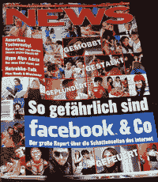

# 高盛指责媒体关注扼杀了其在美国脸书的上市 

> 原文：<https://web.archive.org/web/http://techcrunch.com/2011/01/17/goldman-facebook/>

# 高盛指责媒体的关注扼杀了其在美国脸书的上市

华尔街日报和*纽约时报*今天早上[报道](https://web.archive.org/web/20230203014153/http://www.techmeme.com/110117/p30#a110117p30)高盛已经决定限制其大肆宣传的高达[15 亿美元的脸书股票](https://web.archive.org/web/20230203014153/https://techcrunch.com/2011/01/02/facebook-50-billion/)的私人发行，仅面向国际投资者。

原因？1 月 2 日《纽约时报》的这篇文章引发了 SEC 的审查，这篇文章宣布高盛投资 4 . 5 亿美元，并为脸书创建了一个“特殊目的投资”工具。可以说，由于《纽约时报》的文章创造了参与私募发行的需求，这实际上可以被视为 SEC 的招揽行为。

在给《纽约时报》【安德鲁·罗斯·索尔金】的一份声明中，高盛[特别提到](https://web.archive.org/web/20230203014153/http://dealbook.nytimes.com/2011/01/17/goldman-limits-facebook-investment-to-foreign-clients/?emc=da)“强烈的媒体关注”是取消美国配售的动机。

> *“高盛最初打算在美国和海外向对脸书感兴趣的投资者进行私募。2011 年 1 月 2 日晚，在交易启动后不久，一篇文章发表后，该交易引起了媒体的强烈关注。鉴于媒体的密集报道，高盛决定只向美国以外的投资者进行要约*
> 
> *高盛得出结论，媒体关注的程度可能与美国法律规定的美国私募发行的适当完成不一致。不在美国继续进行的决定是基于高盛的唯一判断，而不是任何其他方的要求或请求。我们对这一决定的后果感到遗憾，但高盛认为这是最谨慎的选择。”*

尚不清楚如果高盛继续向美国投资者提供购买脸书股票的机会，而美国证券交易委员会发现其行为不当，比如向《纽约时报》泄露消息，会有什么后果。通过只在 SEC 管辖范围之外提供投资，高盛实际上规避了此类调查以及罚款或其他制裁的可能性。

过去，媒体对热门公司的报道已经引起了 SEC 监管机构的警惕，最引人注目的是谷歌在 IPO 前臭名昭著的[花花公子采访](https://web.archive.org/web/20230203014153/http://news.cnet.com/Google-says-Playboy-article-could-be-costly/2100-1030_3-5308657.html)。谷歌以每股 85 美元的价格上市。

图片: **[凯乐拉伯特](https://web.archive.org/web/20230203014153/http://www.flickr.com/photos/kellerabteil/)**