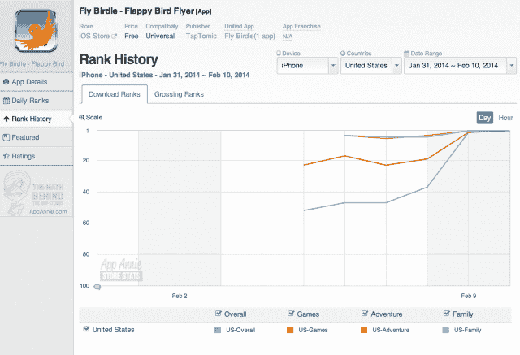
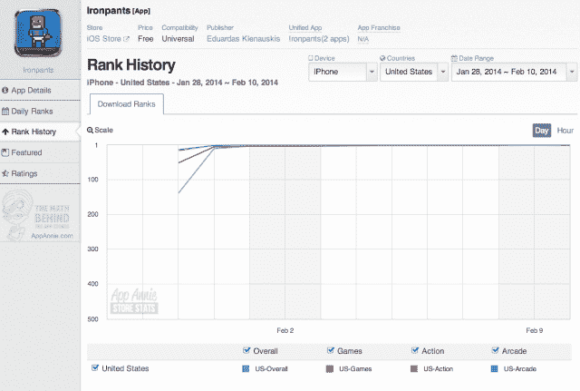
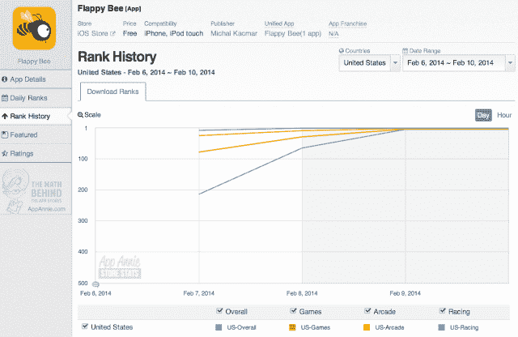

# 消失但未被遗忘:Flappy Bird 克隆版占据 App Store 排行榜 TechCrunch

> 原文：<https://web.archive.org/web/https://techcrunch.com/2014/02/10/gone-but-not-forgotten-flappy-bird-clones-fill-the-app-stores-top-charts/>

周日，Flappy Bird 的创作者 Dong Nguyen 可能已经从 App Store 和 Google Play 上撤下了他简单但令人抓狂的手机游戏，但这并没有阻止人们对这个看似不可能的小应用程序成功的兴趣——显然，成功对 Nguyen 来说太过强大。从那以后，这款游戏出现在许多地方，包括 [torrent](https://web.archive.org/web/20230206171412/http://torrentfreak.com/flappy-bird-piracy-surge-ok-to-download-it-off-the-pirate-bay-now-140210/) 网站、[在易贝上市的售价为 99999 美元的手机](https://web.archive.org/web/20230206171412/http://www.businessinsider.com/iphone-with-flappy-bird-selling-on-ebay-2014-2)(我不能相信那些是认真的出价)，在[任天堂](https://web.archive.org/web/20230206171412/http://blogs.wsj.com/digits/2014/02/10/no-complaints-about-flappy-bird-nintendo-says/?mod=WSJBlog)提供的一份声明中反驳了[关于他们应该为这款游戏的消亡负责的谣言](https://web.archive.org/web/20230206171412/http://www.iphonehacks.com/2014/02/flappy-bird-removed-app-store-nintendo.html)(阮抄袭《超级马里奥》的烟斗，真的没关系！)，以及其他地方。

但 Flappy Bird 游戏正式版的缺席也导致了几个潜在竞争对手和普通克隆产品的起飞，这些产品现在占据了 App Store 和 Google Play 的排行榜。(甚至[Pebble app store](https://web.archive.org/web/20230206171412/http://appadvice.com/appnn/2014/02/flappy-bird-might-have-left-ios-but-a-new-app-brings-him-to-the-pebble-watch)，我不骗你。)

iTunes 上的第 1、2、5 和 20 位分别是看起来像 Flappy Bird 的“飞行小鸟”、“铁裤”、“Flappy Bee”和“Flappy Plane”。他们是唯一上升到顶端的人。在 App Store 上搜索关键词“Flappy ”,会发现更多的开发者——现在总共有 81 个，并且还在增加——他们希望利用人们对这款游戏的浓厚兴趣。其中一些包括其他 Flappy Bird 的崇拜者，例如“Flappy Penguin”，而其他人只是用“Flappy”关键字填充不相关的应用程序，就像几个相机应用程序现在正在做的那样。

与 Flappy Bird 本身一样，克隆的图表显示了类似的令人印象深刻的增长趋势，这不是由机器人和付费下载驱动的(尽管有些人[不同意](https://web.archive.org/web/20230206171412/http://www.bluecloudsolutions.com/blog/flappy-birds-smoke-mirrors-scamming-app-store/))，而是病毒式增长的继续，这就是“2014 年 Flappy Bird 的惨败”

与此同时，在 Google Play 上，“铁裤”已经攀升至第 11 位，排在第 19 位的“笨鸟”之后。

现在的问题是我们对《T2》的痴迷会持续多久？这款应用登上 App Store 榜首是否预示着人们对任何人都可以花几秒钟时间玩的更基本的手机游戏的兴趣重新燃起？当然，这个问题可能只有到时候才能得到答案，但值得指出的是，Flappy Bird 本身可能已经进入了一个以前未得到充分服务的人群:拥有智能手机的儿童。

当 Nguyen 接受 TechCrunch 采访时，[他注意到了](https://web.archive.org/web/20230206171412/https://techcrunch.com/2014/02/01/developer-behind-flappy-bird-the-impossible-game-blowing-up-the-app-store-says-he-just-got-lucky/)，虽然他不知道他的应用程序是如何变得如此受欢迎的，但它在儿童群体中很受欢迎。“我的大多数球员都是在校学生，”他说。

随着越来越小的孩子拥有智能手机，这些智能手机被添加到家庭共享数据计划中，随着这些计划的成本也下降，Flappy Bird 可能是未来许多应用中第一个能够利用校园口碑的应用，就像之前的应用将目光投向大学校园一样。

在未来，“它在所有游乐场都很受欢迎”会成为新的“它在大学生中传播吗？”我想我们很快就会知道了。