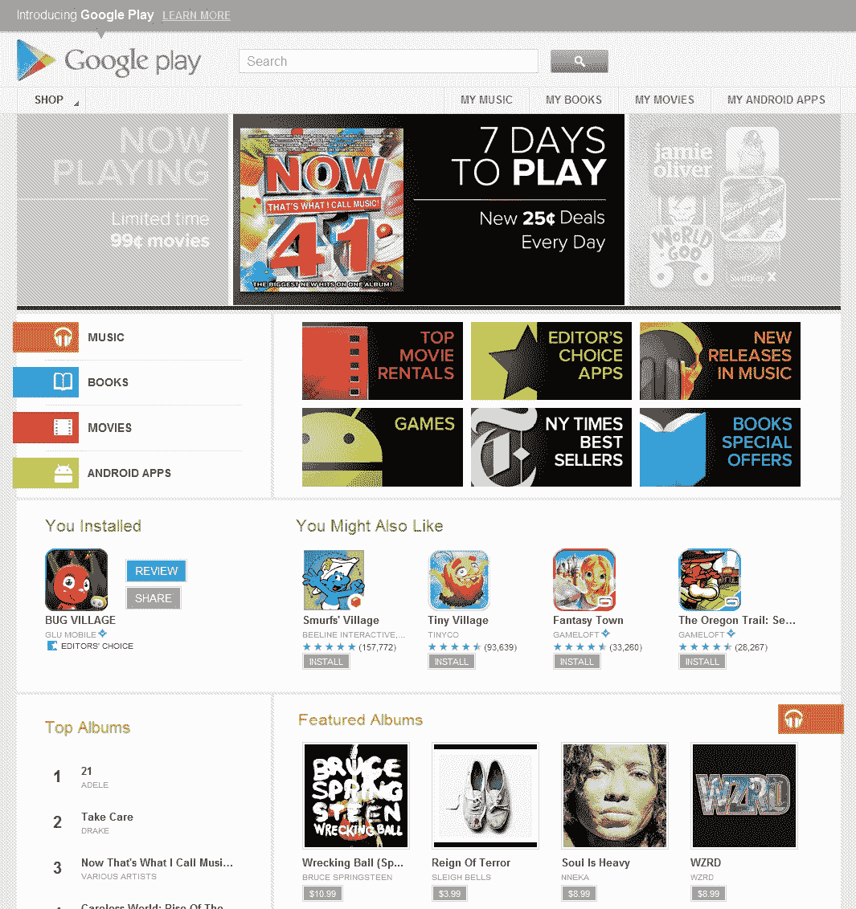

# 再见安卓市场，你好 Google Play | TechCrunch

> 原文：<https://web.archive.org/web/https://techcrunch.com/2012/03/06/goodbye-android-market-hello-google-play/>

过去一年左右，谷歌的安卓市场经历了一些巨大的变化。最初只是一个独立的应用程序商店，现在已经迅速发展到包括电子书、音乐、视频和视频，现在谷歌感觉“安卓市场”这个名字对他们真正想要提供给用户的东西限制太多了。

这也是谷歌正式停止使用 Android Market 名称的原因。从今天开始，谷歌的所有数字媒体服务都被重新命名为一个全新的品牌:Google Play。这是正确的小工具爱好者，尽管有一些令人愉快的新传言，Google Play 不是山景城的人们的新平板电脑，而是一个统一的品牌，旨在将该公司的数字媒体服务捆绑在一起。

据谷歌工程总监克里斯·耶加(Chris Yerga)称，更名是谷歌考虑了很长时间的事情，但该公司认为这是扣动扳机的“自然时机”。

谷歌已经花了好几个月的时间将 Android Market 打造成了一个数字媒体中心，但是不断地使用 Android 这个名字似乎导致了一些用户的排斥感。从谷歌租借电影、购买音乐或浏览电子书的过程并不要求任何感兴趣的人实际拥有一台 Android 设备。用户的所有相关媒体都存储在谷歌庞大的云中，可以通过普通的网络浏览器访问，谷歌希望通过新的 Google Play 品牌来实现这一点。

随着品牌重塑的开始，你会看到谷歌大部分新的修饰努力都在网络上发挥作用。Android Market 网站已经进行了彻底的修改，更加强调谷歌为用户提供的其他数字媒体——不再占据页面顶部容易错过的小标签，谷歌图书、音乐和视频子部分的链接和相关优惠现在占据了眼睛水平的黄金区域。

这并不是说变化不会发生在你选择的 Android 设备上。古老的 Android Market 将被重新命名为谷歌 Play 商店，而类似的名称变化也将对谷歌的一系列播放应用程序生效——例如，谷歌音乐应用程序现在将被称为谷歌播放音乐。很简单，对吧？按照通常的谷歌方式，受影响应用的更新将于今天上线，并将在未来几天继续推出。

就设备方面的变化而言，差不多就是这样了——自从最近的设计变化生效以来，Android 用户已经能够从 Android Market 应用程序中访问谷歌的图书、电影和歌曲目录。

这种对联合谷歌网络数字媒体服务的新关注强调了这家搜索巨头希望传达的一个关键概念——他们创造的媒体生态系统不仅仅是针对 Android 设备，而是针对所有类型的用户。耶加告诉我，谷歌推出 Google Play 的目的不仅是打破谷歌内容类型的“孤岛”，而且是“打破内容消费和商店体验之间的壁垒。”遗憾的是，目前还不知道像谷歌电视(或者目前正在测试的神秘的谷歌家庭盒子)这样的设备是否能够享受新的 Play media hub。

您使用 Google Play 的体验也会因您所在的位置而异。谷歌官方博客称:

> 在美国，音乐、电影、书籍和 Android 应用程序都可以在 Google Play 中使用。在加拿大和英国，我们将提供电影、书籍和安卓应用；在澳大利亚，书籍和应用；而在日本，电影和应用。在其他地方，Google Play 将成为 Android 应用的新家。