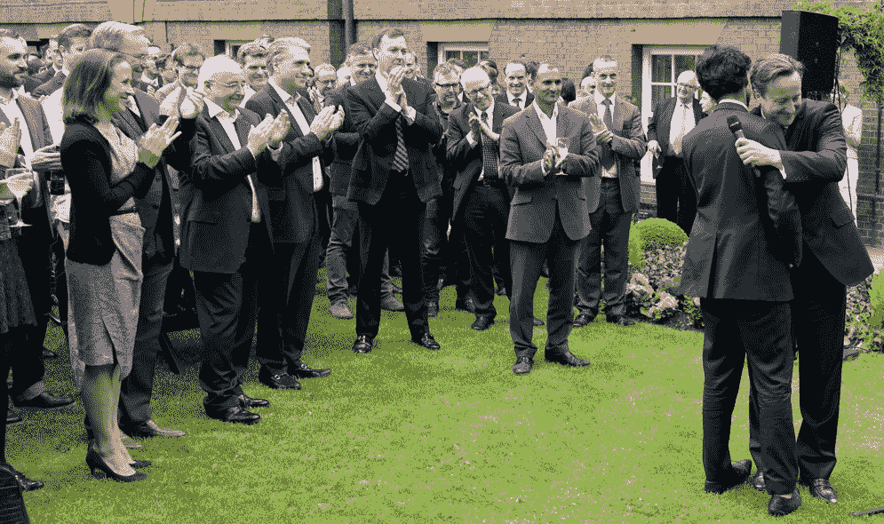
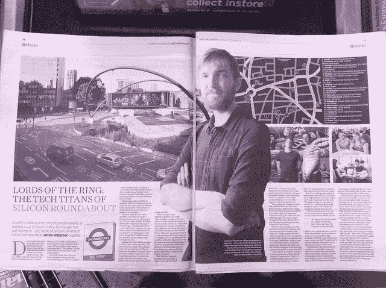

# 再见，席尔瓦先生——东伦敦“科技城”简史

> 原文：<https://web.archive.org/web/https://techcrunch.com/2013/07/05/goodbye-mr-silva-now-its-time-to-test-tech-city-yourself/>

那是 2009 年 12 月，我正前往唐宁街 10 号参加圣诞派对。对我来说，这不是一个正常的日记约会。在伦敦之外的 TechCrunch 工作两年后，事实证明，要吸引政府官员关注科技企业家和初创公司的问题，比我想象的要难。尽管[绑架了文化部长的推特账户](https://web.archive.org/web/20221208210147/https://beta.techcrunch.com/2008/12/29/i-stole-the-culture-secretarys-twitter-account/)。我猜 Twitter 在 2009 年还不够大。

这不完全是一个技术大人物的事件。时任首相戈登·布朗的妻子莎拉·布朗举办了一场名为[“唐宁街”](https://web.archive.org/web/20221208210147/http://www.dailymail.co.uk/news/article-1168630/PMs-wife-Sarah-Downing-Tweet-joins-Twitter-craze.html)的派对，这是一场由英国顶级推特用户主导的活动，他们中的许多人支持布朗夫人的慈善努力。我以为我是第一个在推特上透露消息的后来到这里的，而不是就为什么英国自己还没有产生新一波社交媒体的类似科技巨头发表我的看法。

这是一个很棒的聚会，充满了有趣的人。后来，任何来自技术社区的流浪儿和流浪儿都去了对面著名的红狮酒吧。但是，第二天带着轻微的宿醉醒来时，我在想，除了邀请著名的推特用户去唐宁街 10 号，我们是否还能有所进展。

回到 2009 年，尽管有一些断断续续的尝试来支持英国蓬勃发展的科技初创企业，包括为访问硅谷的[“web mission”](https://web.archive.org/web/20221208210147/https://beta.techcrunch.com/2008/04/25/webmission-thats-a-wrap/)企业家举办的招待会(其中有明星，他们后来成为英国巨大的成功故事，如 [Huddle](https://web.archive.org/web/20221208210147/http://huddle.com/) 和 [Skimlinks](https://web.archive.org/web/20221208210147/http://skimlinks.com/) ),但在某个政府办公室为推特用户举办的聚会似乎是大多数科技初创企业在那个时候能够获得的最多认可。政府似乎只有在签发大型公共部门合同时才会遇到科技公司，这些合同通常由三家公司中的一家赢得。

前一年，工党政府的文化大臣(我偷了他的推特账户)着手监管网站内容，甚至加强英国对网络诽谤的铁腕法律。我们看到的不是鼓励创业创新，而是通常由游说推动的立法，比如由大型唱片公司和老式科技企业推动的数字经济法案(也碰巧得到了保守派的支持)。

曾经有一些令人鼓舞的迹象——有一个重大的政策转变，转向[开放政府数据和更快的宽带](https://web.archive.org/web/20221208210147/https://beta.techcrunch.com/2010/03/22/gordon-brown-launches-big-shift-to-open-gov-data-and-broadband-but-wheres-the-detail/)——但当时的首相，工党的戈登·布朗，似乎更喜欢一种“自上而下”的技术政策方法，而不是支持科技创业的法律。

2010 年 3 月，布朗首相宣布成立[网络科学研究所](https://web.archive.org/web/20221208210147/http://www.wired.co.uk/news/archive/2010-03/22/gordon-brown-announces-institute-of-web-science)，该研究所将由网络的创造者蒂姆·伯纳斯·李领导。

好吧，我想，这很了不起。但焦点仍然是从上而下颁布法律，而不是参与正在基层发生的革命——并且很少支持科技企业家。

不管出于什么原因——尽管选举即将到来——工党政府似乎对东伦敦创业公司的繁荣不感兴趣，这种现象在 2008 年夏天开始逐渐出现。

等到大选的时候，他们这样做已经太晚了。新的保守党/自由民主党联盟赢得了选举，工党错过了获得蓬勃发展的科技行业支持的机会。

随着保守党和自由民主党组成全新的联合政府，随着经济陷入困境，政府似乎不会把重点放在相对富裕的科技行业，而是专注于拯救国家免受经济灾难。

但是，仅仅过了三年，英国的科技领域已经得到了比推特派对更多的认可。

这在很大程度上要归功于一个人的努力，Rohan Silva(见上图)。

总理的高级政策顾问上周离开之前，在唐宁街 10 号的玫瑰花园举行了一场派对，并举行了最后一场“科技城”早餐会(应该注意的是，“科技城”这个词在席尔瓦到来之前从未被提及，但后来有了更多的说法)。

尽管毫无疑问，当一位特别顾问(或 SpAd)离开时，唐宁街 10 号会发生很多这样的事情，但这一次可能与众不同。毕竟，有多少公务员能吸引谷歌(Google)的埃里克·施密特(Eric Schmidt，见下图)参加他们的离职酒会？

在过去的三年里，席尔瓦无疑是英国政府对科技创业企业家群体态度巨变的主要设计师。他的离开为我们提供了一个机会，来分析我们现在所处的位置、已经取得的成就以及还需要做些什么。

故事从 2008 年开始。

那个夏天，随着旧的“Web 2.0”运动的果实开始成熟，新的创业项目层出不穷。寻找廉价办公室的伦敦科技创业公司被吸引到了肖尔迪奇的旧工业建筑，还有前几年搬到那里的许多创意机构和艺术家。该地区曾是第一次互联网繁荣的发源地。

Dopplr 搬迁到位于城市路 100 号的 Moo 工作室的分租公寓，直接俯瞰环岛。这是著名的巨大的环球屋，因为要重新开发，所以租金很便宜。周五晚上在附近的 Last FM 和 Moo 有定期的屋顶烧烤。

[和朋友](https://web.archive.org/web/20221208210147/http://gigaom.com/2012/12/11/how-londons-silicon-roundabout-really-got-started/)聊起这个地区， [Dopplr](https://web.archive.org/web/20221208210147/http://dopplr.com/) 的首席技术官 Matt Biddulph 想出了这条推文:“[“硅环岛”:伦敦老街地区不断增长的有趣的初创公司社区](https://web.archive.org/web/20221208210147/https://beta.techcrunch.com/2008/07/30/so-where-are-londons-existing-organic-techhubs/)”。

在许多转发表明社区的认可后，他和其他人开始向任何愿意听的人，尤其是媒体，宣传东伦敦的科技创业公司。

两天后，在颇具影响力的创始人理查德·莫罗斯(Richard Morross)举办的一场 [Moo](https://web.archive.org/web/20221208210147/http://moo.com/) 夏季派对上，随着音乐和饮料的流动，Biddulph 向英国《金融时报》记者讲述了这个想法，以及他将为该地区所有初创企业制作的谷歌地图。

几天后，故事开始了。当然， [TechCrunch 和许多其他网站一样报道了这件事。很久以后，连线](https://web.archive.org/web/20221208210147/https://beta.techcrunch.com/2008/07/30/so-where-are-londons-existing-organic-techhubs/)[创建了自己的地图](https://web.archive.org/web/20221208210147/http://www.wired.co.uk/magazine/archive/2011/02/start/silicon-roundabout?page=all)。一个可定义的社区诞生了。

一年过去了。其他公司被吸引到这个地区…

在此之前很久，2006 年，在联合政府接管之前，Rohan Silva 是财政部的政策分析师。一天，乔治·奥斯本(当时的影子大臣)带他出去喝咖啡，并邀请他加入自己的团队。“但我不是经济学家，”席尔瓦抗议道。“没关系，我也不是，”奥斯本反驳道。

这是一个偶然的时机。席尔瓦已经开始意识到科技行业对经济的影响越来越大，事实也开始显现出来。波士顿咨询公司(Boston Consulting)的数据显示，互联网经济对英国 GDP 的贡献接近 8%，高于 20 国集团中的任何一个国家。席尔瓦对[行为经济学](https://web.archive.org/web/20221208210147/http://en.wikipedia.org/wiki/Behavioral_economics)也很感兴趣，行为经济学可以引导社会朝着某个方向前进，而不是通过立法来控制。

选举后，在一个关键时刻，席尔瓦与杰里米·亨特(当时新任文化、媒体和体育大臣)一起前往硅谷和谷歌总部 Googleplex。此行旨在达成几周之后首相可能宣布的一些重大投资交易。在与埃里克·施密特和尼科什·阿罗拉会面后，谷歌同意在伦敦东部创建谷歌园区。这一时刻的无名英雄是安尼尔·汉斯吉，他当时是谷歌在伦敦的并购负责人。汉斯吉一直在内部推动这个想法，直到最终获得一栋大楼的 10 年租约(他后来离开，成为一名独立投资者)。

 同样影响这项新政策的还有来自伯格创新工作室的[马特·韦伯。他是那些(可以说是主要的一个)帮助](https://web.archive.org/web/20221208210147/http://berglondon.com/studio/matt-webb/)[论证](https://web.archive.org/web/20221208210147/http://gigaom.com/2012/12/11/how-londons-silicon-roundabout-really-got-started/#comment-1243672)新技术浪潮的人之一，更重要的是，他一直在推动东伦敦令人着迷的创业集群[。他和政府部长们、席尔瓦一起去了印度，并且](https://web.archive.org/web/20221208210147/http://berglondon.com/blog/2009/05/12/stories-about-silicon-roundabout/)[不停地谈论硅环岛](https://web.archive.org/web/20221208210147/http://berglondon.com/blog/2010/08/02/india/)。在早期，琼斯是席尔瓦在这一新兴领域的“内应”。还有其他的局外人，包括，我的罪过，我。

一年前[我一直在为某人竞选](https://web.archive.org/web/20221208210147/https://beta.techcrunch.com/2008/07/29/starting-the-campaign-for-the-techhub/)——任何人！–在伦敦东部建立一个共同工作空间，作为帮助初创公司和企业家起步的辅助项目。在我看来，有太多的事件，但没有足够的偶然时刻，技术人员可以简单地走进彼此，创造东西，就像他们在硅谷和旧金山所做的那样。我们需要一个属于自己的空间。

由于对这方面没有什么进展感到沮丧，我于 2009 年开始与朋友伊丽莎白·瓦利(Elizabeth Varley)一起研究这个想法。它最终在 2010 年夏天发布(T2 tech hub，这就是我宣布的兴趣所在)。在敲开大门以吸引兴趣和支持的过程中，我们去见了一些政府官员，但是 2009 年的对话毫无进展。我们继续说，认为科技不是政府的优先事项，就像其他政府对待科技一样。应该由私营部门来解决这个问题。

到 2010 年夏天，TechHub 在老街环岛上找到了一个空间[。与此同时，企业家查尔斯·阿姆斯特朗(Charles Armstrong)将他的蹦床系统办公室改造成了一个合作空间，即蹦床](https://web.archive.org/web/20221208210147/http://london.techhub.com/directions/london-city-road/)。大约在同一时间，伦敦黑客空间从在旧柴郡奶酪酒吧见面转变为在克雷默街开设黑客空间。事情开始好转了。

10 年的那个 10 月，我在 TechHub 工作，一个家伙打电话来。

“我能过来和你们谈谈吗？”他在纽约的一条爆裂声线上说。第二周，被借调到唐宁街 10 号[担任助手的蒂姆·卢克从希思罗机场红眼航班上直接飞来。为了保持清醒，他一口气喝下几杯咖啡，盘问了我们和他能找到的每一位创业创始人大约 4 个小时。然后他消失了。](https://web.archive.org/web/20221208210147/http://www.newstatesman.com/blogs/the-staggers/2011/03/policy-advisers-cameron)

接下来发生的事情让我们中的很多人都非常惊讶。2010 年 11 月 4 日，许多人被邀请到东伦敦的一个地方(杜鲁门啤酒厂)。

首相戴维·卡梅伦(David Cameron)上台宣布了一系列计划来认可伦敦日益壮大的科技初创企业群体以及东伦敦科技产业集群，这种兴奋是显而易见的——但更重要的是，采纳新的创业签证和一系列新举措等政策理念。

他的演讲——由席尔瓦广泛参与——有效地表达了科技企业家的语言。初创公司的创始人甚至被邀请发言。来自[预订臭虫](https://web.archive.org/web/20221208210147/http://bookingbug.com/)的格伦·肖史密斯，他谈到了向中小企业开放政府采购的必要性(这一点后来在实际的政策中出现)，以及来自[社会集团](https://web.archive.org/web/20221208210147/http://socialgo.com/)的史蒂夫·坚硬人，他谈到了在早期融资方面采取行动的必要性——这一举措后来为广受赞誉的 EIS / SEIS 税收改革提供了信息。

可以公平地说，科技初创企业群体中的许多人都被这一系列举措冲昏了头脑。这一点，以及相当令人满意的认识，即任何人都注意到东伦敦的科技领域正在发生一些令人兴奋的事情。

当然，似乎科技初创企业领域的每一个事件和网络专家都突然转向东方。

继迷你酒吧和 T2 技术中心的开拓性努力之后，该地区涌现出许多其他事物，如脸书开发者的车库伦敦、黑客新闻伦敦和大型社区活动，如 Moo 年度夏季派对。随着 TechHub 和 Trampery 的出现，Moshi Monsters 的 Michael Acton Smith 开始了 [Silicon Drinkabout](https://web.archive.org/web/20221208210147/http://silicondrinkabout.com/) (现在仍在继续)，后来出现了多个事件和组织，包括: [Techpitch4.5](https://web.archive.org/web/20221208210147/http://www.4pt5.co.uk/) 、[天使在城市](https://web.archive.org/web/20221208210147/http://www.cityoflondon.gov.uk/business/support-promotion-and-advice/supporting-small-businesses/accessing-finance/Pages/Angels-in-the-City.aspx)、[City meet Tech](https://web.archive.org/web/20221208210147/http://citymeetstech.com/)、 [ProductTank](https://web.archive.org/web/20221208210147/http://www.producttank.com/) 、 [Lean Startup London](https://web.archive.org/web/20221208210147/http://www.meetup.com/the-london-lean-startup-group/) 、[大会](https://web.archive.org/web/20221208210147/https://generalassemb.ly/london)、[创新仓库](https://web.archive.org/web/20221208210147/http://www.innovationwarehouse.org/)、

当然，正如 TechCrunch [在](https://web.archive.org/web/20221208210147/https://beta.techcrunch.com/2008/07/30/so-where-are-londons-existing-organic-techhubs/)上看到的那样，首相出现在“硅转盘”上也有积极和消极的影响。一方面，它将揭露一场看似——直到那时——令人兴奋的私人派对。但另一方面，它使整个运动成为主流。

最终，这是“一件好事”——科技初创企业家突然得到了他们应得的认可。在互联网泡沫破灭的低迷之后，科技股被允许再次降温。在一个很多人——其中很多是年轻人——都在找工作的时代，有一群人实际上在创造新的高技能工作。

虽然在早期并不明显，但席尔瓦是这一新方法的幕后黑手这一点逐渐变得清晰起来。在包括[约翰·吉布森](https://web.archive.org/web/20221208210147/http://uk.linkedin.com/pub/john-gibson/14/54b/b38)、[乔纳森·勒夫](https://web.archive.org/web/20221208210147/http://luff.co/)和[基兰·库马里亚](https://web.archive.org/web/20221208210147/https://twitter.com/kkumaria)在内的得力团队的支持下，席尔瓦推进了议程(这四人后来都去了私营部门)。

就在首相演讲后一天左右，在一次匆忙召集的“早餐会”(没有早餐，只有咖啡和茶)上，席尔瓦在唐宁街 10 号著名的内阁会议室主持了一次会议，与会者包括一些英国领先的风投公司、主要的科技公司和来自东伦敦集群的四名代表。鞋匠、瓦利、克里斯蒂安·阿勒特(经营迷你酒吧，相当于伦敦的纽约科技聚会)和我自己。

很快就清楚了，席尔瓦是极其认真的。总理的声明不会成为泛媒体事件中的一个亮点，议程会转移到其他地方。他们真的打算做这件事。

没有派对，没有新闻发布会，什么都没有。他们实际上打算用这个想法来立法。

在接下来的几个星期和几个月里，早餐持续不断。它们变大了。更多的科技和东伦敦的利益相关者出现了。更大的科技公司。金融机构的代表，平方英里。几乎所有的大佬都被邀请了。

几乎每一次，席尔瓦都在那里，主持对话，当问到有争议的问题时，从不回避话题——比如为什么初创公司仍然很难在该地区快速安装宽带。在那些早餐会上，席尔瓦经常第一个站出来痛斥英国电信公司的糟糕代表。

他推动了科技城投资机构的创建，并引进了一位有证可循的企业家埃里克·范德克莱伊(Eric van der Kleij)领导该机构。

这并非没有争议。对一些批评者来说，这看起来像是政府试图将“硅环行交叉口”(本身就是一个从社区中召唤出来的短语)的有机增长归功于政府，并浪费了它本没有的钱。其中最大声疾呼的是记者米洛·伊安诺普洛斯。这些批评者批评说，TCIO 200 万英镑的预算实际上是一家公关公司，因为这个集群不含任何实际的硅或硬件，不像非常成功的剑桥集群，像苹果手机芯片制造商 ARM Holdings 这样的公司崛起了。集群也只产生了一个相当大的出口，即 Last.fm 到 CBS。以这种方式吸引人们对一个集群的关注真的可以持续吗？

但是，确实发生了一些很明显引起媒体兴趣的事情。以前公开的秘密——至少在极客中——现在已经泄露了，一些英国最聪明、最有远见的企业家被关在伦敦这个相对较小、肮脏的地方。

原来 Last.fm 的故事，一位创始人为了省钱，睡在办公室屋顶的帐篷里，后来被哥伦比亚广播公司收购；或者是多普勒的故事，与 TweetDeck 和 Moo.com 一起在旧的 Transworld House 大楼里闲逛，面对着老街环岛，这不仅仅是昙花一现。环形交叉路口已经举办了伦敦最大的开发者大会(2010 年迷你酒吧有 3000 名会员，现在会员人数增加了一倍)，并涌现出许多合作空间和新公司。比赛开始了。

出现在这个领域，或者后来被吸引进来的是诸如 7digital、AMEE、Conversocial、Duedil、GroupSpaces、Huddle、Mendeley、Moshi Monsters、Mixcloud、Peer Index、Skimlinks 和 Songkick 等公司。此后，至少有五家被认为是未来的首次公开募股。几乎所有的公司都发起了多次风险投资。一些公司，如门德尔利，正在以数亿美元的价格离开 T2。Songkick 接着为伦敦(也可能是英国)有史以来最大的科技初创公司举办了招聘活动:[硅谷](https://web.archive.org/web/20221208210147/http://www.siliconmilkroundabout.com/)。

“硅环形交叉路口”正在成为一个媒体轰动。那么，为什么政府开始坚持称它为“科技城”？“科技城”这个词是从哪里来的？

当我们第一次听到它时，我们这些在技术领域的人往往会感到恐惧。“硅环岛怎么了”我们想？！

让我们听听 Silva 自己的看法:“我觉得‘Silicon round about’是 Old St 周围企业的一个很好的昵称，但我们需要一个正式的集群名称，作为一个整体，抓住我们对该地区的全球雄心(并且在海外也容易理解)。此外，我相信，随着时间的推移，该集群将发展到远远超出旧的 St 环岛震中，因此，该集群有一个超越狭窄地理区域的标题是很重要的。在与各种技术人士(如硅城、硅肖尔迪奇)讨论了其他建议后，我决定选择科技城。

无论是哪种情况，有一个组织——TCIO——为集群中的科技创业公司摇旗呐喊，需要一个人们一口气“得到”的名字，这一点变得很明显。解释“硅转盘”是由 Dopplr 首席技术官 Matt Biddulph 在 2008 年的一次 Moo 聚会上创造的，被转发了很多次，并出现在一些 t 恤上，这不会太复杂。这个短语说的是技术，它说的是城市。它不需要更多。

但是这个短语有三方面的影响。这让当地人非常困惑，他们突然认为这些科技城政府的人是来“帮助”他们的(不寒而栗！)或者对他们吠叫命令。

事实上，在 UKTI 和英国驻外使馆的大力支持下，科技城及其为数不多的员工开始吸引游客。很多人。各国代表团开始陆续抵达，尤其是美国。他们会去寻找闪闪发光的技术大楼——相反，他们看到的是肮脏的肖尔迪奇背街小巷和沐浴在条状灯光下的创业办公室。埃里克和他的团队以非常英国的方式继续前进。在剑桥展示其“硅沼”的地方，科技城的人们展示了由企业家和工程师建立的 SAAS、消费移动、企业和金融科技初创公司的快速发展，他们白天将平板电脑沉入水中，晚上将肖尔迪奇的酒馆和酒吧挤满。

不管是否有人喜欢这个想法，只要有一个名为“科技城”的“地方”可以参观，总理就可以将媒体的搜索光转向科技创业的整个主题，出现在共同工作空间并召开圆桌会议。这正成为政治信号的一个案例研究。

突然之间，在多年被贴上仅仅是极客的标签后，初创公司的创始人[看起来非常炙手可热](https://web.archive.org/web/20221208210147/http://www.flickr.com/photos/mbites/6269197671/)，并吸引了主流报纸的[双页版面](https://web.archive.org/web/20221208210147/http://www.flickr.com/photos/mbites/6199788657/)。

它是否有助于唤醒英国的观念，即科技和工程可以再次变得性感，就像维多利亚时代一样？伊桑巴德·金德姆·布鲁内尔是他那个时代的偶像吗？不会有伤害的。[2010 年的电影《社交网络》](https://web.archive.org/web/20221208210147/http://en.wikipedia.org/wiki/The_Social_Network),帮助支持了任何人都可以加入这场运动的想法。英国正忙着创造自己的英雄。

**科技城木马**

主要的缺点是认为科技城几乎独立于伦敦本身。许多初创公司的首席执行官向我抱怨说，他们受到了歧视，因为他们没有 EC1 或 EC2 的邮政编码。这是完全正确的——为什么要这样对待他们？认出这个地区的意义在于，它过去是、现在也是伦敦本身的一个大集群——肯定是最大的集群，但绝不是唯一的集群。

但话说回来，在某个特定领域零增长显然有外部营销优势。不管席尔瓦是否是这样计划的，整个科技城的表演更像是特洛伊木马——打开对话大门的一只脚。

这个名字被证明是一个足够宽泛的短语，不仅可以作为伦敦最大的新浪潮科技创业公司集群的展示，也可以作为更广泛的伦敦和英国科技场景本身的一个开端。

在“科技城”的幌子下，企业家们突然发现自己能够直接与政策制定者对话。

席尔瓦成立了科技城顾问团，其中包括迈克尔·阿克顿·史密斯(MindCandy)、艾琳·伯比奇(Passion Capital)、雪莉·库图(天使投资人)、伊恩·霍加斯/佩特·史密斯(Songkick)、罗宾·克莱因(Index Ventures)、迈克·林奇(Autonomy)、理查德·莫罗斯(Richard Moross)、乔安娜·希尔兹(脸书)、雷什玛·索霍尼(Seedcamp)等重量级人物。你可以想象他们向他灌输了什么样的思想——值得称赞的是，他听从了。

让创业企业家更接近政府核心的举措在欧洲背景下并非没有意义。

2011 年夏天，在巴黎匆忙召开的“八国峰会”上，席尔瓦在英国大使官邸为英国企业家举办了一场派对。

一些羞怯的巴黎科技企业家出现了，他们抱怨说，一周前，他们自己的政府疯狂地四处奔走，因为他们不知道可以邀请哪些法国科技初创公司，或者“ [Silicon Sentier](https://web.archive.org/web/20221208210147/http://siliconsentier.org/?lang=en) 是一条充满初创公司的街道(过去是，今天也是，尽管法国政府希望将它搬到[其他地方](https://web.archive.org/web/20221208210147/http://www.rudebaguette.com/2012/10/11/paris-capitale-startup/)。

回到伦敦，在席尔瓦策划的第 10 届科技城早餐会上，企业家们传达了伦敦市中心的宽带问题、天使投资的问题以及雇佣欧盟以外人员的问题。你真的不能让他们闭嘴。

突然间，科技企业家——就像从木马涌入特洛伊的希腊人——被允许进入英国政府决策部门的核心。这几乎肯定会直接或间接地导致国家政策的改变，而席尔瓦不失时机地提出了一系列政策倡议。事实上，首相对他的昵称是“大火箭筒”——他可以向问题开火来解决问题的人。

一年之内，英国[击败美国，获得了对企业家友好的创业签证](https://web.archive.org/web/20221208210147/https://beta.techcrunch.com/2011/03/17/uk-beats-the-us-to-a-tech-friendly-startup-visa/)(2011 年 3 月)，谷歌[在伦敦开设了世界上第一个校园](https://web.archive.org/web/20221208210147/https://beta.techcrunch.com/2012/04/01/fragmentation-open-source-buzzwords-for-android-and-also-googles-latest-effort-google-campus/)(2012 年 4 月)，亚马逊和脸书开始行动[将工程师领导的实验室](https://web.archive.org/web/20221208210147/https://beta.techcrunch.com/2012/07/23/amazon-just-put-a-rocket-under-londons-biggest-tech-startup-cluster/)带到该地区(2012 年 7 月)。

对于一个习惯于只有挤满广告人的销售办公室，而真正的编码在其他地方完成的城市来说，这是一个大新闻。

这还不是全部。对天使投资(EIS / SEIS)有新的税收减免，企业家减免，对加入初创企业的员工征收 10%的营业税；向高增长技术公司开放伦敦公共市场的举措(与伦敦证券交易所合作)；取消目标市场的印花税；向中小企业开放政府信通技术合同；创建英国的开放数据议程；英国知识产权制度的改革；以及其他几个倡议，如英国的生命科学战略。事实上，其中大部分是由席尔瓦驾驶的。

在奥运年，这种对技术的重视并没有减弱，政府为游客举办了一场创新会议，游客只需步行就能到达备受追捧的沙滩排球场。科技城的早餐源源不断。

最终，2012 年 10 月到来，范德克莱齐离开了。几个星期以来，那里唯一的声音是本·索思沃斯，一个热情的码头工人，他在这个地区举办了很多活动，并且与开发者社区有着良好的关系——但是这个组织需要一个更引人注目的人，他可以与大工业对话。

席尔瓦显然打开了一个浩繁的联系簿，并拉拢一个大人物加入该项目:即脸书在欧洲的首席执行官乔安娜希尔兹。

 希尔兹[曾是以 8.5 亿美元将 Bebo 卖给 AOL 的破解团队](https://web.archive.org/web/20221208210147/https://beta.techcrunch.com/2010/06/17/bebo-the-great-rock-n-roll-swindle-or-aols-screw-up/)的一部分。

希尔兹也有着优秀的硅谷血统。她曾是 Veon(已被飞利浦收购)的首席执行官，加入 RealNetworks，先后担任过谷歌的 EMEA 董事总经理、美国在线的人力资源网络主管，后来被雪莉·桑德伯格聘为脸书在欧洲的负责人。诚然，希尔兹搬到科技城是在脸书上市之后，但这仍然是一个巨大的成功。这意味着科技城地区拥有欧洲其他政府举措所不具备的东西——一位名片式企业家和一位经验丰富的科技高管，他的人脉广得令人垂涎。

因此，当罗汉席尔瓦(Rohan Silva)上周在一个阴云密布的夏日在唐宁街 10 号(10 号)的玫瑰园发表告别演讲时，即便是对最严厉的批评者来说，英国的科技创业状态似乎也取得了不少成就。

**不利的一面**

当然，并非一切都是固定的。

席尔瓦，科技城和政府的倡议的批评者说，一些问题仍然存在。当涉及到实际问题时，从欧盟以外(即美国)雇佣员工的企业家签证就没那么有用了——尽管围绕这个问题的地缘政治超出了科技行业。

在这一点上，席尔瓦简单地告诉我:“与我认识的年轻以色列企业家交谈，他已经能够通过企业家签证进入英国，你会看到它带来的变化。”

一项由政府支持的 5000 万英镑的基金用于重建旧的街道环岛，看起来资金严重过剩。目前还没有定论，但大多数人认为，这些资金会得到更好的利用，或许会用在一个能够吸引大型科技会议和活动的世界级会议场所(伦敦的任何人都会告诉你，Excel centre 太远了，没有任何特色)。

席尔瓦说:“钱不是用来堵路的。它将为科技城创造一个市民空间，其中将包含个体初创企业负担不起的设施——包括 3d 打印实验室、教室和礼堂。把它想象成一个打了兴奋剂的谷歌校园——它将像校园一样，对科技城经济和社区的发展起到催化作用。”不幸的是，这听起来太像重复了。谷歌校园和该地区的许多合作空间可能对此有所表示。

特别是[种子企业投资计划(SEIS)](https://web.archive.org/web/20221208210147/http://www.hmrc.gov.uk/seedeis/) 已经释放了一波天使投资者，他们已经意识到 SEIS 几乎完全消除了他们投资的风险。大多数人认为这是一个积极的举措。然而，对该计划的批评——它的低水平——15 万英镑的上限可能意味着，许多符合条件的初创公司最终可能因他们想要推出的产品而资金不足。当然，这完全取决于投资者如何部署该计划——但我采访过的大多数投资者都支持该计划。

左倾的 DEMOS 智库在一份报告中批评了科技城倡议，称初创公司“受挫”，一些政策适得其反。

事实上，一些年轻的初创公司因为租金上涨而搬出去，这可能是席尔瓦玩过头了的一个迹象。该地区的房东当然很高兴受到关注。虽然，随着英国经济现在显示出复苏的迹象，位于富裕的平方英里以北的廉价办公室总是有被更大的公司，金融和技术公司盯上的危险。

席尔瓦称这是“对科技城办公空间更高需求的一个迹象，因为越来越多的公司希望搬到那里，类似于旧金山的趋势。我们已经做了大量工作来帮助初创公司获得他们需要的空间，从将谷歌园区搬到东伦敦，到支持共享工作空间的增长。”

谷歌校园自己调查了自己的进展，发现它现在容纳了 100 多家初创公司，其中四分之一搬到了更大的房子里。

尽管剑桥集群有自己的 Fab labs 和 ARM，但“科技城”仍需要证明，它可以打破通常专注于应用程序而不是全球改变游戏规则的平台的集群——尽管 Huddle、Moshi、Moo、Import.io 和 Songkick 等公司显然也在努力。

让亚马逊、脸书和谷歌开设工程办公室是个好主意吗？他们会简单地用更高的薪水从初创公司中吸引人才吗？2013 年，现在说还为时过早。至少，我们可以希望一些惊人的人才能够双向流动，并有望流向初创企业。

然后是有争议的数字。科技城表示，三年前，东伦敦大约有 100-200 家科技公司。他们表示，截至 2013 年 1 月，伦敦东部有 1300 家科技公司，去年前 9 个月，伦敦有 9.2 万平方米的房地产被科技、媒体和通信初创企业收购。他们说，出租给“科技和媒体”初创企业的城市办公空间去年增加了 39%。

问题是，这些数字看起来太高了。以这个为例。[据负责促进旧金山成为科技集群的机构 SFCiti.com](https://web.archive.org/web/20221208210147/http://www.sfciti.com/news/releases/san-francisco-tech-leaders-launch-sf-citi)称，旧金山有超过 1500 家科技公司，该行业雇佣了超过 30000 人——而这还只是在 2012 年 5 月。认为伦敦已经与旧金山平起平坐似乎有些异想天开。

由于太急于取悦其主人[科技城的 TCIO 可以使用现实检查](https://web.archive.org/web/20221208210147/https://beta.techcrunch.com/2013/05/20/yet-another-techcity-report-confuses-tech-companies-with-web-agencies-and-consultants/)。虽然每个人都同意东伦敦集群肯定有所增长，但很少有人能在数字上达成一致。

但是伦敦东部的大城市群显然没有缩小，而且正在向附近的其他城市扩展，比如白教堂和斯特普尼。

随着[银城项目](https://web.archive.org/web/20221208210147/http://www.cityam.com/article/boris-johnson-gives-go-ahead-15bn-silvertown-quays-project)的实施，该地区技术繁荣的白热化也为重振伦敦东区最偏远地区的项目推波助澜。

一天结束时，人们仍然会遇到想要搬到东方的初创公司——希望能够成为同龄人中的一员——互相碰撞，交流想法——这种愿望仍然非常强烈。

接下来去哪里？

如果还有问题需要解决，科技界仍有一只脚在第 10 号门前。科技城早餐会和 TCIO 将会继续。重要的是，前《经济学人》美国编辑克里斯·洛克伍德(Chris Lockwood)将接替席尔瓦负责科技城和创业政策。丹尼尔·科尔斯基，泛欧外交关系委员会(ECFR)高级政策研究员，负责席尔瓦的创新政策工作。

席尔瓦呢？

他离开政府时显然有很多粉丝。Songkick 的联合创始人佩特·史密斯称他为“英国科技企业家的伟大倡导者”激情资本(Passion Capital)的艾琳·伯比奇(Eileen Burbidge)表示，他“对政府政策如何改善创业环境的理解是首屈一指的。”

这些新朋友可能会被证明是有用的:他已经离开，本周开始了新的职业生涯——作为一名常驻创业企业家，最初在 Index Ventures 的办公室工作。他说，他一直在“拉紧皮带”做自己的创业，很可能是在在线教育领域。

事实上，这里有一个恶作剧的想法:“科技城”仅仅是 Rohan Silva 进入他第二职业生涯的特洛伊木马吗？

我把这个问题问了他本人，但他笑着说我的理论“绝对是一个太过分的阴谋论！”

他坚持说，他创建了科技城议程和围绕科技的相关政策，“因为我热情地相信企业和创新——这也是我冒险开始自己创业的原因！”

嗯，就像美国人说的那样，他即将“自食其果”。如果他的任何政策不符合标准，他准备自己去发现。