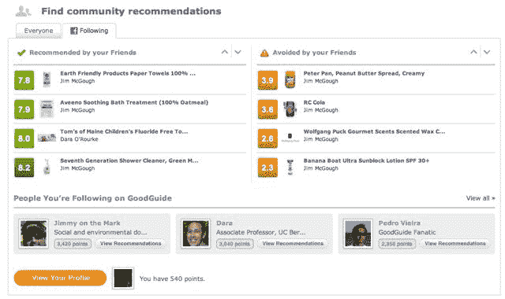
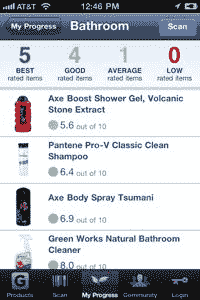

# GoodGuide 推出新的社交功能 TechCrunch

> 原文：<https://web.archive.org/web/https://techcrunch.com/2011/01/04/goodguide-new-social-features/>

GoodGuide 是一款移动应用程序和网站，帮助人们找到符合其环境和社会价值的产品。本月，它悄然推出了新的社交网络和产品推荐功能。

一群朋友和同事现在可以通过 [GoodGuide](https://web.archive.org/web/20230202235320/http://www.goodguide.com/) 互相关注，分享产品评论，或者警告避免，或者鼓励彼此尝试那里的某些品牌或商品。“社交网络覆盖”(该公司高管称之为社交网络覆盖)为应用和网站增加了以下功能:

现在，人们在他们的 iPhones 上扫描或查找什么产品的实时反馈。

社区投票，对 GoodGuide 社区推荐或回避的产品进行汇总。

让用户看到他们的脸书朋友推荐或回避哪些产品的社交环境。

影响 GoodGuide 用户的分数，考虑他们的贡献数量和他们与他人的联系数量。

影响力得分最高的 GoodGuide 成员排行榜。

基于网站流量和 Good Guide 的科学团队，涵盖消费者感兴趣的成分、问题和品牌的趋势主题。

GoodGuide [的创始人兼首席可持续发展官达拉·奥洛克](https://web.archive.org/web/20230202235320/http://nature.berkeley.edu/orourke/)解释说，大多数应用程序用户担心健康、环境*和社会影响*，但每个人的优先考虑不同。

一些人更担心公平的劳动和贸易实践，比如一家公司是否在整个供应链中公平地补偿他们的工人，而另一些人则更担心产品或其包装的可生物降解性。奥洛克说，2010 年，GoodGuide 的用户越来越多地转向该应用程序，以避免特定的已知有毒或令人不快的成分。

该公司的员工已经形成了他们自己的具有新的社会特征的小组，并开始分享和讨论企业社会责任问题，以及产品的影响和有效性(上图)。

该应用的早期版本已经允许用户扫描他们所拥有的物品上的条形码，并存储与房屋中一个房间相对应的物品列表(如下图)。他们积累自动“分数”,反映他们的浴室或洗衣房用品在给定的价值下的排名。通过 Good Guide 的新社交功能，用户可以比较浴室与浴室、茶水间与茶水间等。

奥罗克认为，社交功能可以极大地提升最受消费者青睐、最诚实(或透明)地展示产品和生产方式的品牌的口碑。他还认为，这可以激发人们以一种善意的方式去竞争，去过一种健康和可持续的生活方式。

最近的研究表明，总体而言，社交推荐比社论或广告更能让人记住品牌。今年秋天，[尼尔森在线](https://web.archive.org/web/20230202235320/http://www.nielsen.com/us/en/insights/reports-downloads/2010/Global-Trends-in-Online-Shopping-Nielsen-Consumer-Report.html)发布的研究发现，68%的人在网上看到朋友推荐的广告、品牌或公司名称，或者将自己与这些广告、品牌或公司名称联系起来，更容易记住它们。

GoodGuide 报告称，由于增加了社交功能，从 2010 年 11 月到 12 月，其独立访客数和参与人数分别增长了约 20%。与 2009 年 12 月和 2010 年 12 月相比，Good Guide 的独立访问者增长了 12%。