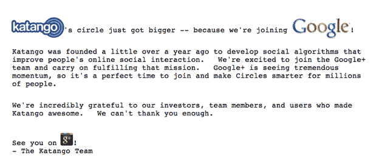

# 谷歌收购自动交友分类器 Katango 

> 原文：<https://web.archive.org/web/https://techcrunch.com/2011/11/10/google-acquires-katango-the-automatic-friend-sorter/>

# 谷歌收购朋友自动分类器 Katango

早在 9 月份，我们[就曾爆料](https://web.archive.org/web/20230203180939/https://techcrunch.com/2011/09/28/source-google-in-talks-to-acquire-katango/)谷歌正在就收购 [Katango](https://web.archive.org/web/20230203180939/http://www.katango.com/) 进行谈判，这是一家由凯鹏华盈(Kleiner Perkins)支持的小型创业公司，于今年夏天成立。今天，他们正式宣布:Katango 刚刚[宣布](https://web.archive.org/web/20230203180939/https://s3.amazonaws.com/static.katango.com/announcement.html)被谷歌收购，并将加入 Google+团队。我们还听说，谷歌收购 Katango 不仅仅是因为他们的人才，它对他们的技术也很感兴趣。

Katango 符合谷歌的逻辑，尽管他们最初的产品主要集中在脸书。

这家初创公司在 7 月份首次推出了一款 iPhone 应用，旨在让有选择地与脸书上的各种朋友群分享变得更容易。脸书的列表功能长期以来一直允许用户与不同的朋友分享某些内容，但它几乎没有自动将你的朋友分成不同的小组。这就是 Katango 的用武之地:你将应用程序与你的脸书社交图谱连接起来，它会分析你的朋友，自动将他们分类到不同的类别。

它很强大，但在 Katango 推出后不久，竞争格局发生了重大变化。9 月，脸书发布了[智能列表](https://web.archive.org/web/20230203180939/https://techcrunch.com/2011/09/13/facebook-officially-unveils-smart-friend-lists/)，这*也*有助于自动将朋友划分到列表中(它提供了一些预建的列表，如同事和住在附近的人，它的建议功能也使定制列表变得容易)。换句话说，脸书正在自己解决问题。

但是 Google+有一个类似于脸书好友列表的功能:圈子。尽管谷歌在其营销和 Google+上大力推广圈子，但它在自动帮助用户将朋友分类到圈子中的方式上做得不多——仍然需要大量的跑腿工作。Katango 似乎很适合帮忙。

以下是谷歌发言人的声明:

> “Katango 团队让你的社交圈变得更加智能的创新方法给我们留下了深刻的印象，我们认为他们将成为 Google+团队的一大补充。”

