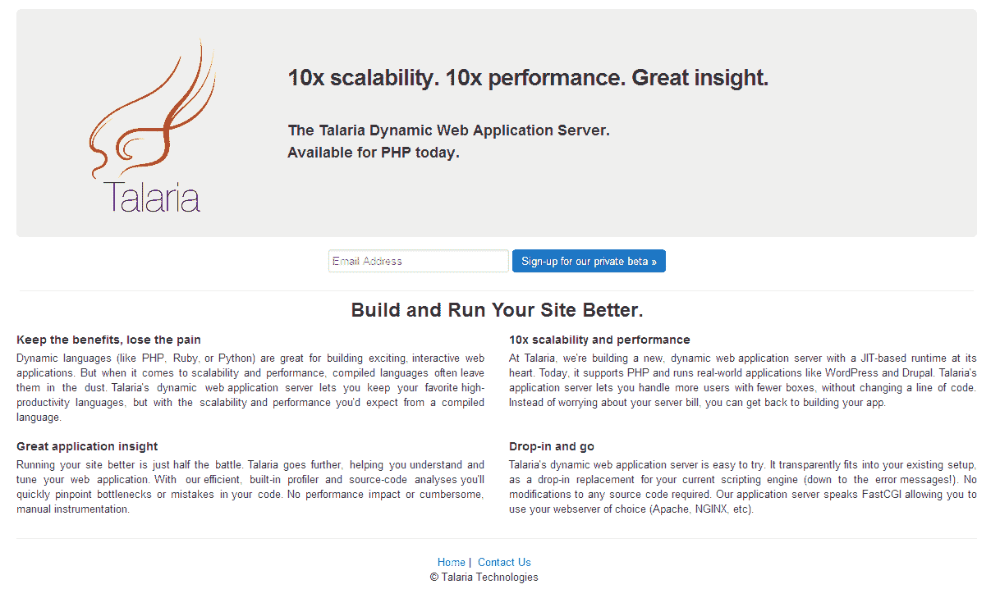

# 谷歌收购网络应用服务器 Talaria 以增强其云平台 

> 原文：<https://web.archive.org/web/https://techcrunch.com/2013/03/15/google-acquires-web-application-server-talaria-to-enhance-its-cloud-platform/>

# 谷歌收购网络应用服务器 Talaria 以增强其云平台

[Talaria](https://web.archive.org/web/20221205092853/http://talariatech.com/),[正在构建](https://web.archive.org/web/20221205092853/http://webcache.googleusercontent.com/search?q=cache:isF-gM46hP0J:talariatech.com/+&cd=4&hl=en&ct=clnk&gl=us)一个“以基于 JIT 的运行时为核心的新的动态网络应用服务器”的公司，刚刚宣布它已经被谷歌收购。Talaria 团队将成为谷歌云平台团队的一部分。在很大程度上，这家总部位于帕洛阿尔托的公司直到现在都不为人知。该公司于 2011 年由 [Austin Robison](https://web.archive.org/web/20221205092853/http://www.linkedin.com/in/austinrobison) 共同创立，当谷歌收购它时，它显然仍处于私人测试阶段。

谷歌发言人刚刚向我们证实了此次收购:“Talaria 团队开发了尖端技术，帮助人们更有效地建立和运行网站，我们认为他们将是我们谷歌云平台团队的一个伟大补充。”

虽然 Talaria 对它的服务器有一个更宏伟的愿景，但它目前只支持 PHP，并允许开发人员运行 WordPress 和 Drupal 等应用程序。该公司声称，其技术允许开发人员“用更少的机器处理更多的用户，而无需更改一行代码。”Talaria 还声称它的“服务器可以让你保留你最喜欢的高生产率语言，但具有你从编译语言中期待的可伸缩性和性能。”

所有这些显然都非常适合谷歌的云平台，Talaria 的声明指出，该团队将致力于“帮助更多的开发者更好地构建和运行他们的网站。”

以下是来自 Talaria 的完整声明:

> 在 Talaria，我们着手修正人们构建和运行现代网站和应用程序的方式。在过去的两年里，我们已经通过为一些最受欢迎的网站提供支持证明了我们的技术。现在，通过与谷歌的云平台团队合作，我们将能够帮助更多的开发者更好地建设和运营他们的网站。
> 
> 我们要感谢那些帮助我们来到这里的人。我们的投资者和顾问无论在顺境还是逆境中都支持我们。我们的测试客户推我们，踢轮胎，并热情地邀请我们加入他们的组织。最后，我们的朋友和家人在我们忙碌的时候得到的关注和时间比他们应得的要少。
> 
> 我们对我们将与[谷歌云平台](https://web.archive.org/web/20221205092853/http://cloud.google.com/)一起交付的东西感到兴奋。
> 
> 塔拉里亚团队

