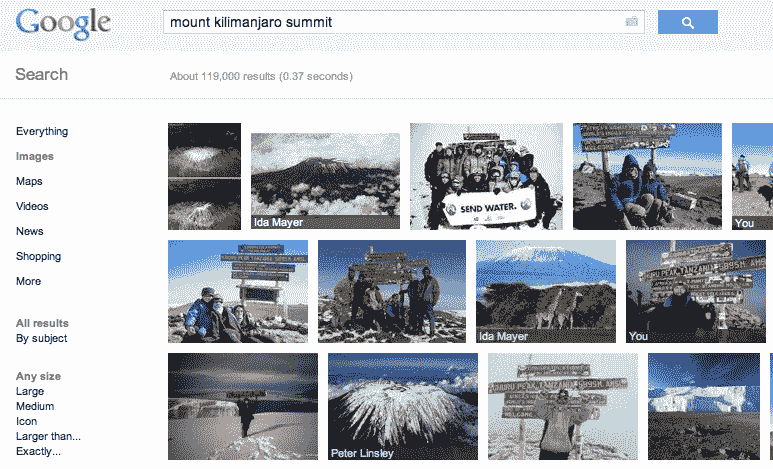

# 谷歌为图片添加+1 按钮 TechCrunch

> 原文：<https://web.archive.org/web/https://techcrunch.com/2011/11/09/google-adds-1-button-to-images/>

# 谷歌为图片添加+1 按钮

谷歌正在将它的+1 按钮添加到谷歌搜索结果中的图片上，该公司今天通过博客文章宣布了。这意味着，当你在谷歌图片栏中进行搜索时，当你悬停在一张图片上时，你会看到一个小的“+1”按钮出现。这将通过 Google+和你的谷歌个人资料与朋友分享推荐，就像传统搜索结果上的 [+1 按钮](https://web.archive.org/web/20230203155315/http://googleblog.blogspot.com/2011/03/1s-right-recommendations-right-when-you.html)一样。

但这次更新也增加了一些东西:当你搜索谷歌图片时，可以看到你的朋友喜欢哪些图片。随着更新的推出，谷歌搜索结果页面上的图片将显示一个灰色条，以白色文本显示你朋友的名字，以表明你朋友喜欢的图片，或者用谷歌的行话来说，“加了”

这项新功能仅适用于那些设置并启用了谷歌个人资料的用户。图像+1 将出现在你的 Google 个人资料中与其他+1 相同的位置，如果你愿意，你可以删除它们。

不管你喜不喜欢，Google+正在慢慢地融入谷歌，反之亦然，这次最新的更新只是这种变化的又一个例子。

