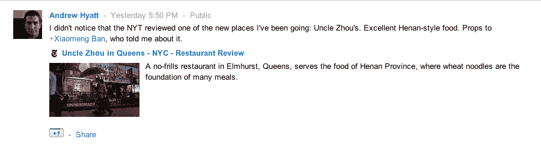

# 谷歌将 Google+公共帖子添加到其社交搜索结果中

> 原文：<https://web.archive.org/web/http://techcrunch.com/2011/08/12/google-adds-google-public-posts-to-its-social-search-results-ho-hum/>

# 谷歌将 Google+公共帖子添加到其社交搜索结果中，呵呵

在谷歌最终将 Google+整合到大部分(如果不是全部)谷歌产品的整体战略中，这一举措几乎是不可避免的，谷歌宣布，它现在将在其[“社交搜索”](https://web.archive.org/web/20230204210239/https://techcrunch.com/2011/02/17/google-social-search/)结果中包括公开分享的 Google+帖子。

用户登录他们的 Google+账户，如果他们正在搜索一个与某人在他们的 Google+圈子中公开发布的东西相匹配的关键词，最终会看到“在 Google 上分享了这个”的废话。作为一个以前很少关注我的“社交搜索”结果的人，我很清楚这有多有用。

但是，由于“社交搜索”结果已经包括 Twitter、Flickr LinkedIn 和 Quora，这根本不是什么惊天动地的举动。事实上，正如搜索引擎之乡的丹尼·沙利文[指出的](https://web.archive.org/web/20230204210239/http://searchengineland.com/google-public-posts-coming-to-googles-social-search-results-89333)，服务[可能已经上线](https://web.archive.org/web/20230204210239/http://searchengineland.com/how-being-friends-on-google-leads-to-better-rankings-87376)，我们今天看到的只是它的公开声明。

谷歌表示，他们将在未来几天推出这项功能。我真正祈祷的是[谷歌实时搜索](https://web.archive.org/web/20230204210239/http://searchengineland.com/google-realtime-search-goes-missing-84130)的回归。

更新:在得到谷歌的确认后，丹尼·沙利文回应道:“这是新的。你在 Google+上分享的帖子现在会出现，排名会更靠前。以前，只有你在其他地方分享的帖子才可以。”