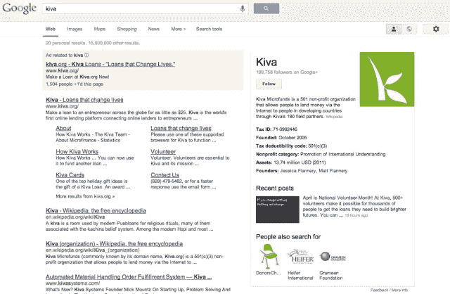

# 谷歌将非盈利信息添加到知识图表中，通过 Google+关注按钮 为他们提供支持

> 原文：<https://web.archive.org/web/https://techcrunch.com/2013/04/09/google-adds-non-profit-information-to-knowledge-graph-gives-them-a-boost-with-google-follow-buttons/>

# 谷歌将非盈利信息添加到知识图表中，通过 Google+关注按钮给他们提供动力

一些人认为，谷歌在搜索方面的做法神秘而不公平——或者有时是邪恶的——但该公司想做的是，当你对其最重要的产品执行任务时，为你呈现最重要的信息。随着去年[知识图谱](https://web.archive.org/web/20230322234529/https://techcrunch.com/2012/05/16/google-just-got-a-whole-lot-smarter-launches-its-knowledge-graph/)的引入，谷歌开始在搜索结果的右侧显示信息，以帮助你判断你是否正在搜索正确的东西，无论是人、地点还是事物。

今天，[谷歌宣布](https://web.archive.org/web/20230322234529/https://plus.google.com/u/0/116899029375914044550/posts/MtxDMf7J9P2)它现在正在用非营利组织的信息填充它的知识图谱，这将帮助人们找到他们想要查看并可能捐赠的组织。

谷歌在其声明中表示，这仍处于早期推出阶段，更多信息将不断增加:

> 我们刚刚开始将非营利组织的信息添加到知识图表中。当你在 Google.com 上搜索一个非营利组织时，你会开始在搜索结果的右侧看到信息，突出显示该非营利组织的财务状况、原因和最近的 Google+帖子。点击“关注”按钮，直接在 Google+上关注公司。要了解更多关于相关非营利组织的信息，点击“人们也搜索”下的一个组织，类似组织的转盘将出现在搜索结果的顶部。随着时间的推移，我们将继续努力为您的搜索体验带来更多非营利信息。

除了关于非营利组织的关键信息，包括他们的类别和减税代码，谷歌也在推广他们的 Google+页面。这意味着 Google+可能会立即成为非营利组织寻找新志愿者和筹款渠道的热点，更重要的是，为他们的活动和事业增加知名度。

虽然所有已知的非营利组织还没有出现在知识图表中，但看起来大多数大的非营利组织都有。你会注意到谷歌也在发布该组织的最后一篇 Google+帖子，允许人们直接进入对话:

这是另一个例子，说明谷歌如何战略性地、精确地开始将所有产品整合在一起，创造一个人们只需花一点点时间就能更快获得更好结果和信息的世界。这也是一个例子，说明 Google+是如何成为连接所有这些联系的结缔组织的。