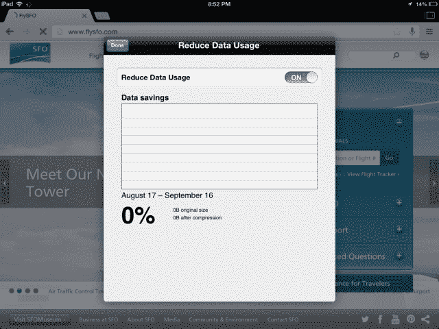
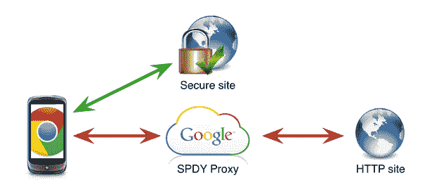

# 谷歌为移动版 Chrome 添加了可选的数据压缩功能，将您的数据使用量减少了 50% 

> 原文：<https://web.archive.org/web/https://techcrunch.com/2014/01/15/google-adds-optional-data-compression-feature-to-chrome-for-mobile-reducing-your-data-usage-by-up-to-50/>

谷歌今天正式宣布为其 Chrome 移动网络浏览器发布数据压缩功能，允许您减少智能手机和平板电脑上的数据使用量，潜在地为您节省每月手机账单或数据计划的费用。该功能是 Chrome 手机浏览器的几个新功能之一，它还包括 iOS 上的谷歌翻译，Android 上最喜欢的网站的应用快捷方式支持，以及其他修复。

然而，数据压缩特性是这个即将发布的版本的亮点。启用后，它还将包括 Chrome 的[安全浏览](https://web.archive.org/web/20221205185720/http://blog.chromium.org/2012/01/all-about-safe-browsing.html)技术，以防止恶意网页。谷歌表示，该功能将在未来几天内通过 iTunes 应用商店和谷歌 Play 商店的应用更新推出。

你可能还记得，谷歌去年 3 月通过 Android 应用程序的 Chrome Beta 测试版开始在 Android [上测试当时处于实验阶段的数据压缩功能，然后](https://web.archive.org/web/20221205185720/https://beta.techcrunch.com/2013/03/05/chrome-beta-for-android-gets-support-for-experimental-data-compression-on-googles-servers-reduces-data-usage-by-50/)[在秋天将这些测试扩展到 iOS](https://web.archive.org/web/20221205185720/https://beta.techcrunch.com/2013/09/17/google-expands-chrome-data-compression-feature-on-ios/) 。

可选的功能，本质上是一个谷歌代理，通过谷歌的服务器路由网络请求，该公司的 PageSpeed 库压缩和优化内容。与此同时，浏览器和谷歌服务器之间的实际连接由 SPDY 协议[处理，以进一步优化。](https://web.archive.org/web/20221205185720/http://www.chromium.org/spdy)

无论你是否对后端技术感兴趣，谷歌声称通过这种配置实现的节省是显著的。谷歌表示，当打开时，Chrome 的数据压缩和带宽管理功能可以减少高达 50%的数据使用量，无论是 Android 版还是 iOS 版。[如前所述](https://web.archive.org/web/20221205185720/http://blog.chromium.org/2013/03/data-compression-in-chrome-beta-for.html)，即使只是使用 PageSpeed 库将图像转码为谷歌的 WebP 格式，而不是 JPEG 或 PNG 格式，也会产生很大的差异，因为平均网页上所有传输的字节中有 60%是图像。

当然，移动数据压缩并不是一个新想法——例如，Opera 的移动浏览器 Turbo mode 提供了类似的功能，Amazon Silk 也是如此。与此同时，谷歌的竞争对手[脸书今年 10 月收购了 Onavo](https://web.archive.org/web/20221205185720/https://beta.techcrunch.com/2013/10/13/facebook-buys-mobile-analytics-company-onavo-and-finally-gets-its-office-in-israel/) ，这是一家移动数据分析公司，提供面向消费者的应用程序(Onavo Extend)，帮助用户优化他们的设备，以从他们的数据计划中获得更多信息。换句话说，谷歌并不是唯一一个释放用户迫切需求的公司，他们需要从自己的数据计划中获得更多，而不会被高额的使用费用所困扰。让消费者在线时间更长是谷歌的首要目标。

## Chrome 数据压缩和隐私

需要注意的一点是，通过打开这个功能——这是通过访问应用程序中的“设置”>“带宽管理”>“减少数据使用”——您同意通过谷歌的代理服务器路由您的所有 HTTP 流量。(该功能对于 HTTPS 和“匿名”模式流量是禁用的)。

这引起了一些用户的关注，他们现在对潜在的隐私问题更加敏感。但是[谷歌之前说过](https://web.archive.org/web/20221205185720/https://www.google.com/intl/en/chrome/browser/privacy/whitepaper.html#datacompression)当请求被记录时，标题和 cookies 被删除，网页内容被缓存，但是*没有*被记录。最重要的是，谷歌表示，这些日志与你的谷歌账户无关，整个日志条目会在六个月内被删除。这些细节在去年 11 月更新的 Chrome 隐私白皮书中有所提及。尽管如此，当该功能上线时，还是值得关注潜在的隐私政策变化…以防万一。

## 其他新增内容

更新后的应用程序还带来了一些其他有趣的东西。iOS 上的另一个功能是在浏览器中支持谷歌翻译 Android 和桌面用户已经可以使用这项功能。这允许您将网页翻译成设备的母语。

与此同时，由于有一个菜单选项“添加到主屏幕”，Android 用户将能够更容易地将喜欢的网站保存到主屏幕上[一些网站](https://web.archive.org/web/20221205185720/http://blog.chromium.org/2013/10/chrome-31-beta-android-application.html)将在这样做后以全屏模式打开，谷歌也在宣布这一发布的[博客帖子](https://web.archive.org/web/20221205185720/http://chrome.blogspot.com/2014/01/more-web-more-savings-with-chrome-for.html)中提到。

要访问以上任何选项，你需要下载 Chrome 应用程序，或者应用更新(如果已经安装的话)。