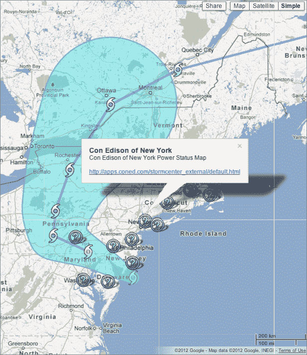
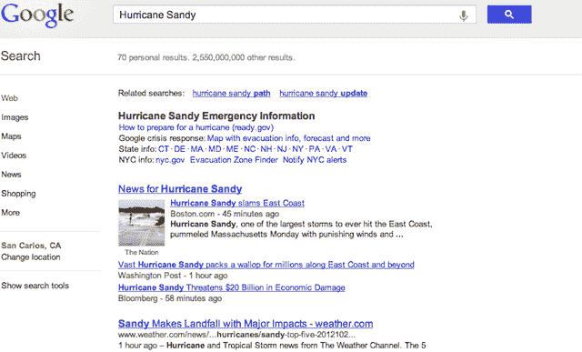

# 谷歌在其飓风桑迪危机地图中添加停电信息

> 原文：<https://web.archive.org/web/https://techcrunch.com/2012/10/29/google-adds-power-outage-information-to-its-hurricane-sandy-crisis-map/>

# 谷歌在其飓风桑迪危机地图中添加了停电信息

正如我们昨晚提醒你们注意的那样，当我们等待飓风桑迪登陆时，[谷歌建立了它所谓的“危机地图”](https://web.archive.org/web/20230319090922/https://techcrunch.com/2012/10/28/google-has-set-up-a-crisis-map-for-those-preparing-for-hurricane-sandy/)。它已经发生了，而且已经造成了损害，包括所有受影响地区的大规模停电。

今晚，该公司更新了这张地图，将这些信息包括在内。[以下是地图团队的发言](https://web.archive.org/web/20230319090922/https://plus.google.com/u/0/111401917971052287374/posts/2vg4igFYY6x):

> 我们#桑迪地图的新内容:停电地图。在移动设备上？单击“层”按钮查看更多信息，包括避难所信息、风暴跟踪和公共警报。
> 
> 在这里访问地图:【http://google.org/crisismap/2012-sandy】T5
> 
> 如果你在纽约地区，看看我们的纽约地图:
> [http://google.org/crisismap/2012-sandy-nyc](https://web.archive.org/web/20230319090922/http://google.org/crisismap/2012-sandy-nyc)

添加关于避难所的信息太棒了，尤其是对于移动设备。我一直在与东海岸的朋友交谈，他们失去了电力，很快就失去了电池寿命，但在这种情况发生之前，他们正在争先恐后地寻找每一条有用的信息。

此外，[你可以在谷歌上搜索“飓风桑迪”](https://web.archive.org/web/20230319090922/https://www.google.com/search?aq=f&oq=Hurricane+Sandy&sugexp=chrome,mod=0&sourceid=chrome&ie=UTF-8&q=Hurricane+Sandy)并根据你的居住地获得一些有用的信息:

【T2

注意安全，风暴还没有结束。事实上，已经造成的损害比所有的风和洪水更危险。待在室内，直到你被告知不要出去！