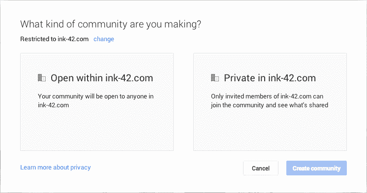

# Google+增加受限社区以吸引商业用户

> 原文：<https://web.archive.org/web/https://techcrunch.com/2013/11/05/google-adds-restricted-communities-in-an-effort-to-court-business-users/>

# Google+增加受限社区是为了吸引商业用户

许多企业现在已经采用了 Yammer 或 Podio 等工具，但 Google+也想在这一社会企业行动中分一杯羹。虽然谷歌的社交网络在一年多前通过增加[受限帖子](https://web.archive.org/web/20230202045303/http://support.google.com/plus/bin/answer.py?hl=en&answer=2705802)和许多其他商业功能开始吸引企业用户[，但它今天](https://web.archive.org/web/20230202045303/http://googleenterprise.blogspot.com/2012/08/bringing-google-to-work.html)[通过推出受限社区](https://web.archive.org/web/20230202045303/http://googleenterprise.blogspot.com/2013/11/private-conversations-with-restricted.html)更进一步。这在通常的企业工具之上增加了额外的安全层，并确保只有给定公司内的用户才能加入该组并查看其中的更新。

这消除了员工在 Google+上意外分享新产品或其他机密信息的可能性。毕竟，在社区中发布的所有内容都会留在那里。

鉴于只要存在信息意外泄露的风险，大多数企业就不太可能使用 Google+进行内部沟通，这是 Google+在吸引更多企业用户方面迈出的重要一步。

用户可以选择一个社区是对公司的每个人开放还是私有，以及它是可加入的还是仅被邀请的。管理员可以将受限社区设置为组织的默认社区，但用户也可以随时选择其他设置。

在今天的声明中，谷歌强调，企业可以利用这些社区来分享文件、视频、事件和照片——这也是大多数其他社交商业工具所提供的。

