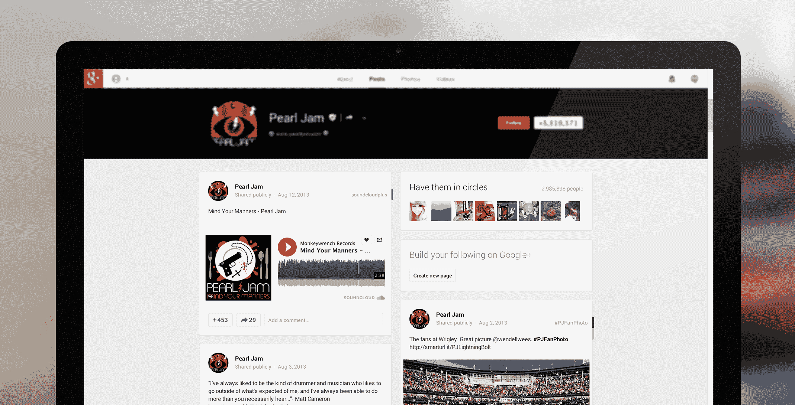

# Google+增加了 SoundCloud 嵌入，因为它慢慢向更多第三方集成开放 

> 原文：<https://web.archive.org/web/https://techcrunch.com/2013/08/12/google-adds-soundcloud-embeds-as-it-slowly-opens-up-to-more-third-party-integrations/>

# 随着 Google+慢慢向更多第三方集成开放，它增加了 SoundCloud 嵌入功能

[SoundCloud](https://web.archive.org/web/20221205132348/http://soundcloud.com/) ，这个越来越受欢迎的分享所有音频的服务，今天[宣布](https://web.archive.org/web/20221205132348/http://snd.sc/soundcloudplus)它现在已经深度整合到 Google+中。虽然它的用户已经可以很容易地从 SoundCloud 分享到 Google+的链接，但 Google+现在有一个内置的音频播放器，可以让你直接在[艺术家的 Google+页面](https://web.archive.org/web/20221205132348/https://plus.google.com/+ArminvanBuuren/posts/X19a2HMFZhm)上播放音频文件。这标志着谷歌首次允许第三方服务直接在 Google+帖子中嵌入音轨。

SoundCloud 在 5 月份推出了与谷歌新的基于 Google+的登录服务的集成，并从那时起慢慢加深了与该服务的集成，在今天的发布中达到高潮。SoundCloud 表示，这种整合将使艺术家“比以往任何时候都更容易”通过向 Google+共享声音来接触(他们的)观众。这也意味着，每当你将 SoundCloud 链接分享到 Google+时，新的播放器就会自动出现。

到目前为止，Google+上的 SoundCloud 链接只会带你去该公司的网站播放文件。这项服务目前每月在网站上有超过 2 亿的活跃听众。

对于 Google+来说，这是一个非常有趣的举动，因为它仍然是一个相对封闭的平台。新的 Google+登录使第三方服务的用户更容易在 Google+上分享内容，但在大多数情况下，这并不意味着内容会完全嵌入帖子中。如果今天与 SoundCloud 的整合只是一系列类似公告中的第一个，我不会感到惊讶。

