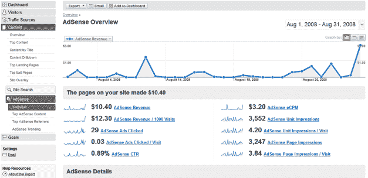

# Google Analytics 获得了一个重要的升级(AdSense、自定义报告、API、气泡图)

> 原文：<https://web.archive.org/web/https://techcrunch.com/2008/10/22/google-analytics-gets-a-major-ugrade-adsense-custom-reports-api-bubble-charts/>

# Google Analytics 获得了一个重要的升级(AdSense，自定义报告，API，气泡图)

谷歌分析刚刚变得更好。谷歌今天将开始推出一系列对免费网站测量工具的重大升级[。新功能包括创建自定义报告的能力，查看受众细分的更好方法，在 Google Analytics 中跟踪和测量 AdSense 的能力，一个 API(正在开发中)，引入酷泡“运动图表”，以及一些用户界面改进。让我们一次一个地了解这些新特性。](https://web.archive.org/web/20221007030842/http://analytics.blogspot.com/2008/10/more-enterprise-class-features-added-to.html)

**1。定制报告**:允许你使用任何数据源(比如在你的网站上购买过东西的人，平均浏览量，地理位置，访问来源)作为图表的 X 和 Y 坐标来创建报告。
2**。受众细分**:让你可以查看网站受众的定制切片(比如停留超过两分钟的人，来自 TechCrunch 的人，来自《纽约时报》的人，购买了东西的人，来自 Techcrunch *和*购买了东西的人)。
**3。AdSense 整合**:这是一个漫长的过程。你已经可以跟踪你的 AdWords 活动如何影响你的网站流量。现在你也可以看到你的 AdSense 帐户的数据。将这些与谷歌分析数据结合起来，你不仅可以获得关于你通过 AdSense 投放的哪些广告做得最好的新见解，还可以获得关于哪些推荐网站的新见解。(在 [AdSense 博客](https://web.archive.org/web/20221007030842/http://adsense.blogspot.com/2008/10/make-date-with-data-in-google-analytics.html)上阅读更多内容)。
**4。API** :这将“很快”推出，但也是在今天宣布。谷歌将向 Gogle Analytics 开放一个 API，允许开发者将谷歌分析中的所有数据传输到其他网站、工具、小工具甚至移动应用程序。因此，如果有人想创建一个小工具，让人们在他们的博客上显示他们的谷歌分析图表，这将是可能的。
**5。气泡图**:新的运动图允许你可视化五个维度的数据(x 轴、y 轴、气泡的大小、气泡的颜色以及随时间的位置)。它可以让你创建一个动画来展示你的网站的关键指标发生了什么。这个功能来自谷歌 2007 年从 Gapminder 收购的趋势分析软件[。(见下面视频)。
**⑥。用户界面调整**:你会注意到一些新的微妙的阴影和高亮。但最大的变化将是在管理仪表板。现在，如果你用 Google Analytics 跟踪多个网站，你将能够一次看到所有网站的趋势。](https://web.archive.org/web/20221007030842/http://googleblog.blogspot.com/2007/03/world-in-motion.html)

下面是一个新的“运动图表”的视频，它可以让你随时跟踪数据。你可以在这里找到更多展示这些新功能的视频[。](https://web.archive.org/web/20221007030842/http://uk.youtube.com/view_play_list?p=AFDC0271A9E3C759)

【YouTube http://www.youtube.com/watch?v=UKsBTqqhVTs&hl=en&fs=1]

