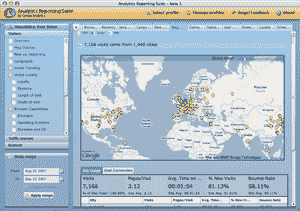

# 空气中的谷歌分析；这就是我要说的技术危机

> 原文：<https://web.archive.org/web/https://techcrunch.com/2007/09/24/google-analytics-in-air-thats-what-im-talking-about/>

# 空气中的谷歌分析；这就是我在说的

在使用了十年视窗系统后，我刚刚买了一台苹果电脑，我觉得我对使用起来很愉快的产品和服务有了更高的评价。虽然我喜欢有效地实现 Ajax 或 Flash 的网站，但很少有在线目的地能与设计良好的桌面应用程序的可用性相媲美。

这就是为什么我发现 9 月 17 日公开发布的谷歌分析空气测试版《T4》是如此新鲜的空气(不是双关语)。

谷歌分析的这一非官方 AIR 版本提供了基于浏览器的谷歌分析的功能，但具有更高的可用性和更丰富的体验。如果你没听说过 [AIR](https://web.archive.org/web/20221209135915/http://www.beta.techcrunch.com/2007/06/10/adobe-apollo-launches-beta-now-called-adobe-air/) (曾被命名为“Apollo”)，这是一个由 Adobe 开发的平台，它使 web 开发人员能够在浏览器之外部署他们的 web 服务，这样他们的功能就更像传统的应用程序。

这是我测试过的第一个真正让我对这个平台感到兴奋的 AIR 程序。作为一个测试程序，它并不完美(我遇到了一些错误)，但总的来说，它执行得很好。看到这样一个使用别人的 API(在本例中是谷歌的 API)开发的全功能程序也很不错。

查看 Google Analytics AIR 测试版，并向开发者 [Nico](https://web.archive.org/web/20221209135915/http://www.aboutnico.be/) 提供反馈，以帮助事情变得更好。如果您还没有 AIR，您需要[下载它](https://web.archive.org/web/20221209135915/http://labs.adobe.com/technologies/air/)来使用任何基于 AIR 的应用程序(就像使用 Flash 一样)。

感谢[奥利](https://web.archive.org/web/20221209135915/http://go2web2.blogspot.com/)。

**更正和更新:**谷歌实际上没有自己的分析应用编程接口；Nico 说他必须自己制作这个程序(不太确定它是如何工作的)。

他还表示，Adobe 和谷歌现在都参与了这个项目。Adobe 已将该应用程序纳入其 Showcase 计划，谷歌产品经理和工程师正在向他提供反馈，并帮助他提高安全性。

Nico 表示，Google Analytics AIR 的 beta 2 将在 AIR beta 2 向公众发布时推出。他目前专注于改善国际支持和 AdWords 的整合。