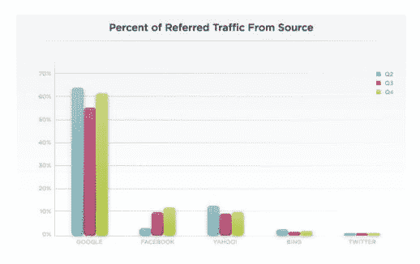
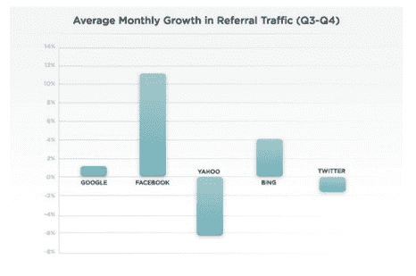

# 谷歌和脸书继续引领媒体网站视频的推荐流量 

> 原文：<https://web.archive.org/web/https://techcrunch.com/2011/02/17/google-and-facebook-continue-to-lead-referral-traffic-for-videos-on-media-sites/>

# 谷歌和脸书继续引领媒体网站视频的推荐流量

2010 年第三季度，BrightCove 和 Tube Mogul 的[在线视频&媒体行业报告](https://web.archive.org/web/20230203080458/https://techcrunch.com/2010/12/23/facebook-second-largest-source-videos/)显示，脸书超过雅虎成为媒体网站在线视频的第二大流量来源。(这项研究测量了 Brightcove 网络上的视频，重点是报纸、杂志、广播公司、品牌和在线媒体网站)。根据视频平台公司的一份新报告，2010 年第四季度，脸书继续保持其作为第二大流量来源的统治地位，仅次于谷歌。

就推荐流量而言，脸书表现出最健康的增长率，现在占所有推荐给媒体公司的视频流量的 11.8%。该报告称，社交网络的增长主要归功于脸书对白名单嵌入式视频播放流的支持，允许在不需要任何流量重定向的情况下进行上下文查看。谷歌占了 60%的流量，而推特只占了 2%的流量。显然，搜索推动了浏览。

从增长率来看，雅虎和 Twitter 的增长率都在下降。就推荐流量而言，脸书增长最快，其次是必应和谷歌。

然而，以观看时间来衡量，脸书和 Twitter 比谷歌吸引了更高的参与度。该报告显示，与其他内容相比，品牌(相对于杂志、报纸、广播公司和在线媒体)在包括谷歌和脸书在内的所有参考来源中的参与度更高，这可能表明通过搜索引擎优化和社交分享发现的视频正在增加品牌观众的参与度。雅虎推荐的品牌视频参与度最高，平均观看时间达到 2:30 分钟，这可能表明此类内容的联合努力取得了成功。

