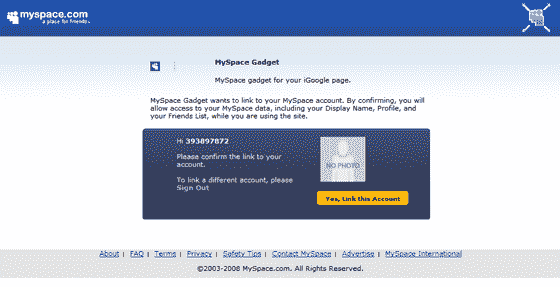
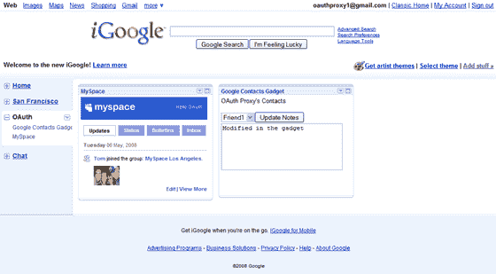
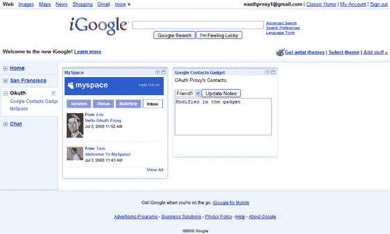
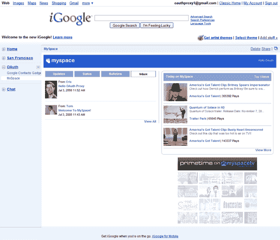
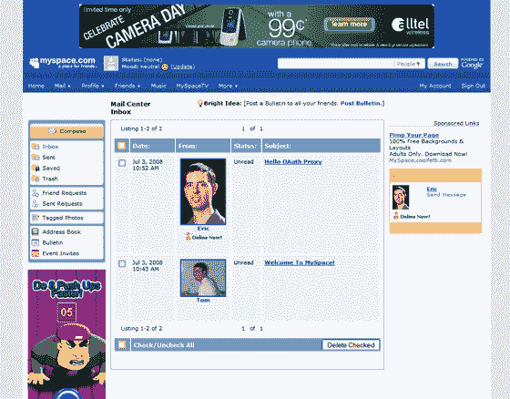

# iGoogle TechCrunch 即将推出的 MySpace 数据可用性小部件的屏幕截图

> 原文：<https://web.archive.org/web/https://techcrunch.com/2008/07/11/google-and-myspace-demo-data-portability/>

# 即将推出的 iGoogle MySpace 数据可用性小部件的屏幕截图

几周前，MySpace 和谷歌在 [oAuth 峰会](https://web.archive.org/web/20220930193444/http://wiki.oauth.net/OAuthSummit2008)上展示了一个有趣的 MySpace 数据可用性 API 、oAuth 和 iGoogle gadget 规范的混搭。该应用程序将 MySpace 的核心功能集整合到 iGoogle 中，目前还没有公开发布，尽管 MySpace 表示预计将于 8 月发布。

这是数据可移植性发挥作用的又一个例子(也是 MySpace 和谷歌联手与脸书竞争的例子)。MySpace 为 iGoogle 构建的示例应用程序[是一个小工具，允许 MySpace 用户查看个人资料更新、状态消息和私人消息——所有这些都在这个小工具中完成。该小工具是根据新的小工具规范构建的，这意味着它也可以与其他支持该小工具和 oAuth 的网站(如](https://web.archive.org/web/20220930193444/http://crunchbase.com/company/myspace) [Yahoo](https://web.archive.org/web/20220930193444/http://crunchbase.com/company/yahoo) )一起工作。

这些是会议上展示的屏幕截图:

【T9

