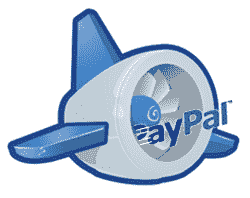

# 谷歌应用引擎“意外”屏蔽了 PayPal TechCrunch

> 原文：<https://web.archive.org/web/https://techcrunch.com/2008/06/10/google-app-engine-accidentally-blocks-paypal/>

 这里有一个阴谋论者的问题:原来[谷歌应用引擎](https://web.archive.org/web/20230218170328/http://code.google.com/appengine/)，他们的新平台[建立和托管第三方网络应用](https://web.archive.org/web/20230218170328/https://techcrunch.com/2008/04/07/google-jumps-head-first-into-web-services-with-google-app-engine/)，正在阻止应用程序与贝宝集成支付。

开发使用 PayPal 处理支付的应用程序的开发者通常需要应用程序向 PayPal 服务发送请求。这些请求中使用的 URL 都在 paypal.com 域名上，并且在 www.sandbox.paypal.com 的 URL 上有一个测试环境设置。在 Google App Engine 应用程序中，对这些 URL 的请求会返回一个普通的“下载”错误，没有具体的细节。

许多开发人员在讨论这个问题的谷歌应用引擎论坛上抱怨(也在黑客新闻上)，他们也发现了一种通过使用第三方代理(如 TinyURL)绕过限制的方法。然后，今天早上，一位名为 Marzia Niccolai 的谷歌员工写了一条评论，称该错误是由他们的反钓鱼保护引起的:

> 感谢您的报告！这是一个错误，我们已经找到了问题所在。我们的反网络钓鱼保护出现错误，阻止使用 URLFetch 服务获取某些特定的 URL 域。这是我们的疏忽，这些特定的域名限制将在未来几天内删除。

通常像这样的事情不会引起太多的关注。但是谷歌和易贝之间有太多不愉快的血缘关系，这一点毋庸置疑，当然，谷歌的反钓鱼黑名单并没有将 paypal.com 域名列为钓鱼网站。

到目前为止，大多数对此发表评论的开发者都坚信这是谷歌故意设置的障碍。到目前为止，我们只能相信谷歌的话，屏蔽贝宝是一个意外，因为他们的反钓鱼规则的工作方式。但是有这么多涉及 Paypal 的钓鱼网站，你可能会认为在执行他们的规则时，他们至少会检查一下真正的 Paypal 网站是否仍然工作。此外，[Google.com 网络钓鱼](https://web.archive.org/web/20230218170328/http://www.google.com/safebrowsing/diagnostic?site=http://paypal.com/)测试显示 **Paypal 被认为是一个安全的网站**。

为什么 App Engine 会不一样？让事情更加可疑的是，这个网络钓鱼测试工具是上个月推出的[。](https://web.archive.org/web/20230218170328/http://googleonlinesecurity.blogspot.com/2008/05/safe-browsing-diagnostic-to-rescue.html)

我们已经给谷歌发了邮件征求意见，并将在有消息时更新这篇文章。

**更新**:在帖子中，我们提到一些开发者使用第三方服务器和/或域名来代理对 PayPal 的请求。事实证明，即使是那些代理请求也不再起作用了(它们在某个时候起作用了)，这让该线程中的一名开发人员得出结论，“我猜他们正在他们(谷歌)的网关上阻止 PayPal。”。