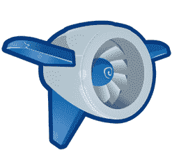

# 谷歌应用引擎今天停止了大约 6 个小时 TechCrunch

> 原文：<https://web.archive.org/web/https://techcrunch.com/2009/07/02/google-app-engine-broken-for-4-hours-and-counting/>

# 谷歌应用引擎今天停止了大约 6 个小时

两个多小时前，一名谷歌员工在[这个谷歌群组主题](https://web.archive.org/web/20221208222253/http://groups.google.com/group/google-appengine-downtime-notify/browse_thread/thread/f7596d1d0bd0f0f9?hl=en&pli=1)中发布了一条消息，指出[谷歌应用引擎](https://web.archive.org/web/20221208222253/http://code.google.com/appengine/)正在“发现数据存储延迟和错误率上升，以及服务错误率上升。”他指出，问题始于太平洋时间早上 6:30 左右，团队正在调查此事。几分钟后，他更新说谷歌应用引擎进入“计划外维护模式”——4 个多小时后，它仍然没有备份。

对于任何服务来说，这都是一段很长的时间，尤其是对于许多初创公司的网络应用来说。更糟糕的是，虽然谷歌正在更新谷歌群组线程，但实际的[应用引擎状态页面](https://web.archive.org/web/20221208222253/http://code.google.com/status/appengine)由于这些问题一直处于关闭状态，所以人们去那里更新，却什么也看不到。

谷歌最近一次更新是在大约一小时前:

> 只读模式继续。数据存储读取的延迟和错误率持续上升。Memcache 写入已重新启用，以更好地吸收只读负载。我们的工程团队正在调查问题的根本原因。一有更多的信息，我们会尽快发布。

很明显，土人在推特上[变](https://web.archive.org/web/20221208222253/http://search.twitter.com/search?q=gae) [躁动](https://web.archive.org/web/20221208222253/http://search.twitter.com/search?q=google+app+engine)。这次中断是在本周早些时候受欢迎的托管服务 Rackspace [经历了一些罕见的停机时间](https://web.archive.org/web/20221208222253/http://www.beta.techcrunch.com/2009/06/29/yes-rackspace-is-down-and-so-are-many-of-your-favorite-sites/)之后。

**更新**:看起来这次宕机甚至阻碍了 Mac 版 Chrome 的开发。首席开发人员 Mike Pinkerton 刚刚发了一条推特[:*“阻止弹出窗口的用户界面已经完成，但 appspot 应用程序都被屏蔽了，所以我无法对其进行审查。#chrome"*](https://web.archive.org/web/20221208222253/http://twitter.com/mikepinkerton/status/2441030020)

6 个小时后，看起来一切终于恢复正常了。来自谷歌的最新更新[谷歌群线程](https://web.archive.org/web/20221208222253/http://groups.google.com/group/google-appengine-downtime-notify/browse_thread/thread/f7596d1d0bd0f0f9?pli=1):

> 数据存储区写入已重新启用并正常运行！总体应用引擎健康恢复正常！如果有新的进展，我们会更新这个帖子，但是现在我们预计不会有其他问题。谢谢你的耐心。

*【感谢亚当和其他发送此消息的人】*