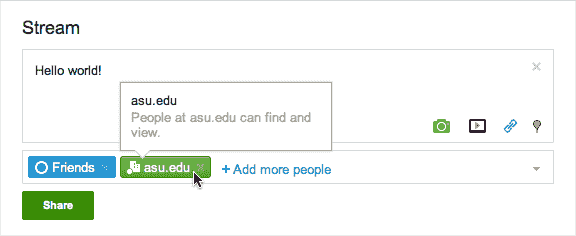

# Google Apps 用户现在可以在 Google+  上闲逛(以及做更多的事情)

> 原文：<https://web.archive.org/web/https://techcrunch.com/2011/10/27/google-apps-users-can-now-hangout-and-more-on-google/>

# Google Apps 用户现在可以在 Google+上闲逛(以及做更多的事情)

去年 6 月，Google first [推出了期待已久的社交网络 Google+的测试版](https://web.archive.org/web/20230304105515/https://techcrunch.com/2011/06/28/google-plus/)。这引起了很多人的惊讶:尽管谷歌在“社交”方面有失误的历史，但 Google+实际上显示出了很大的前景。谷歌表示，这项服务的用户已经增长到 4000 万(我对参与人数更感兴趣，但那是另一回事了)，它正在尽一切努力让更多用户看到这项服务。

但是有一个非常大的群体被冷落了:谷歌应用程序的用户。Google Apps 是 Google 出售给企业和学校的产品套件，允许自定义域、管理员控制、增强的安全性和其他关键功能(收费)。一些应用程序用户对缺乏支持感到愤怒，这是可以理解的，因为他们实际上是在向谷歌付费。

谷歌很快表示，它正在努力支持谷歌应用程序，今天，这一承诺已经实现:谷歌刚刚[宣布](https://web.archive.org/web/20230304105515/http://googleenterprise.blogspot.com/2011/10/google-is-now-available-with-google.html)谷歌应用程序用户现在可以注册 Google+。

应用程序用户将能够直接与工作组和/或大学中的其他用户分享帖子。此外，谷歌正在开发一个迁移工具，允许现有的 Google+用户将他们的个人账户迁移到他们的应用账户(你将保留现有的圈子和追随者)。这项工作还没有完成，但谷歌表示将在几周内完成。

