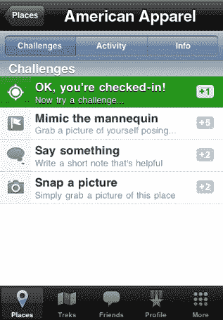

# 谷歌支持的 SCVNGR 挑战 Foursquare，希望通过“挑战”TechCrunch 增加乐趣

> 原文：<https://web.archive.org/web/https://techcrunch.com/2010/05/12/google-backed-scvngr-takes-on-foursquare-looks-to-boost-fun-with-challenges/>

这只是时间问题。自去年[夏天](https://web.archive.org/web/20230304114758/https://techcrunch.com/2009/08/13/scvngr-lets-you-build-awesome-scavenger-hunts-for-any-mobile-phone/)以来，我们一直在跟踪 [SCVNGR](https://web.archive.org/web/20230304114758/http://www.scvngr.com/) 的[进展](https://web.archive.org/web/20230304114758/https://techcrunch.com/2009/12/11/scvngr-scavengr-hunts/)，这是一个基于位置的游戏平台，允许用户建立引人入胜的现实世界寻宝游戏，使用他们的移动设备接收线索和解答谜题。到目前为止，这项服务主要面向博物馆、大学和企业，他们使用它来进行参观、指导和团队建设练习(他们有超过 600 名付费客户)。SCVNGR 最近从谷歌风投那里筹集了 400 万美元，现在它变得更加雄心勃勃:它希望将世界变成一个大型的寻宝游戏，并在这个过程中与 Foursquare 和 Gowalla 等公司展开较量。

为了标志 SCVNGR 面向消费者的新一面的推出，这家初创公司推出了 iPhone 和 Android 的新应用程序(你可以在这里下载 iPhone 应用程序[，Android 应用程序的二维码是](https://web.archive.org/web/20230304114758/http://iphone.scvngr.com/)[这里](https://web.archive.org/web/20230304114758/http://android.scvngr.com/))(目前仅限美国)。如果你以前使用过 Foursquare 或 Gowalla，这些应用程序一开始应该看起来很熟悉——你可以在 SCVNGR 数据库中的 2000 万个地点中的任何一个“签到”,看看你的朋友在做什么。但有一个关键的区别:SCVNGR 围绕着交互式“挑战”，当用户访问一个场地时，系统会提示他们完成这些挑战。这些可以是简单的事情，如在某个地点登记或与商店模特合影，也可以是更丰富的体验，这取决于该业务的创意程度。

SCVNGR 首席执行官 Seth Priebatsch 承认，这已经是一个拥挤的空间，有一些资金雄厚的竞争对手，但他认为这种“挑战”的角度足以将 SCVNGR 与其他公司区分开来。他解释说，在 Foursquare 这样的服务上签到的价值本质上往往是非常短暂的——如果你在创建一两个小时后看到那个签到，很有可能它已经不再相关，因为用户很可能已经转移到他们的下一个目的地了。Priebatsch 认为，挑战的保质期要长得多。

作为一个例子，Priebatsch 描述了如果你走进一家在 SCVNGR 上设置了一些挑战的当地墨西哥卷饼店可能会发生什么。在拿出手机并登记后，该应用程序会提示你用玉米煎饼的锡纸制作一个折纸图，并将你创作的照片上传到该服务。这样做可以奖励您一些 SCVNGR 积分(目前没有价值，但将来可能会成为奖励系统的一部分)。因此，尽管你的朋友可能在几小时或几天内看不到你的签到，他们可能仍然会喜欢你的卷饼锡纸天鹅的照片。例如，另一项挑战可能是指控用户利用散布在商店各处的线索来解开一个谜语。

任何人都可以发起挑战，包括企业主和他们的客户(如果你愿意，你也可以在公园等非商业场所发起挑战)。筛选和标记系统已经到位，以确保没有任何不适当的挑战。虽然大多数挑战将由手机产生，但希望同时在多个地点产生挑战的企业(如连锁餐厅)将能够使用 SCVNGR 的企业工具来实现。

在某些方面，SCVNGR 在这场游戏中姗姗来迟——除了 Foursquare，还有很多其他竞争对手，包括 Loopt，Gowalla，Brightkite，不久的将来可能还有脸书，他们都将争夺当地企业的注意力。SCVNGR 数据库中的每个场馆都将面临三个基本挑战(其中一个是基本的签到)，但只有用户和企业开始花时间进行引人入胜的创造性挑战，它才会变得有趣。从这个意义上说，这有点先有鸡还是先有蛋的问题。

尽管如此，我喜欢 SCVNGR 提供比 Foursquare 和 Gowalla 更吸引人的体验，我很快就厌倦了它们(是的，我知道很多人完全沉迷于它们——我只是觉得这些服务的游戏元素很肤浅)。我怀疑 SCVNGR 的受欢迎程度将取决于挑战的广泛性，更重要的是，它们有多有趣。同样，SCVNGR 将不得不通过让商家提供完成挑战的奖励和优惠券来激励用户玩游戏([给他们](https://web.archive.org/web/20230304114758/http://500hats.typepad.com/500blogs/2010/04/checkins-are-coupons.html)钱)。一些游戏玩家会继续跳到 SCVNGR 上，因为它很有趣，但这项服务需要一个胡萝卜在用户面前晃来晃去，让他们上钩。 
