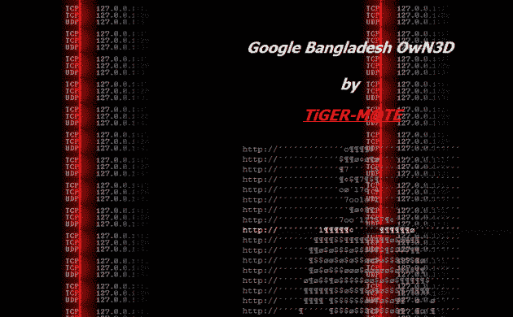

# 谷歌孟加拉网站“OwN3D by TiGER-M@TE”

> 原文：<https://web.archive.org/web/https://techcrunch.com/2011/01/08/google-bangladesh-hacked/>

# 谷歌孟加拉网站“OwN3D by TiGER-M@TE”

我们刚刚得到一个匿名消息，谷歌被“黑”了——果然，该公司的孟加拉搜索网站([Google.com.bd](https://web.archive.org/web/20221207073442/http://google.com.bd/))的访问者看到的是一个损坏的登陆页面，而不是通常的搜索网站。据我所知，[www.google.com.bd](https://web.archive.org/web/20221207073442/http://www.google.com.bd/)功能正常，因此这是否真的构成了“黑客攻击”有待商榷。

孟加拉当地媒体，包括在线报纸[bdnews24.com](https://web.archive.org/web/20221207073442/http://www.bdnews24.com/details.php?id=183856&cid=2)，也报道了这条新闻，引用了当地一家 ISP 的首席技术官的话，他证实了这次黑客攻击。

尽管如此，似乎只有一部分用户看到了损坏的登录页面，而其他人报告说他们可以访问和使用搜索引擎，没有任何问题。

据 [Zone-h](https://web.archive.org/web/20221207073442/http://www.zone-h.org/archive/notifier=TiGER-M@TE/page=1) 报道，孟加拉国黑客 TiGER-M@TE 最近在篡改方面相当活跃，过去曾针对一些高调的网站，包括美国运通和 Airtel 的当地网站([视频](https://web.archive.org/web/20221207073442/http://www.youtube.com/watch?v=NjhO64s901s))。

**更新:**谷歌回应谷歌孟加拉未被黑。显然，这实际上是孟加拉国的 DNS 注册问题，导致用户前往 Google.com.bd 和其他网址被重定向到另一个网站。该问题现已解决，但由于缓存问题，可能暂时不会清除。