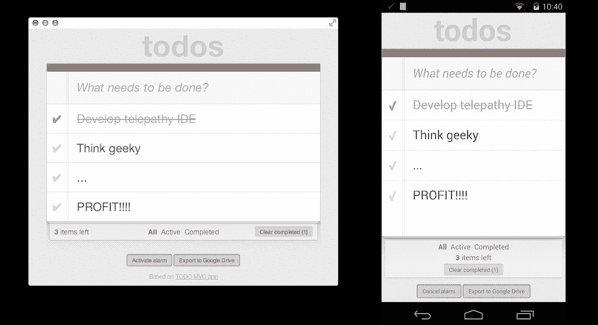

# 谷歌将 Chrome 应用程序引入 Android 和 iOS TechCrunch

> 原文：<https://web.archive.org/web/https://techcrunch.com/2014/01/28/google-brings-chrome-apps-to-android-and-ios/>

# 谷歌将 Chrome 应用程序引入安卓和 iOS 系统

谷歌的离线 Chrome 应用程序即将登陆 Android 和 iOS。使用 Apache 众所周知的开源 [Cordova 平台](https://web.archive.org/web/20221005060601/http://cordova.apache.org/)将网络应用转化为原生应用，谷歌今天发布了一个开发者预览版[工具链](https://web.archive.org/web/20221005060601/https://github.com/MobileChromeApps/mobile-chrome-apps/blob/master/docs/Installation.md)，用于使用 HTML、CSS 和 JavaScript 构建原生应用。

使用这些工具，开发人员可以将他们现有的 Chrome 应用程序封装到原生外壳中，并提交到 Google Play 和苹果的应用程序商店。

谷歌正在为这些应用提供各种各样的 Chrome APIs，包括使用 OAuth2 认证用户的方法、推送消息、存储和警报。在 Android 上，工具链还支持支付和丰富的通知。此外，开发人员还可以通过 Cordova 本身获得全套可用的 APIs】，其中包括适用于各种流行移动平台的广泛服务。

谷歌表示，对于网络开发者来说，这个新的工具链将为他们提供一个简单的工作流程，“将 Chrome 应用的覆盖范围扩大到移动平台上的用户。”

要开始使用，所有平台的开发者都需要安装 node . js 0 . 10 . 0 或更高版本，以及许多[必需的开发工具](https://web.archive.org/web/20221005060601/https://github.com/MobileChromeApps/mobile-chrome-apps/blob/master/docs/Installation.md)，这取决于他们在哪个平台上开发以及为哪个平台开发。

现在，所有的 Chrome 应用程序都已经在桌面上运行了一段时间(去年 12 月 Mac 电脑上线)。据我所知，还没有任何突破性的 Chrome 应用程序像风暴一样席卷桌面。然而，今天的发布可能只是激励更多的开发者编写 Chrome 应用程序，因为他们知道他们也能够轻松地将它们移植到移动设备上。