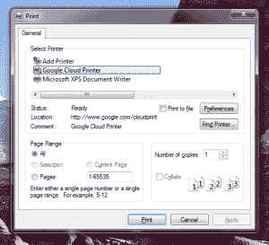

# 谷歌将云打印引入 Windows，让打印机共享更简单 

> 原文：<https://web.archive.org/web/https://techcrunch.com/2013/07/22/google-brings-cloud-print-to-windows-makes-printer-sharing-easier/>

# 谷歌将云打印引入 Windows，让打印机共享更容易

Google today [发布了](https://web.archive.org/web/20221205145044/http://googleenterprise.blogspot.com/2013/07/simpler-printing-from-more-places.html)对[云打印](https://web.archive.org/web/20221205145044/http://www.google.com/cloudprint/)的大量更新，最终将它带到 Windows，并使与其他人共享打印机变得更容易。

就连谷歌也知道，仍然有一些场合你只需要打印一些东西，所以在过去的几年里，该公司一直在稳步改善这项服务。在其核心，云打印允许您与他人共享您的打印机，并打印几乎任何地方的任何东西。

市场上有很多“[云就绪](https://web.archive.org/web/20221205145044/http://www.google.com/cloudprint/learn/printers.html)”打印机，你可以连接到互联网，从你的谷歌云打印账户进行管理。然而，直到现在，谷歌只在 Chrome OS 上支持 Chrome 中的云打印。也有一些用于 OS X 和 Windows 的第三方工具，但直到今天，谷歌本身并没有真正为第三方操作系统提供任何支持。

今天发布的【Windows 云打印服务允许管理员轻松连接学校和企业中现有的打印机。这项服务在后台运行，将你的打印机连接到谷歌的云端。它正式处于测试阶段，要求安装 Chrome，并与安装了 [Windows XPS Essentials Pack](https://web.archive.org/web/20221205145044/http://www.microsoft.com/en-us/download/details.aspx?id=11816) 的 Windows 7、Vista 和 XP 兼容(不过话说回来，你[真的](https://web.archive.org/web/20221205145044/http://nakedsecurity.sophos.com/2013/04/08/windows-xp-death-watch-365/)不应该再在你的电脑上运行 XP 了……)。

谷歌今天推出的另一个工具是谷歌 Windows 云打印机，它本质上是一个 Windows 打印机驱动程序，让你像在你的计算机上安装的任何其他打印机一样使用云打印。有了这个，你就可以从电脑上的任何应用程序打印到云打印。

随着今天的更新，谷歌现在也可以更容易地与附近的任何人共享打印机，只需向他们提供一个链接。您可以通过这种方式管理访问权限，还可以限制给定用户每天可以打印的页数(学校肯定会喜欢这一点)。