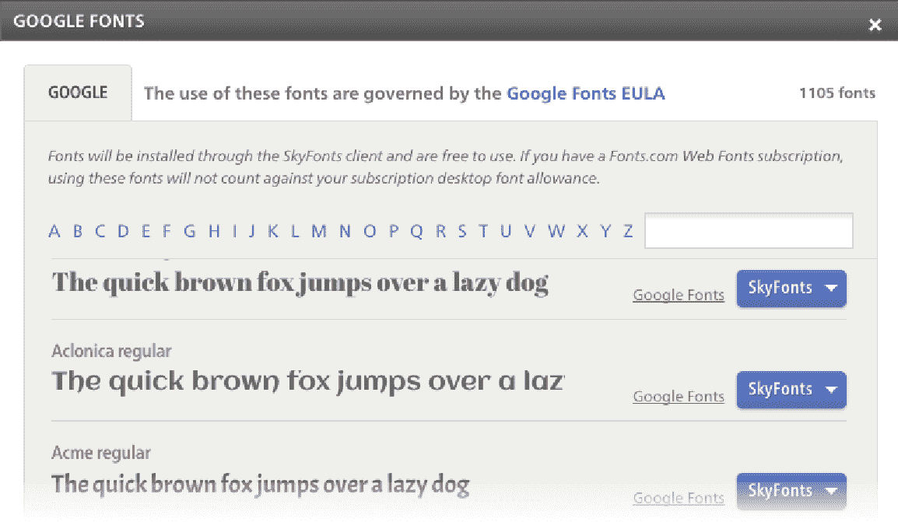

# 谷歌与 Monotype 合作，将其网络字体带到桌面上

> 原文：<https://web.archive.org/web/https://techcrunch.com/2013/05/01/google-brings-its-web-fonts-to-the-desktop/>

# 谷歌与 Monotype 合作，将其网络字体带到桌面上

谷歌的[网络字体](https://web.archive.org/web/20230321223504/http://www.google.com/webfonts)开源字体集合[现在可以在桌面上使用](https://web.archive.org/web/20230321223504/http://googledevelopers.blogspot.com/2013/05/download-google-fonts-to-your-desktop.html)(Mac 和 Windows)。乍一看，这并没有太大的意义，因为网络字体的整体思想是，它们给网络带来了新的排版选项，而这些选项以前只能在桌面上使用。然而，正如谷歌指出的，在你的桌面上本地提供这些字体意味着你的浏览器实际上不必花时间从网上获取它们。

谷歌正在使用字体专家 [Monotype](https://web.archive.org/web/20230321223504/http://www.monotype.com/) 的工具 [SkyFonts](https://web.archive.org/web/20230321223504/http://www.fonts.com/web-fonts/google) ，让你安装这些字体。该公司表示，这样做的好处是，当添加新字符或设计师对其进行其他更改时，该工具还可以确保字体定期更新。

谷歌[在 2011 年推出了](https://web.archive.org/web/20230321223504/http://googlewebmastercentral.blogspot.com/2011/02/beyond-times-and-arial-new-web-safe.html)网络字体。该服务目前提供超过 620 种字体系列，当然，所有这些现在也可以在桌面上使用。当谷歌推出网络字体时，它说这样做是为了让设计师不必使用 Flash 或在图像中嵌入文本，从而为网络带来更好更有趣的排版。

谷歌显然只是这个市场的一个参与者。例如，Adobe 通过其免费增值服务 [TypeKit](https://web.archive.org/web/20230321223504/https://typekit.com/foundries/adobe) 和免费开源字体 [Edge Web Fonts](https://web.archive.org/web/20230321223504/http://html.adobe.com/edge/webfonts/) 提供类似的功能。

同样值得注意的是，谷歌网络字体中的许多字体已经可以在桌面上使用了。