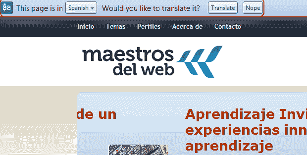

# 咆哮:Chrome 5 中的谷歌翻译工具栏需要一个“关闭”按钮

> 原文：<https://web.archive.org/web/https://techcrunch.com/2010/02/14/google-chrome-5-translate-toolbar/>

# 咆哮:Chrome 5 中的谷歌翻译工具栏需要一个“关闭”按钮

自从我在我的(Windows)电脑上将我心爱的 [Chrome](https://web.archive.org/web/20230326032323/http://www.google.com/chrome) 浏览器升级到[版本 5](https://web.archive.org/web/20230326032323/https://techcrunch.com/2010/01/25/google-chrome-for-windows-extensions/) 后，我就一直想对内置的一个新功能发泄一下，这个新功能让我不胜其烦。

随着该程序最新版本的更新，它与谷歌翻译(Google Translate)相集成，每当我访问包含非英语文本的网页时，一个定制工具栏就会出现在书签栏下。基本上，谷歌 Chrome 默认假设我除了英语之外不懂任何其他语言，并允许我一键翻译西班牙语或荷兰语网页。

谢谢你的帮助，谷歌，但是你能不能让我把那个该死的工具栏*关掉*？

你看，与 Chrome 的[谷歌翻译扩展](https://web.archive.org/web/20230326032323/http://www.google.com/support/chrome/bin/answer.py?hl=en&answer=173357)不同，这个特殊的功能在我最常用的浏览器上找到了自己的路，无需请求许可，也不想很快离开。虽然我肯定很多人会认为这是一个有用的附加功能，但我只想尽快摆脱这个烦人的小家伙。

现在，工具栏要求我确认或拒绝是否要翻译网页。当我点击“不”时，工具栏消失了，只是在我每次跳转到同一个网站的另一个网页时，它又会重新出现。啊，但是让我们看看，在工具栏的右手边有一个选项按钮(当你点击上面嵌入的图像时，你可以在大图中看到它)。

有以下选项:

–从不翻译西班牙语
–从不翻译该网站
–关于谷歌翻译

第三个选项导致了一个没有任何内容的 [Chrome 帮助页面](https://web.archive.org/web/20230326032323/http://www.google.com/support/chrome/bin/answer.py?answer=173424&hl=en)，而实际的设置是不够的:我不想为这个星球上的每一种语言指出，我再也不想看到工具栏弹出来了，而且从现在开始，我肯定不会为我访问的所有非英语网页这样做。

缺少的是一个完全禁用工具栏的[选项，我只能希望 Chrome 的下一个稳定版本能给像我这样的用户提供一个选择。Chrome 是一个伟大的、快速的、免费的浏览器，但是正是这些小东西让我疯狂。我确实意识到这是一个开发者版本，所以考虑一下来自一个非常快乐的用户的建设性反馈。](https://web.archive.org/web/20230326032323/http://www.google.com/support/forum/p/Chrome/thread?tid=6ec71f7012fa78d6&hl=en)

结束咆哮。