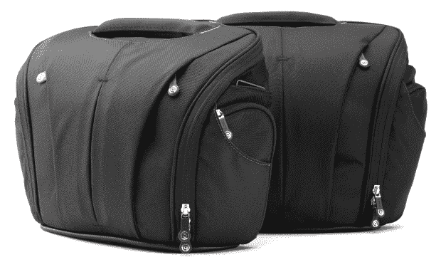
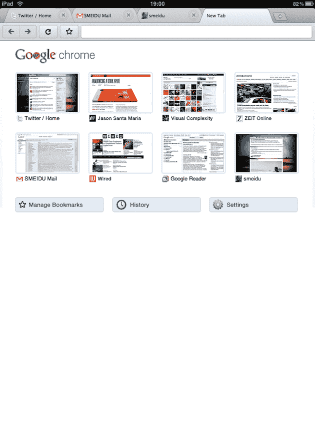
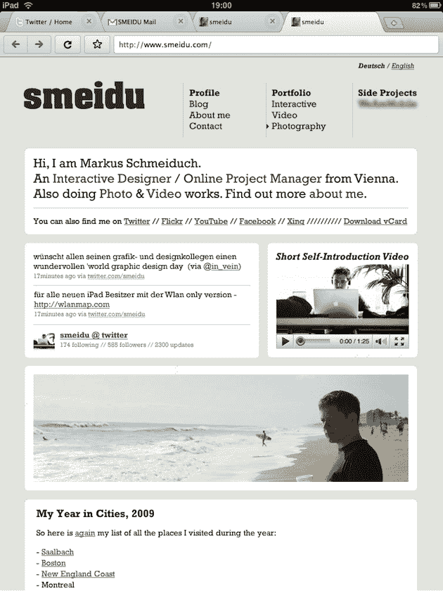
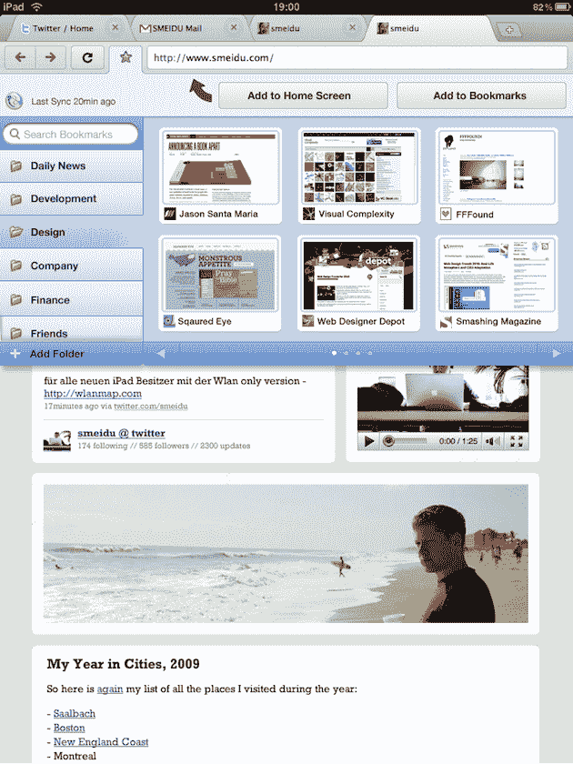

# 谷歌 Chrome 在 iPad 上的样子 

> 原文：<https://web.archive.org/web/http://techcrunch.com/2010/06/04/google-chrome-ipad/>

# 谷歌 Chrome 在 iPad 上会是什么样子

iPad 提供了很好的网络浏览体验——可能是任何设备上最好的(假设你不想去使用 Flash 的网站)。但还可以更好。例如，最好有真正的标签，而不是 iPad 使用的假窗口系统。这个系统在 iPhone 上是有意义的，因为它没有太多的屏幕空间，但在 iPad 上却有很多。毫无疑问，这和其他事情一样是一个内存问题，但这是设计师[马库斯·施梅迪奇](https://web.archive.org/web/20230204093745/http://www.smeidu.com/about/)在决定做一些关于[谷歌 Chrome 如何在 iPad](https://web.archive.org/web/20230204093745/http://www.smeidu.com/chrome-for-ipad/) 上运行的模型时所考虑的事情之一。

Schmeiduch 承认，由于 JavaScript 引擎的限制，用于 iPad 的 Chrome 不太可能很快成为现实(更不用说苹果和谷歌目前的关系了)，但这并没有阻止他的梦想。除了真正的标签之外，他的 Chrome for iPad 还为我们提供了谷歌云同步书签、手势，甚至一些 Chrome OS 功能。

显然，苹果[最近让](https://web.archive.org/web/20230204093745/http://www.mobilecrunch.com/2010/05/28/opera-mini-for-iphone-gets-2-6-million-users-in-2-weeks/)在 iPhone 上运行 Opera 浏览器，所以这表明他们不反对 Safari 平台上的竞争。但你几乎不得不怀疑，他们是否仅仅因为 Opera 不太好就让它在 iPhone 上运行(但仍能安抚人们)。Chrome，尤其是带有任何 Chrome 操作系统功能的 Chrome，可能会是一个不同的故事。尽管如此，施梅迪奇的模型还是很有趣。

下面来看看其中的一些。你也应该[到这里](https://web.archive.org/web/20230204093745/http://www.smeidu.com/projects/chrome-for-ipad/)看完整尺寸的渲染，并在 iPad 上看它们，看看它看起来会是什么样子。

