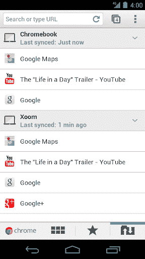

# 谷歌 Chrome 现已可用于安卓系统(这太棒了)

> 原文：<https://web.archive.org/web/https://techcrunch.com/2012/02/07/google-chrome-is-now-available-for-android-and-its-fantastic/>

如果你有目前运行冰淇淋三明治的少数几个 Android 设备之一，那么你会喜欢这篇文章。其余的人，包括 iOS 上的人，将不得不渴望地凝视一会儿。

因为 Chrome 刚刚登陆 Android。

这样更快。它可以同步一切(如果你想的话)。它有漂亮的过渡效果和更直观的标签跳转系统。它也充满了潜力。

谷歌的 Chrome 浏览器自 2008 年首次亮相以来人气飙升，并一直以最快的浏览器获得最高分，但奇怪的是，它长期以来一直没有出现在安卓系统中。需要说明的是，Android 一直都有自己的浏览器——它实际上与 Chrome 共享很多相同的代码，包括 V8 JavaScript 引擎。但与真正的 Chrome 相比，它显然是一个追随者。用了一天，真的没打算再用老一点的浏览器了。

不幸的是，正如我前面提到的，Chrome 仅适用于 Android 4.0 和更高版本，这意味着绝大多数 Android 用户还不能利用它(目前支持 4.0 的设备包括 Galaxy Nexus、Transformer Prime、Xoom 和 Nexus S)。谷歌表示，这样做的部分原因是 Chrome 需要利用最新版本操作系统中引入的硬件加速功能。如果你有支持它的设备，你可以在这里下载。

那么是什么让 Chrome 变得伟大呢？我们来看看特点。

Chrome 和现有 Android 浏览器最明显的区别是用户界面。

【YouTube = ' http://www . YouTube . com/watch？feature = player _ embedded & v = lVjw7n _ U37A ']

首先，Chrome 浏览器采用灰色配色，而不是 ICS 的“赫萝”风格。浏览应用程序时，你会注意到许多微妙的效果，这些效果让浏览器总体上感觉更加优雅。标签页打开时滑入，关闭时淡出，这有助于你在应用程序中保持定位。“所有标签页”按钮包括一个数字，表示你当前打开了多少个标签页，它会弹出一个你打开的标签页的“堆栈”,你可以滑动它，以便在你真正打开它之前更好地查看标签页的内容。

另一个好办法是:如果 Chrome 注意到你试图点击一个链接密集的区域(换句话说，你可能很难点击正确的区域)，它会启动一个整洁的放大窗格，这样你就可以点击你想要的区域。

但是这些变化远远超出了用户界面。我最喜欢的是对同步的支持。

一段时间以来，Chrome 的桌面版本允许你将谷歌账户连接到你的浏览器，允许你在多台电脑之间同步浏览器历史记录、书签、应用程序、自动填充和其他数据(换句话说，如果你有一台笔记本电脑和一台台式电脑，你可以确保它们以相同的方式配置)。现在，你也可以将你的 Chrome 手机应用程序与你的谷歌账户挂钩，它会同步许多相同的数据(不过，它还不能自动填充应用程序)。

同步功能有一个巧妙的技巧:打开手机上的 Chrome，你可以看到你目前在电脑上打开的 Chrome 的所有标签列表，如果你经常需要通过电子邮件给自己发送指示或各种产品评论的链接，这真是太棒了。更好的是，即使你合上了笔记本电脑的盖子，并且它处于“睡眠模式”,这也可以工作——尽管如果你完全退出浏览器，列表将变成空白。

(顺便说一句，如果你正在寻找这些功能，并且使用的是旧的 Android 设备，可以看看 Firefox for Android，它可以做很多相同的事情)。

然后是速度的提升。Chrome 肯定感觉更快，毫无疑问很大程度上是因为它的硬件加速。它还提供了几个与速度相关的功能，如预取——Chrome 将自动开始加载它认为你接下来要访问的页面(默认情况下，它只在 Wifi 上这样做，尽管你也可以将其更改为在移动连接上工作)。它还包括一些股票浏览器没有的关键功能，如 Web Workers 和 WebDB。它没有的一样东西:Flash，因为 Adobe 停止了在移动 Flash 上的开发。不能说我怀念它。

虽然 Chrome 绝对是一次重大升级，但它的测试版标签是当之无愧的，因为它实际上缺少了一些常见的 Android 浏览器的微妙功能。最明显的遗漏是缺少“请求桌面站点”功能，该功能首次出现在 Android 4.0 自带的浏览器中。如果你曾经用手机浏览过一个网站，却发现它检测到了你的手机浏览器，并提供了一个你正在寻找的劣质的“手机友好”版本，那么你会感谢这个小小的复选框。它现在在 Chrome 上没有，但很明显它会在某个时候被添加进来。

至于长期前景，Chrome 看起来很棒。扩展不是此次发布的一部分，但它们是不可避免的。虽然 Android 4.0 目前将继续搭载其股票浏览器——这意味着它将与 Chrome 并存——但最终 Chrome 将取代股票浏览器(目前还不清楚这将如何融入 Android 开源项目，但对于初学者来说，移动客户端的大部分代码将被上传到 Chrome 项目)。

哦，至于你们 iOS 用户呢？我问谷歌的 Chrome 桑德尔·皮帅副总裁，谷歌是否考虑过基于 iOS 的 WebKit 浏览器(他们不会引入 Chrome 的渲染引擎，但他们可能会提供同步功能)。Pichai 没有排除这种可能性，但听起来 iOS 版本不会很快推出——目前，该团队正在观察 Android 版本的接受情况。