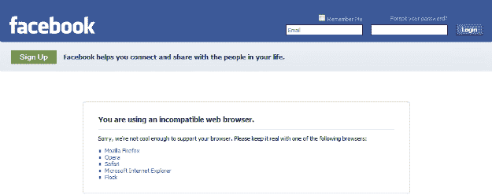
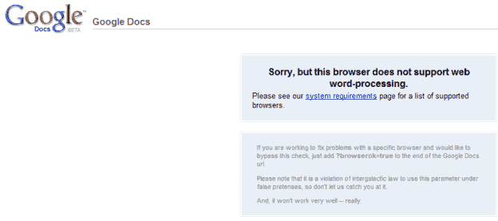

# 谷歌 Chrome 对谷歌文档不够酷，脸书(如果你匿名浏览的话)

> 原文：<https://web.archive.org/web/http://techcrunch.com/2009/02/01/google-chrome-not-cool-enough-for-google-docs-facebook-if-youre-browsing-incognito/>

# 谷歌 Chrome 对脸书的谷歌文档不够酷(如果你是匿名浏览的话)

谷歌的 [Chrome](https://web.archive.org/web/20230202214940/http://www.crunchbase.com/product/chrome) 浏览器内置了这个简洁的小功能，可以让你在~~色情~~匿名模式下浏览网页，这基本上意味着当你访问网页时，它不会存储任何信息。根据[这个帮助页面](https://web.archive.org/web/20230202214940/http://www.google.com/support/chrome/bin/answer.py?hl=en&answer=95464)解释该功能，如果你想在秘密模式下“计划礼物或生日之类的惊喜”,你可以切换到匿名浏览。

除了你不能使用[脸书](https://web.archive.org/web/20230202214940/http://www.crunchbase.com/company/facebook)做到这一点，而不是因为这次[谎称它是一个钓鱼网站](https://web.archive.org/web/20230202214940/http://techcrunch.com/2008/12/03/google-chrome-claims-facebook-may-be-a-phishing-site/)。它甚至不允许你使用谷歌自己的[文档](https://web.archive.org/web/20230202214940/http://www.crunchbase.com/product/google-docs)来打开和编辑文件。

**更新:**谷歌证实了这一漏洞，并表示正在修复补丁。

如果你试图用最新版本的谷歌浏览器(更新 1.0.154.46)打开谷歌文档或脸书，你会看到一个通知，浏览器还不支持。脸书甚至会承认他们可能不够酷，不足以支持这种浏览器，而是指向其他浏览器，如 Firefox、IE、Safari、Opera 和 Flock。这只发生在隐姓埋名的模式下，所以这似乎是谷歌方面的一个有趣的疏忽。

诚然，谷歌 Chrome 的采用到目前为止还不能被认为是非凡的(仍然缺乏 Mac 兼容版本没有帮助)~~并且浏览器仍然处于测试阶段~~，但是他们可能仍然想看看为什么这没有工作，考虑到他们正在制造两种专有产品之间的不兼容问题，并且脸书仍然在世界各地发展得非常快等等。

(这个 bug 已经被[报告](https://web.archive.org/web/20230202214940/http://code.google.com/p/chromium/issues/detail?id=7279)为问题，并且有一个[支持线程](https://web.archive.org/web/20230202214940/http://www.google.com/support/forum/p/Chrome/thread?tid=2e47698a38c26c96&hl=en)

向 Izza Aamer 致敬。