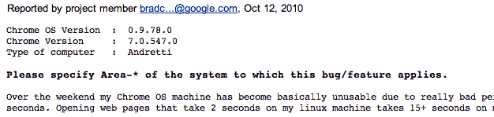
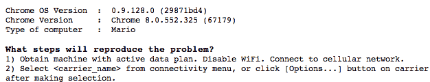
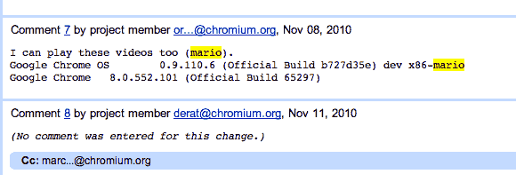
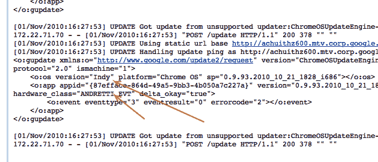

# 谷歌内部代号为“Mario”和“Andretti”的 Chrome OS 上网本？

> 原文：<https://web.archive.org/web/http://techcrunch.com/2010/11/25/google-chrome-os-mario-andretti/>

# 谷歌内部代号为“Mario”和“Andretti”的 Chrome OS 上网本？

因此，第一批 Chrome OS 上网本似乎将在未来几周发布。现在[似乎](https://web.archive.org/web/20230203002132/http://www.nytimes.com/2010/11/25/technology/25chrome.html?_r=3&partner=rss&emc=rss&pagewanted=all)第一批将会是谷歌品牌的版本，由第三方制造商制造。你可以肯定的是，谷歌已经在内部测试这些，因为他们基本上为所有产品的发布做了测试。Chromium 问题跟踪器中可能会有更多关于它们的提示。

几个月来，谷歌一直在各种上网本上测试 Chrome 操作系统。其中包括华硕 Eee 机器，联想机器，戴尔机器，以及其他一些机器。我哪里知道？因为它们经常列在错误报告中的“计算机类型”下面。但是更有意思的是大量提到“狗粮”机器。“狗食化”是对你自己的产品进行内部测试的过程的称呼。同样，谷歌已经这样做了几个月了。

但是“狗粮”机器可以是任何东西。或许只是上面提到的其中一个品牌稍微修改了一下。但最近，引用“狗粮”机器的 bug 数量似乎让位于两种新类型的机器:“马里奥”和“安德烈蒂”。

对于非印地车迷来说，安德雷蒂基本上就是这项运动中的迈克尔·乔丹。他经常被称为地球上最快的车手。这很重要，因为谷歌已经明确表示，他们的 Chrome OS 上网本的主要关键可能是它们必须很快。它们必须在几秒钟内启动。基本上，立刻。他们一定像马里奥·安德烈蒂。

显然，这只是猜测。但鉴于“马里奥”和“安德烈蒂”机器的引用数量，我想这些可能是谷歌给他们打算下个月发布的 dogfood Chrome OS 设备起的绰号。这些名字直到 10 月中旬才开始出现在日志中，从那以后，报告中的引用次数增加了。

更进一步，更详细的报告将 OS 版本列为“Indy”(平台为“Chrome OS”)。很可爱，谷歌。

如果我的猜测是正确的，下一个问题是，下个月将是“马里奥”还是“安德烈蒂”越过终点线并获得释放？或者两者都会？系好你的安全带。

*【图片来源:flickr/ [托马斯·杜奇尼奇](https://web.archive.org/web/20230203002132/http://www.flickr.com/photos/locationscout/4674945320/)*