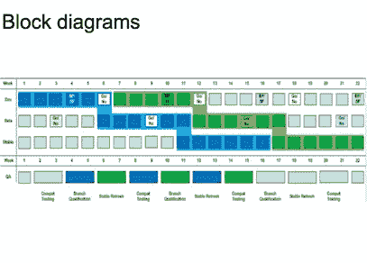

# 谷歌如何加快 Chrome 发布周期(幻灯片)

> 原文：<https://web.archive.org/web/http://techcrunch.com/2011/01/11/google-chrome-release-cycle-slideshow/>

# 谷歌如何加快 Chrome 发布周期(幻灯片)

谷歌开发 Chrome 浏览器的方法是尽早发布更新[，并且经常发布](https://web.archive.org/web/20230203043651/http://blog.chromium.org/2010/07/release-early-release-often.html)。它的目标是大约每六周发布一个新版本[。更新已经变得如此常规，以至于谷歌](https://web.archive.org/web/20230203043651/https://techcrunch.com/2010/07/22/google-chrome-versions/)[几乎不再提及它们](https://web.archive.org/web/20230203043651/https://techcrunch.com/2010/12/02/chrome-8-2/)。

谷歌负责 Chrome 开发的技术项目经理 Anthony la forge[制作了](https://web.archive.org/web/20230203043651/http://groups.google.com/a/chromium.org/group/chromium-dev/browse_thread/thread/77f1de21998ee278?pli=1)下面的演示文稿(并发布在[谷歌文档上)](https://web.archive.org/web/20230203043651/https://docs.google.com/present/view?id=dg63dpc6_4d7vkk6ch&pli=1)来解释 Chrome 的开发周期是如何工作的。不同于传统的软件开发周期，在这一周期中，各种功能被塞进每个版本或推迟发布，Chrome 每六周都会发布一个新版本。如果新功能还没有准备好，他们会等待下一个版本，就像在中央车站等待下一趟预定的火车一样。

另一件加速事情的事情是 Chrome 浏览器是沿着三个不同的“渠道”(开发、测试和稳定)同时开发的。用户可以选择他们最喜欢的浏览器，他们的浏览器会自动更新。新特性首先在 dev 和 beta 通道中引入，随着这些特性得到修补和稳定，它们将与 stable 通道合并。

这些版本开始融合在一起。这种方法更像是更新一个网站，而不是一个客户端软件。版本号并不重要。你用的是哪个版本的亚马逊？没错。

[scribd id = 46659928 key = key-1 yanis 1 zel 773 P5 GQ 3oh mode = slide show]