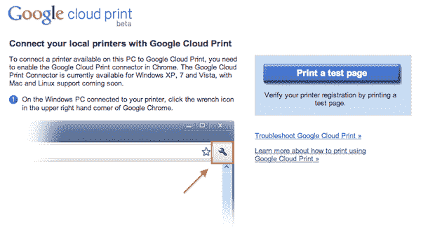
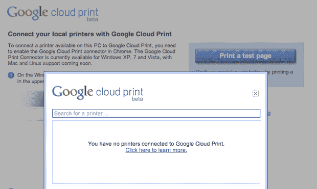
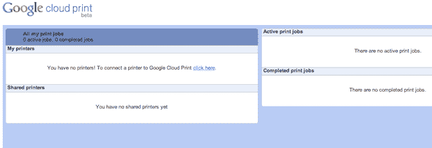

# 在 Chrome 操作系统发布之前，谷歌云打印似乎准备推出测试版 

> 原文：<https://web.archive.org/web/http://techcrunch.com/2010/12/07/google-cloud-print-beta/>

# 在 Chrome 操作系统发布之前，谷歌云打印似乎准备推出测试版

早在 4 月份，我们写了一个非常酷的新功能，谷歌正在与 Chrome OS 一起开发:[云打印](https://web.archive.org/web/20230203002138/https://techcrunch.com/2010/04/15/googles-plan-to-give-chrome-os-and-all-web-enabled-devices-universal-printer-support/)。本质上，它是一种服务，将你通常需要的所有打印机驱动程序放在一台电脑上，并把它们放在云中(在谷歌的服务器上)。这样，无论使用何种操作系统，您都可以轻松地从机器上进行打印。这意味着你可以从 Chrome 操作系统或任何移动设备上打印。现在看来，它即将推出。

[正如你在这里看到的](https://web.archive.org/web/20230203002138/http://www.google.com/chrome/intl/en/p/cloudprint.html)，谷歌云打印已经有了一个实时登陆页面。从这个页面，您可以打印一个测试页。这不应该太令人惊讶，因为据信谷歌将于今天晚些时候在旧金山的一次活动中发布 Chrome 操作系统的测试版。

但测试版的一个警告是，它说你目前需要 Windows 7，Vista 或 XP 才能使用它。它说 Mac 和 Linux 支持即将到来。这个好像跟用户端没有太大关系，而是打印机端。目前，你需要有一台 Windows PC 连接到一台打印机来设置它。

早先的[报道](https://web.archive.org/web/20230203002138/http://www.thechromesource.com/google-cloud-print-requires-chrome-9/)称该功能也需要 Chrome 9(Chrome 的开发版本目前是版本 9)。它被定为 Chrome 9 的一个功能。但是截止到五天前，这个功能已经被[通过](https://web.archive.org/web/20230203002138/http://code.google.com/p/chromium/issues/detail?id=60092)Chrome 营销团队进行了最终批准。一种可能性似乎是，Chrome OS 将像 Chrome 一样推出稳定、测试和开发频道，这种云打印功能可能会在开发(可能是测试)频道上启用，因为它可能会运行 Chrome 9 而不是 Chrome 8(是的，在 Chrome OS 本身内部)。

WebSonic.nl 有一些在 Windows 机器上实际运行的功能的[截图](https://web.archive.org/web/20230203002138/http://www.websonic.nl/nieuws/google-cloud-print-krijgt-vorm-16125)。这个帖子里的都是我 Mac 机里的。

**更多** : [Chrome 操作系统和 Chrome 网络商店将在发布会上推出基于网络的游戏](https://web.archive.org/web/20230203002138/https://techcrunch.com/2010/12/07/chrome-os-gaming/ "Chrome OS And Chrome Web Store To Play Up Web-Based Gaming At Launch")

