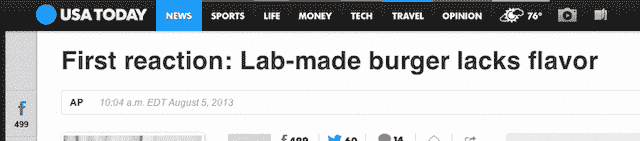

# 谷歌联合创始人公布了他最新的登月计划:试管汉堡 

> 原文：<https://web.archive.org/web/https://techcrunch.com/2013/08/05/google-co-founder-unveils-his-latest-moon-shot-a-test-tube-burger/>

谷歌联合创始人谢尔盖·布林[资助了下一次食品生产革命](https://web.archive.org/web/20221006183401/http://www.theverge.com/2013/8/5/4589744/cultured-beef-burger-public-tasting-mark-post-sergey-brin):试管汉堡。荷兰研究人员周一在一次公众品尝测试中展示了一种干细胞培育的 5 盎司牛肉馅饼。这种太空时代的汉堡有潜力抵消牲畜造成的极端环境破坏，并为世界饥饿人口提供至关重要的营养。

这个价值 32.5 万美元的肉饼是用牛干细胞培育出来的，而且是在周末培育出来的，但是首席研究员、马斯特里赫特大学马克·波斯特教授估计，我们可能还需要“10 到 20 年”才能吃到麦克实验室的汉堡。

牛津大学 2011 年的一项研究发现，合成肉可能只需要当前畜牧业方法的 1%的土地和 4%的水，并且使用不到一半的能源。由于这些材料是从牛的肩膀上提取的，如果没有稳定的牲畜供应，可以种植的数量是有限的，[英国素食协会对布林项目的前景“正式感兴趣”](https://web.archive.org/web/20221006183401/http://www.itv.com/news/update/2013-08-05/how-can-beef-be-manufactured-in-a-lab/)——但不是正式兴奋。

这对于环保主义者、动物权利活动家和人权爱好者来说都是非常令人兴奋的。然而，媒体对这种潜在革命性产品的疯狂反应是，这种汉堡可能会更美味。“第一反应:实验室制作的汉堡缺乏味道，”[用](https://web.archive.org/web/20221006183401/http://www.usatoday.com/story/news/world/2013/08/05/first-reaction-lab-made-burger-lacks-flavor/2618599/) *今日美国*的标题报道。或者《每日电讯报》的“22 万个实验室培育的汉堡第一次被食用——但是需要番茄酱。”

是的，这是真的，两位品尝者认为汉堡可以更美味一点。志愿者品尝员汉尼·鲁茨勒说:“我原以为质地会更柔软。”波斯特承认合成脂肪是他尚未克服的技术障碍。

重点是，这有可能影响数百万人的生活，并有助于避免环境灾难，而不是推出一个暗示“科学，不错的尝试”的标题。显然，这是一项正在进行的工作。

到 2050 年，粮农组织预测，随着发展中国家不断增长的财富和人口超过我们生产足够肉类的能力，肉类消费量将翻一番。也许更糟糕的是，牛占据了惊人的 70%的农业用地。

有趣的是，布林并不是第一个资助肉类替代品的互联网先驱。Twitter 的联合创始人比兹·斯通[已经资助了](https://web.archive.org/web/20221006183401/http://www.fastcoexist.com/1680007/biz-stone-explains-why-twitters-co-founders-are-betting-big-on-a-vegan-meat-startup)一种商业上可用的大豆基人造鸡肉产品，超越肉类。在去年的旧金山 Disrupt 会议上，我们品尝了肉类以外的食物，作为一名狂热的 T2 旧石器时代节食者，我可以诚实地说，味道相当不错。

我不知道为什么互联网创始人对替代肉类生产情有独钟，但我想还有更糟糕的爱好。

布林通过视频出现在今天的试管汉堡发布会上，他说:“我们正试图创造第一个培养牛肉汉堡。在此基础上，我乐观地认为我们真的可以实现跳跃式发展。”

[图片:法新社照片/记者协会/大卫·帕里]