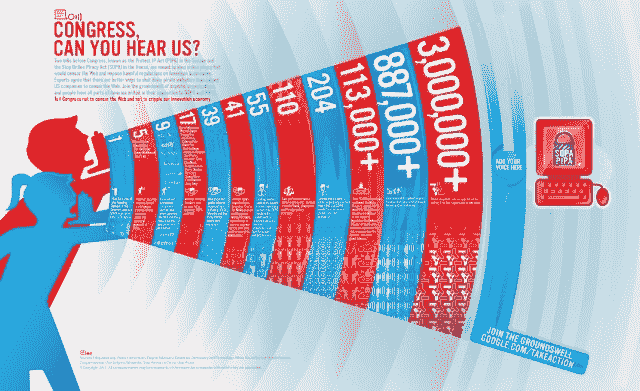

# 谷歌今天收集了 450 万个反 SOPA 签名 TechCrunch

> 原文：<https://web.archive.org/web/https://techcrunch.com/2012/01/18/google-collected-4-5-million-anti-sopa-signatures-today/>

# 谷歌今天收集了 450 万个反 SOPA 签名

当谷歌被认为滥用其在搜索行业的优势地位时，它通常会陷入困境。但不可否认的是，尽管有些举措绕过了滥用垄断的边缘，但其他举措却非常受欢迎。例如，在自然灾害期间，谷歌为想要捐赠或志愿服务的人提供了有用的链接和资源。他们的标志涂鸦表达了对许多人忽略的人物和事件的敬意。

Today 肯定是他们选择位置的最佳应用之一:谷歌主页上的一个链接和成千上万的分享已经产生了令人兴奋的 450 万个签名在他们的反 [SOPA](https://web.archive.org/web/20221207214402/https://beta.techcrunch.com/tag/sopa/) 请愿书上。

几个月前，当我写《杀死开关》的时候，有一些相关的请愿书，当时有数万人，现在[有 15 万](https://web.archive.org/web/20221207214402/http://www.change.org/petitions/stop-the-internet-control-bill-now)(Whitehouse.gov 的[刚刚超过 10 万](https://web.archive.org/web/20221207214402/http://www.whitehouse.gov/blog/2012/01/18/numbers-103785))。而在 [Avaaz](https://web.archive.org/web/20221207214402/http://www.avaaz.org/en/save_the_internet_us_a/?cl=1399376004&v=11183) 的请愿将近 150 万。草根阶层对这些法案的反对是巨大的，事实上比其他像 NDAA 这样可怕的法案更强烈，也许是因为 SOPA 和 PIPA 是直接针对互联网自由的。

不管怎样，450 万是个大数目，而且是在一天之内。我今天早些时候刚刚写了我们需要如何改善互联网和我们的管理当局互动的方式，但像这样的事情肯定是现有在线方法的最佳应用之一。当然，这些数字可能会被认为有些夸大，不如 450 万写有社会安全号码和选民地址的书面签名突出，但这并不是真正的重点。450 万人花时间访问这个页面，通知自己，填写相关信息以记录他们的不满。

它也被广泛分享，因为我们的许多读者肯定能够证明；根据脸书的统计，它已经被分享了 344，000 次，谷歌在 Google+上显示了超过 125，000 次分享，当然还有那些[240 万](https://web.archive.org/web/20221207214402/https://beta.techcrunch.com/2012/01/18/twitter-sopa-pipa-tweets/) #SOPA、#stopSOPA 等等中的一些。推特也指向了谷歌的请愿书。

[如果你还没有在请愿书上签名，你可以在这里签名](https://web.archive.org/web/20221207214402/https://www.google.com/landing/takeaction/)，而[在这里](https://web.archive.org/web/20221207214402/http://www.usa.gov/Contact/Elected.shtml)联系你的立法者。